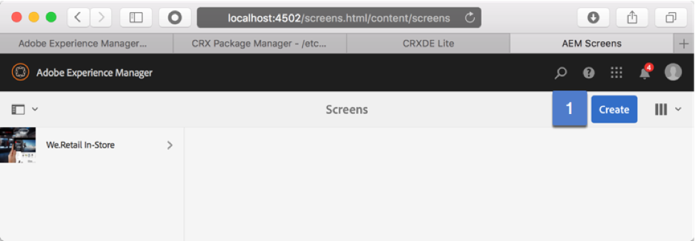
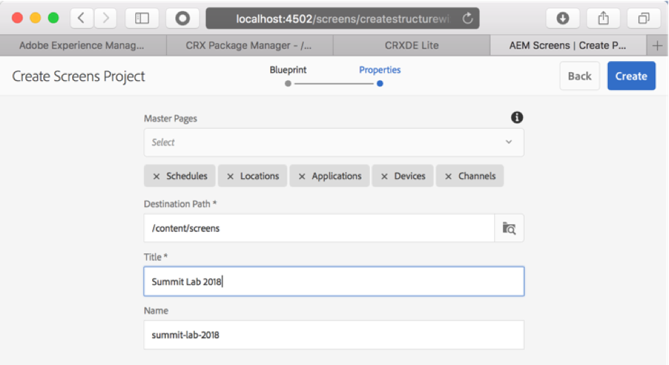

## Exercise 2 - Creating your Project

===========

## Objective
Create a Screens Project

## Tasks

1. From the Adobe Experience Manager link (top left), click on Screens to arrive at the main Screens section  http://localhost:4502/screens.html/content/screens

2. Click on the Create button & select Create Project & step through the wizard. 

3. The name of the project in the Title field should be Summit Lab 2018.  You will notice that the Name field will get auto-populated.

4. Select the newly created Summit Project & go to Properties  http://localhost:4502/screens/properties.html?item=%2Fcontent%2Fscreens%2Fsummit-lab-2018&returnPage=/screens.html/content/screens 

Download the summit.png file below & Upload this image within the thumbnail section.

 