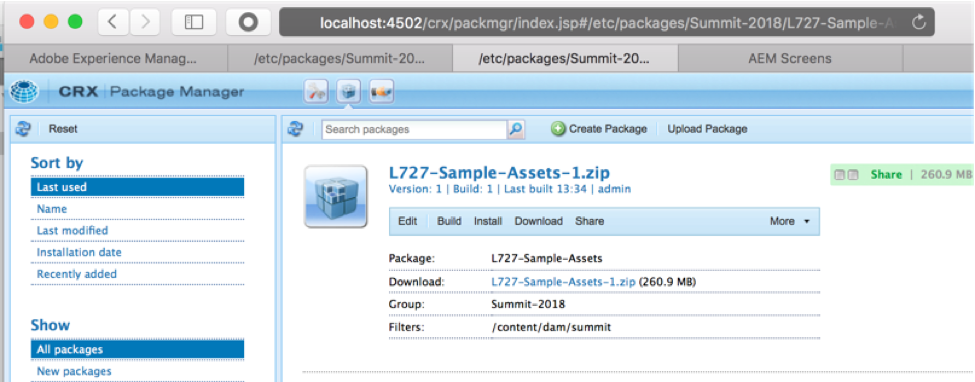
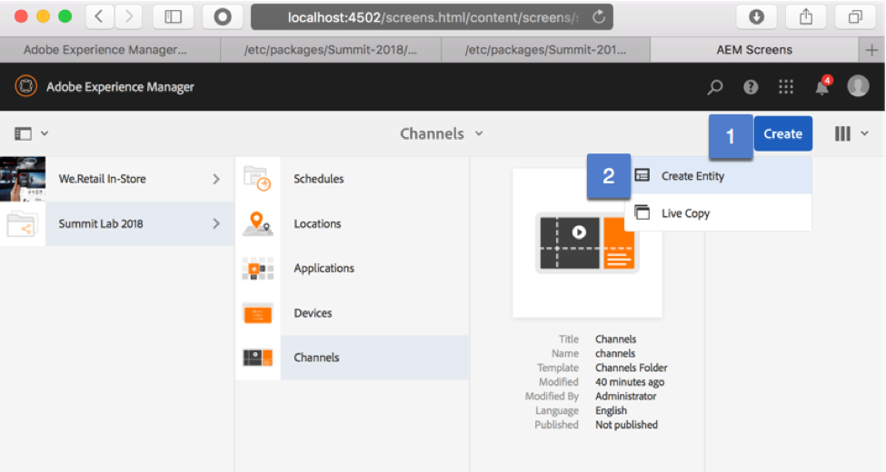
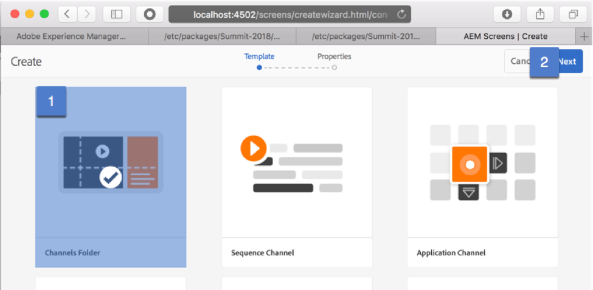
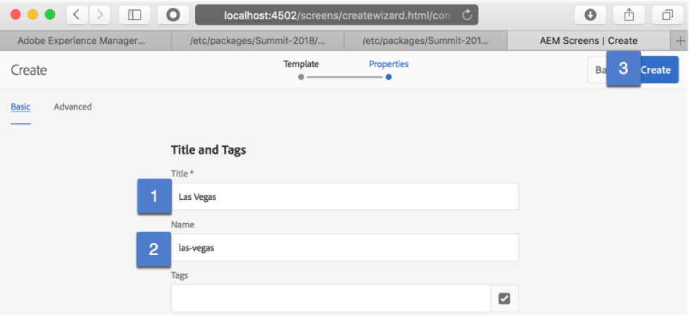
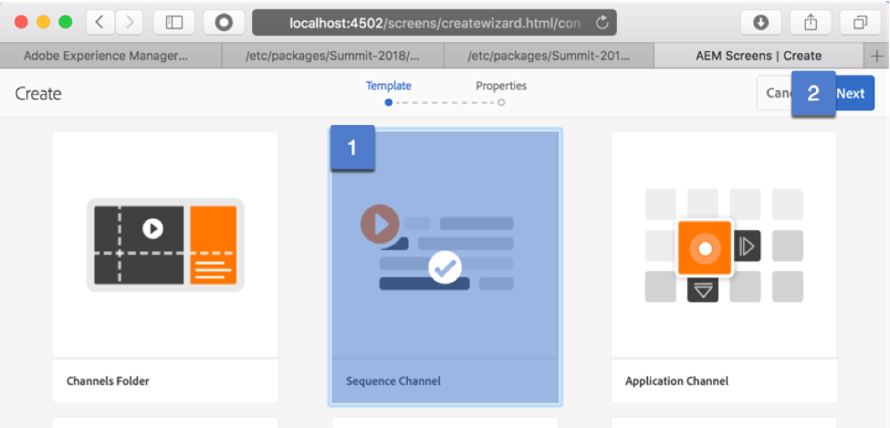
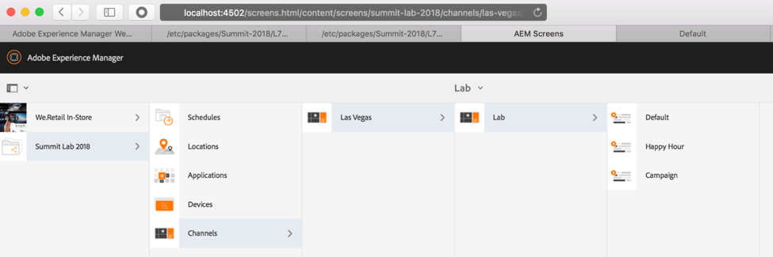
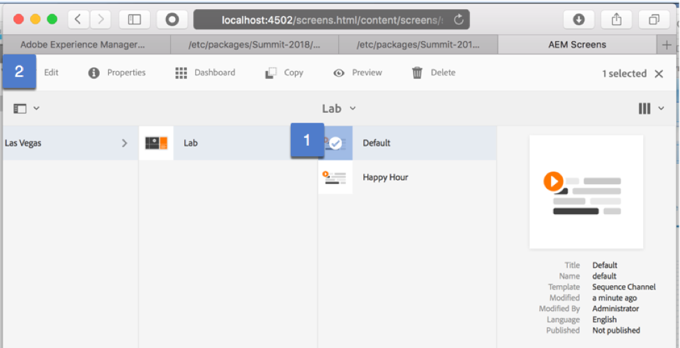
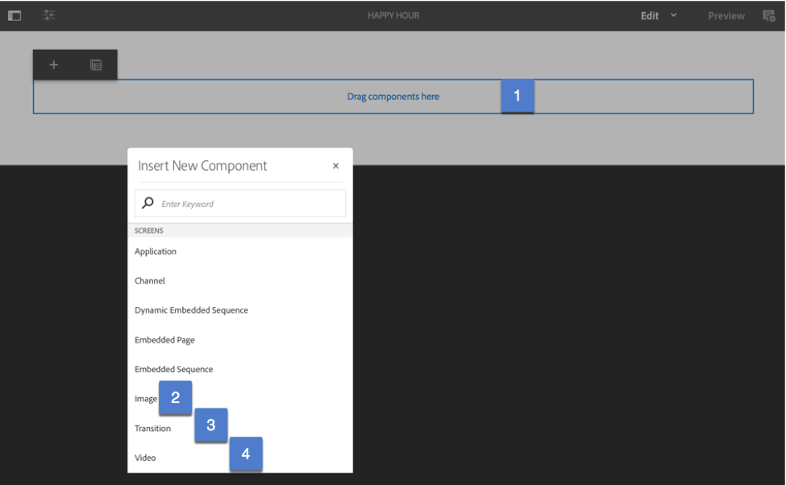

## Exercise 3 - Creating your Playlist (Sequence Channel)

===========

## Tasks

1. (Optional) Please install the Sample Asset package file via package manager --> http://localhost:4502/crx/packmgr/index.jsp
Sample Assets --> https://files.acrobat.com/a/preview/29461192-40fb-4107-9ed3-9a66b97fad37

 
If the images from a GA AEM 6.4 is not creative enough, i am supplying a few additional images & videos.

2. From the Channels folder, click on the Create button & then the Create Entity button

3. Select Channels Folder tile & Click Next

4. Start creating a folder taxonomy, starting with Las Vegas.  After creating the Las Vegas folder, continue to create another folder called Lab.
   -	Title should be a friendly name
   -	Name should be lower-case with no spaces.

5. From the lowest level channel folder (Lab), select Create & choose the Sequence Channel tile

6. Create multiple Sequence Channels:  Default, Happy Hour, Campaign

7. Select the Default channel & click on edit

8. Click on the Drag Components Here to open up the available component dialog.  Add Image, Transitions, Video components.  Add an image component, followed by a transition component & then a video component followed by another transition component.  Add three or four more pairs of image/transition components.

9. Open the Side Panel via the toggle (1) & open the Asset Rail (2).  You can toggle between images & videos.  Add images & videos to the playlist by dragging the image over to the appropriate component.  Then double click on the Transition component & select a transition option such as Fade, Bottom up etc.

10. Open your other Sequence Channels & add images

 

