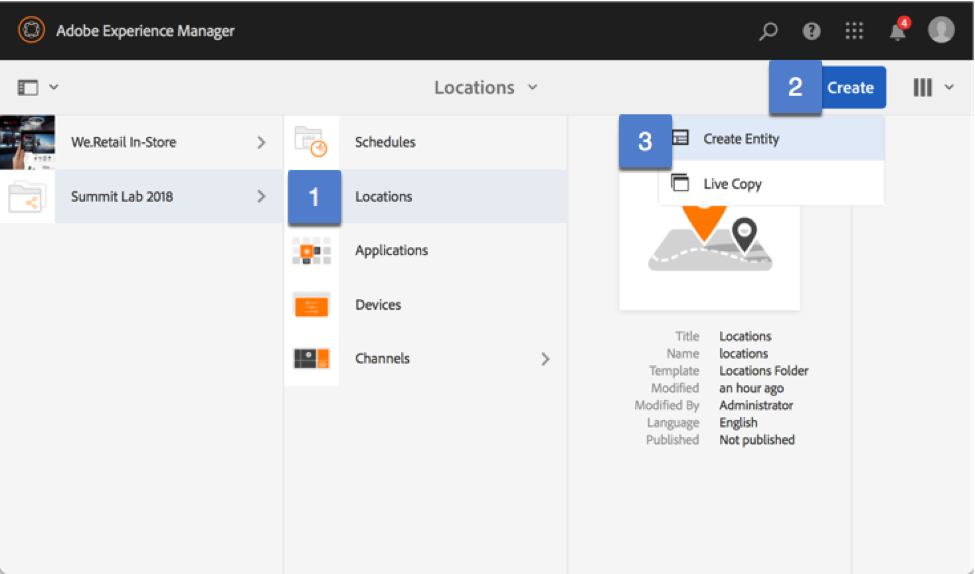
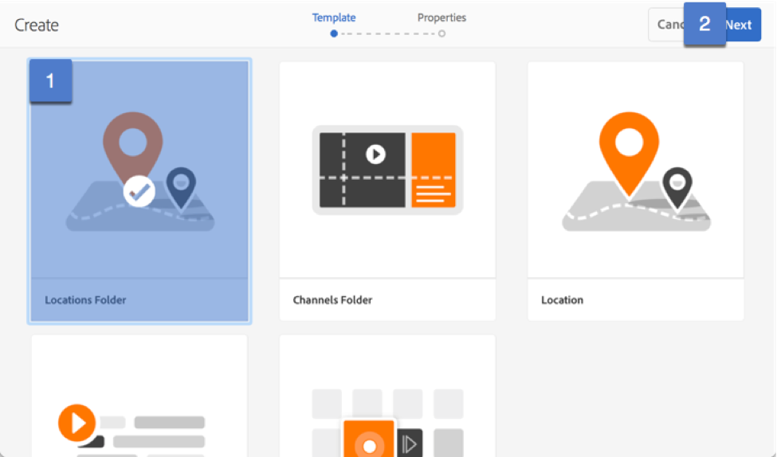
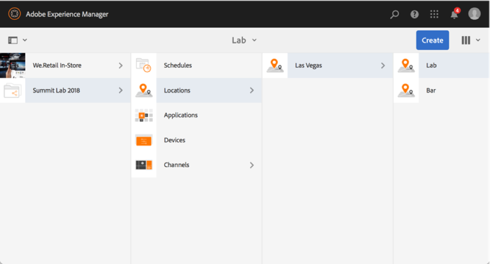
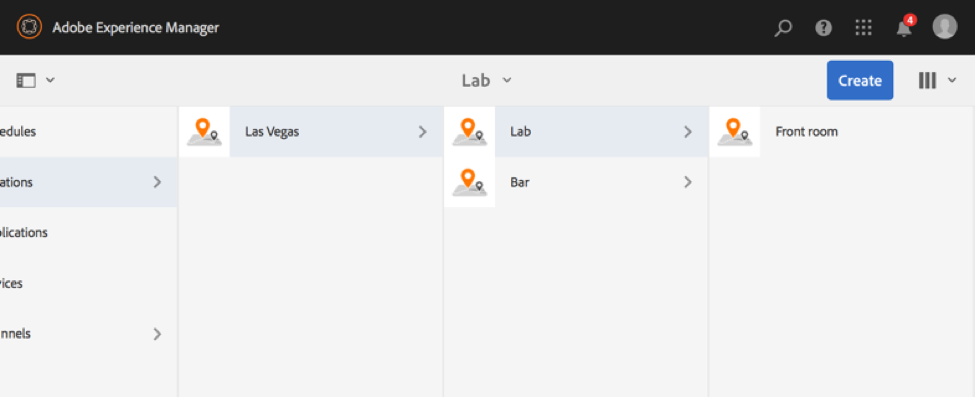
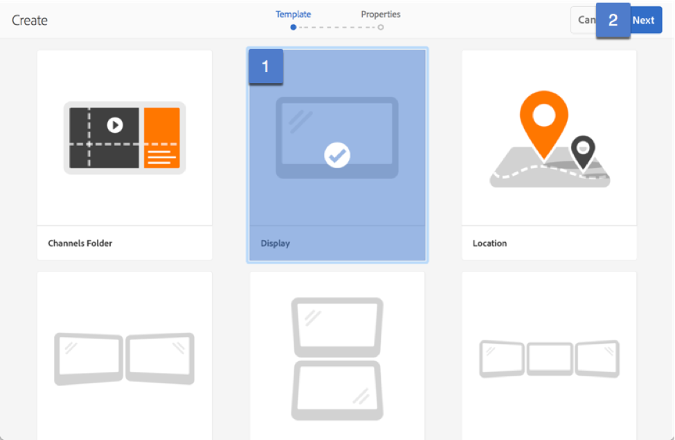
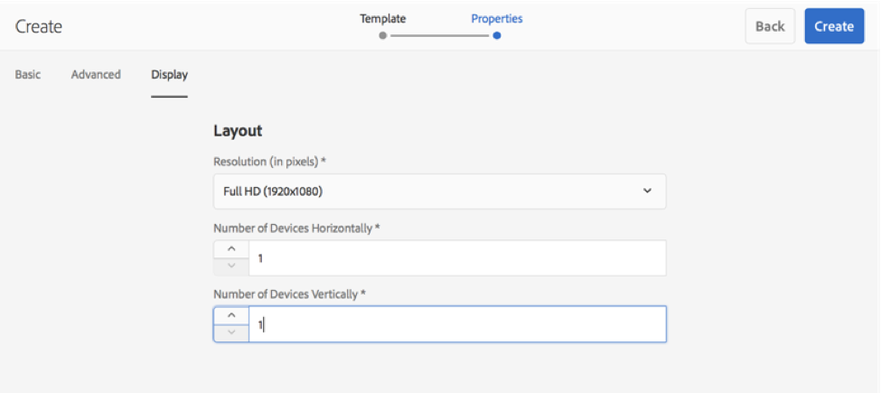
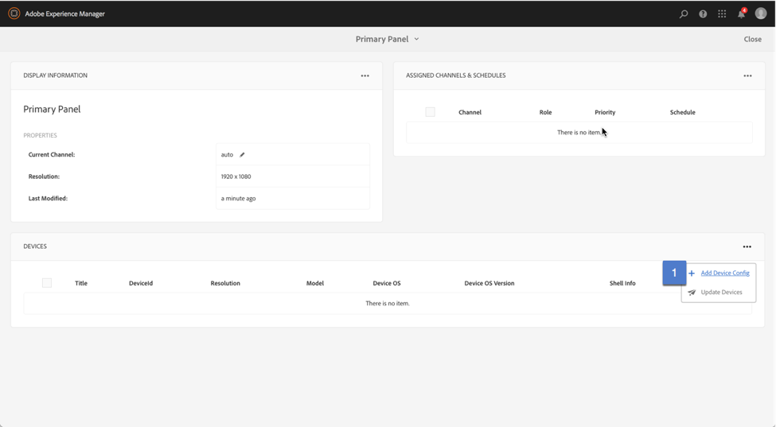
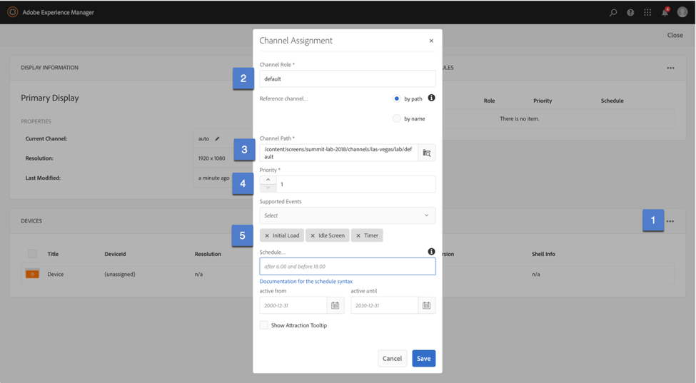
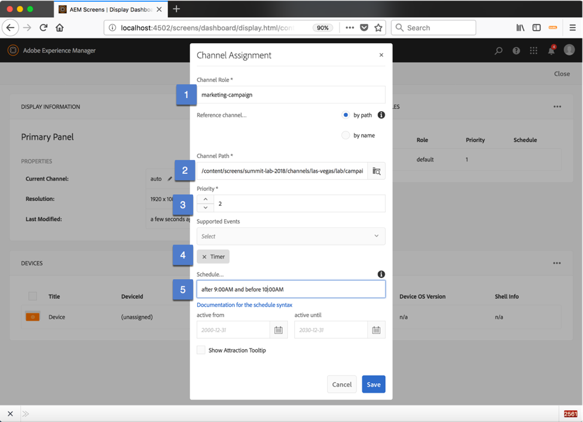

## Exercise 4 - Attaching a Player to your location

===========

## Objective

## Tasks

1. Select Locations, then Create, new entity

2. Select the Locations Tile & create a Location folder called Las Vegas

3. Within the Las Vegas folder, create 2 more folders called Lab & Happy Hour

4. Within the Lab folder, create a new Location (different then a Location folder) & call it Front of the Room. Within the Bar Location Folder, create a location called Overhead

5. Within the Front of the Room location, click on Create & select Display to create a new display. Call this display Primary.  
   
   When creating a Display, in addition to the Title/Name, there is an additional required tab called Display.  Within this tab, you must put in information around the physical display you intend to use.  Select the 1920x1080 (landscape high definition) & enter the number 1 in the number of devices (horizontally & vertically) to indicate that the canvas spans a single physical display.
   
   Create a display for the Bar, Overheard location as well using the same information

6. Select the Front of the Room Display & Click on the Dashboard to take you to the location dashboard.  
   
   Then from the location dashboard, click on the … menu to the right of Device Details module & Select Add Device Config
   
   Create a new Device Config called Device 
   
 
 
 7. From Lab > Front of the Room> Primary Panel Dashboard, select the … menu from the Assigned Channels & Schedules module & Select Assign Channel.
    
    -	Create a role called Default
    -	The Channel Path should point to the default channel  -> /content/screens/summit-lab-2018/channels/las-vegas/lab/default
    -	The priority value should be 1
    -   Select the following events:  Initial Load, Idle Screen, Timer
    
 
 
 8.  From Lab > Front of the Room> Primary Panel Dashboard, select the … menu from the Assigned Channels & Schedules module & Select Assign Channel.
     
     -	Create a role called Marketing-Campaign
     -	The Channel Path should point to the marketing-campaign channel   /content/screens/summit-lab-2018/channels/las-vegas/lab/campaign
     -	The priority value should be 2
     -	Select the following events: Timer
     -  Add the following schedule:  after 9:00 AM and before 10:00 AM
 
 
 9. From Bar > Overhead > Primary Display Dashboard, select the … menu from the Assigned Channels & Schedules module & Select Assign Channel.
    
    -	Create a role called Default
    -	The Channel Path should point to the default channel 
    -	The priority value should be 1
    -   Select the following events:  Initial Load, Idle Screen, Timer
    
 10. From Bar > Overhead > Primary Display Dashboard, select the … menu from the Assigned Channels & Schedules module & Select Assign Channel.  
     
     -	Create a role called Marketing-Campaign
     -	The Channel Path should point to the marketing-campaign channel   /content/screens/summit-lab-2018/channels/las-vegas/lab/campaign
     -	The priority value should be 2
     -	Select the following events: Timer
     -  Add the following schedule:  after 9:00 AM and before 10:00 AM 
     
 11.  From Bar > Overhead > Primary Display Dashboard, select the … menu from the Assigned Channels & Schedules module & Select Assign Channel.  
      
      -	Create a role called Happy Hour
      -	The Channel Path should point to the marketing-campaign channel   /content/screens/summit-lab-2018/channels/las-vegas/lab/happy-hour
      -	The priority value should be 2
      -	Select the following events: Timer
      - Add the following schedule:  after 5:00PM and before 7:00PM   
      
 
  
  12.  From Bar > Overhead > Primary Display Dashboard, select the … menu from the Assigned Channels & Schedules module & Select Assign Channel.  
      
 Then from the location dashboard, click on the … menu to the right of Device Details module & Select Add Device Config
       
 Create a new Device Config called Device 
       
 
      
  