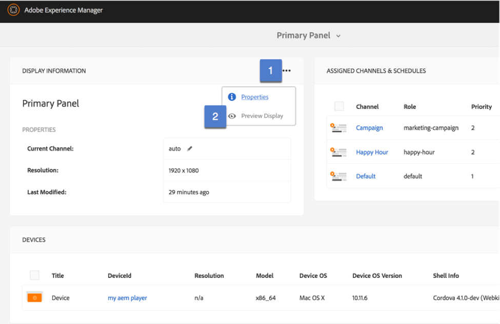
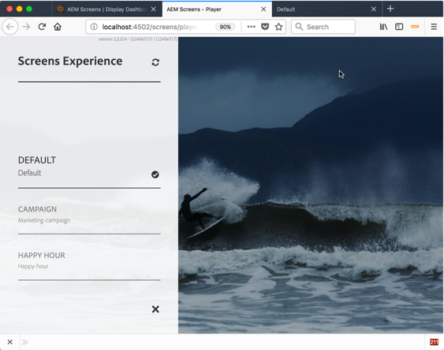

## Exercise 5 - Previewing your Display

===========

## Objective
In this lesson, we will learn how to use the embedded firmware to preview your display (as it would render using the native Screen player)

## Tasks

1. From your location dashboard, click on the (…) menu from Display Information & Select Preview Display

The URL should be --> http://localhost:4502/screens/dashboard/display.html/content/screens/summit-lab-2018/locations/las-vegas/lab/front-of-the-room/primary-panel

**NOTE**
The preview Display opens the AEM Screens firmware via the browser.  It will have the same hidden menu’s on the top & bottom left.

