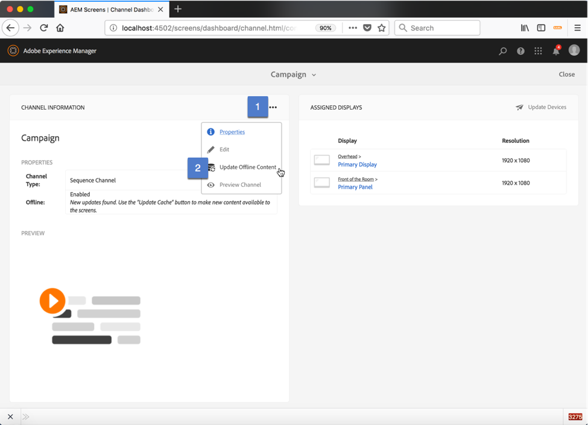
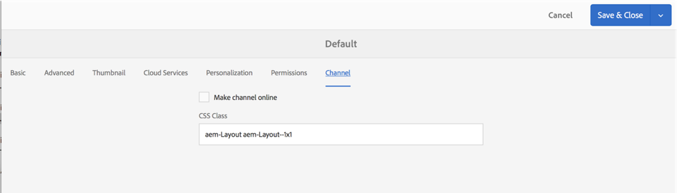

## Exercise 6 - Update Offline Content for your channels

===========

## Tasks

1. For every channel that you have created, open it up it’s dashboard.  You can get there via the location dashboard by clicking on the channel link

2. Click on the Channel Information module menu (…) & Select Update Offline Content.  Ensure that all channels have offline content created, otherwise your player experience will skip over the content.

**NOTE**
If you choose not to use offline content, you can disable it via the channel property.
	
In the Channel Properties, select Channel & check the “Make channel online”

