## Exercise 7 - Attaching a player to your location

===========

## Tasks

**NOTE**
On a OSX, there is a shortcut to get out of full screen.  Control + Command + F

On Electron/Windows, you must ALT+Tab to bring up the switcher & you must quit the application.

1. Open your Screens player and ensure that the admin configuration is on the registration tab.
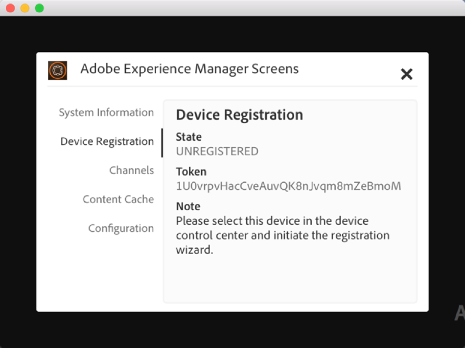

2  In AEM, go to the Device folder & click on Device Manager
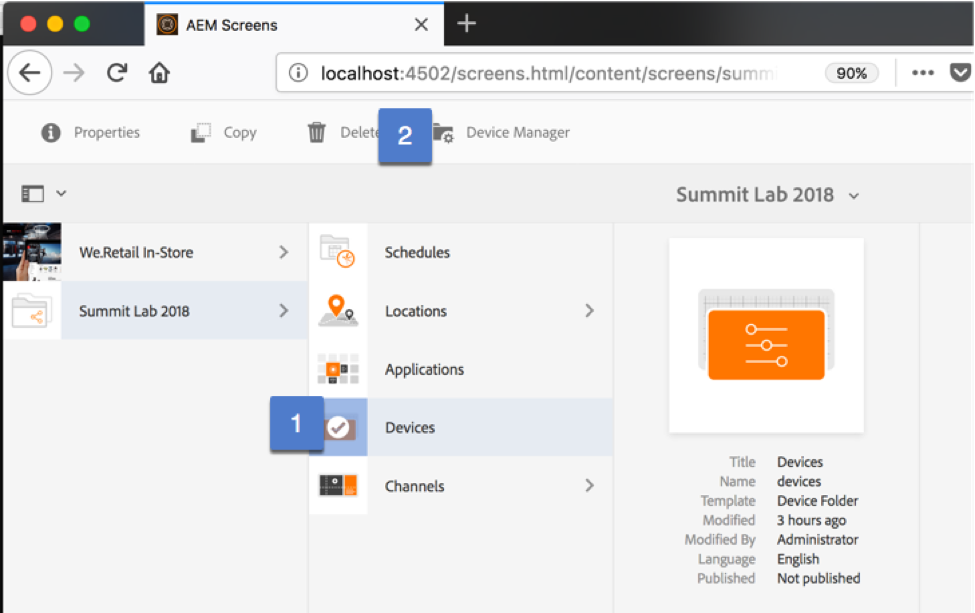

3. From the Device Manager, click on Device Registration
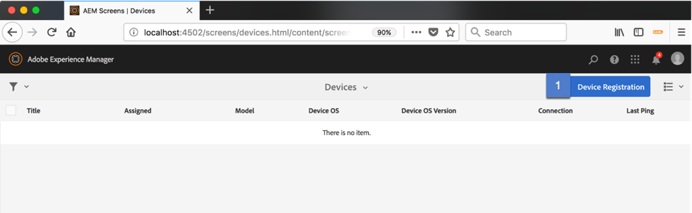

4. From the Device Registration Page, find the matching token
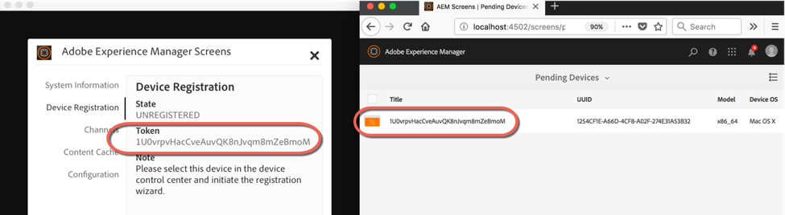

5. Select the correct token & click Register Device
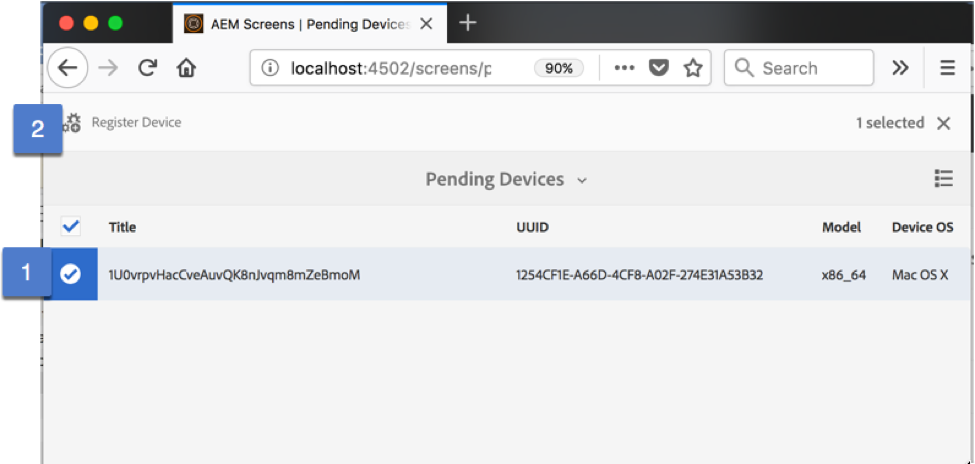

6. Ensure your Registration code matches & then click Validate
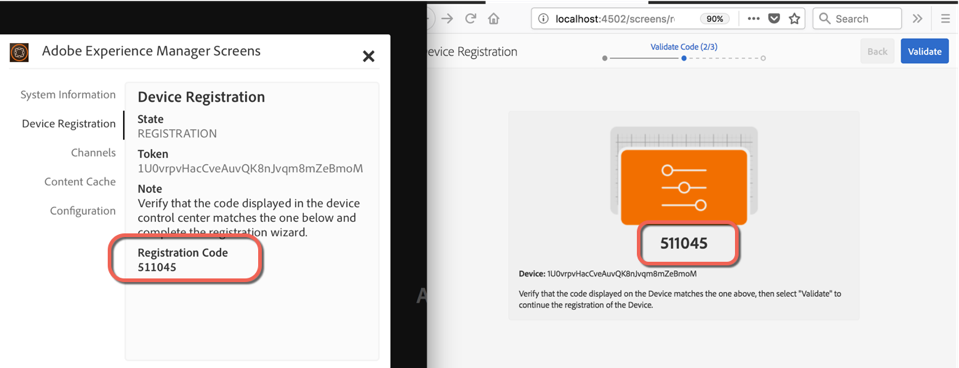

7. Enter a name for your player & select automatic & then click Register.

I'm going to use my AEM player.  you can use whatever you wish.
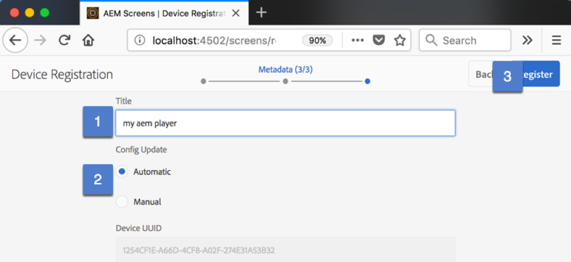

8. When the confirmation dialog popsup, select Finish
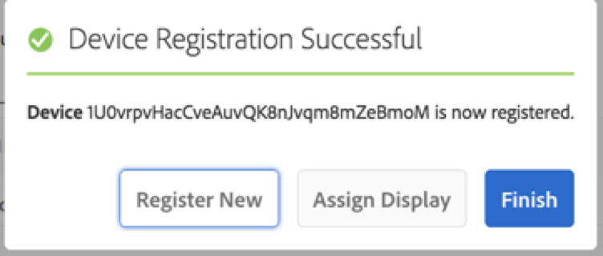

9. Go to the location where you intend to attach your physical player.  

For example, Go to the Lab Front of the Room primary panel Dashboard. http://localhost:4502/screens/dashboard/display.html/content/screens/summit-lab-2018/locations/las-vegas/lab/front-of-the-room/primary-panel
   
From the Device Detail Module, select the (unassigned) Device Configuration Node & click on Assign Device.
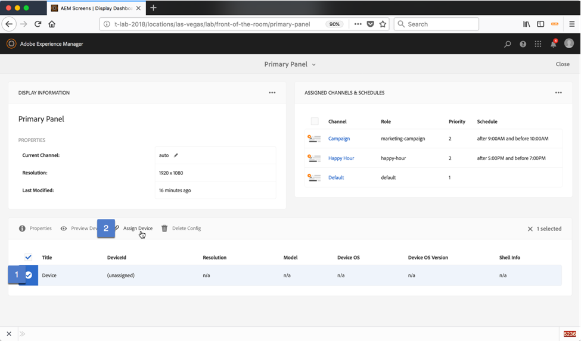

10. Select your recently registered AEM Player & click Next & complete the wizard
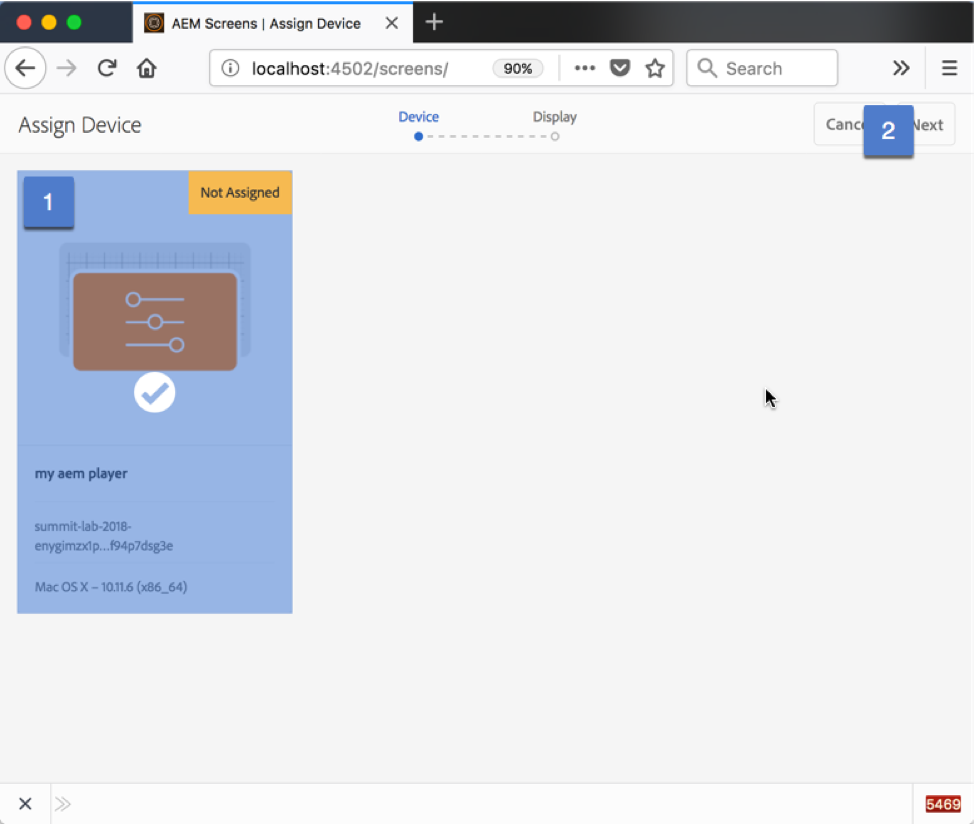

** Why do i get a blank screen**
Click on the bottom left of your screen player to bring up the channel switcher.  Ensure that channels are found & that one of them is selected.

If none are selected, your schedule may not be correct.

If no channels, check the location dashboard to ensure channels are assigned & offline content is updated
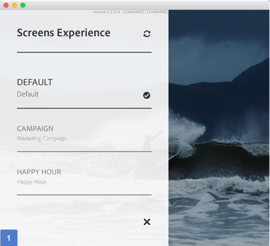

Go to the Device dashboard by clicking on your screen player link via the Location dashboard.

From the Device Dashboard, click on clear cache.  Watch the player for the synching message – ensure there are no errors
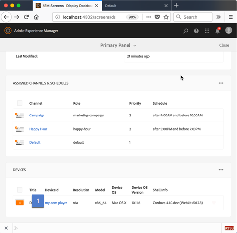
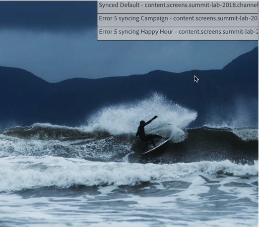

From the Device Dashboard, ensure there is a valid heartbeat.

