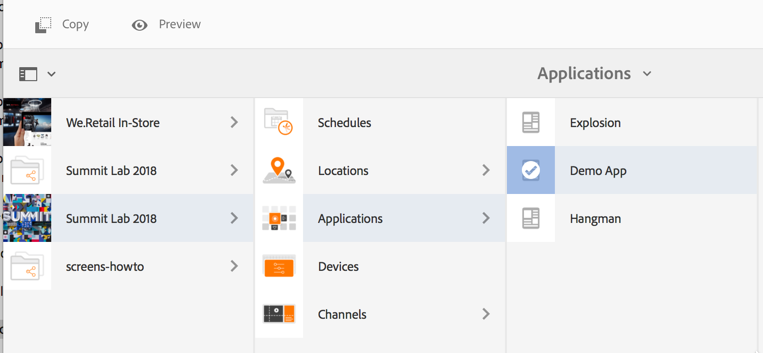
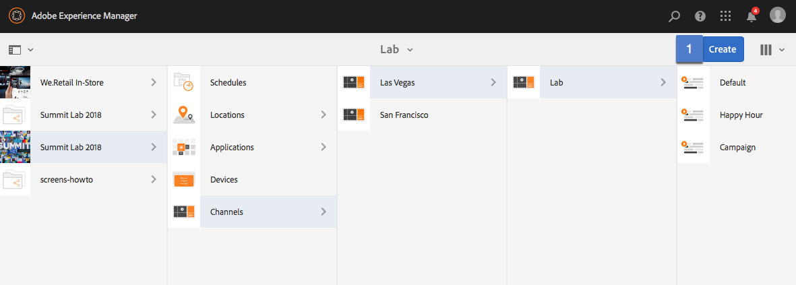
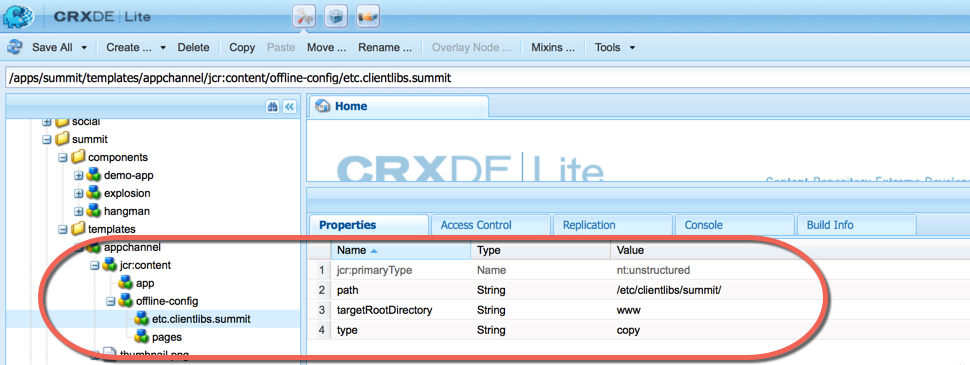
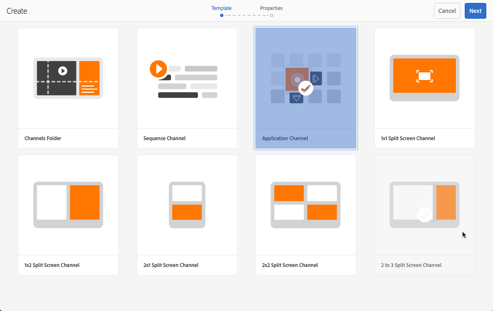
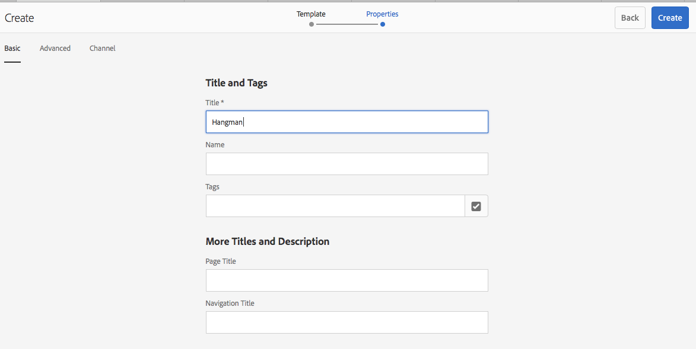
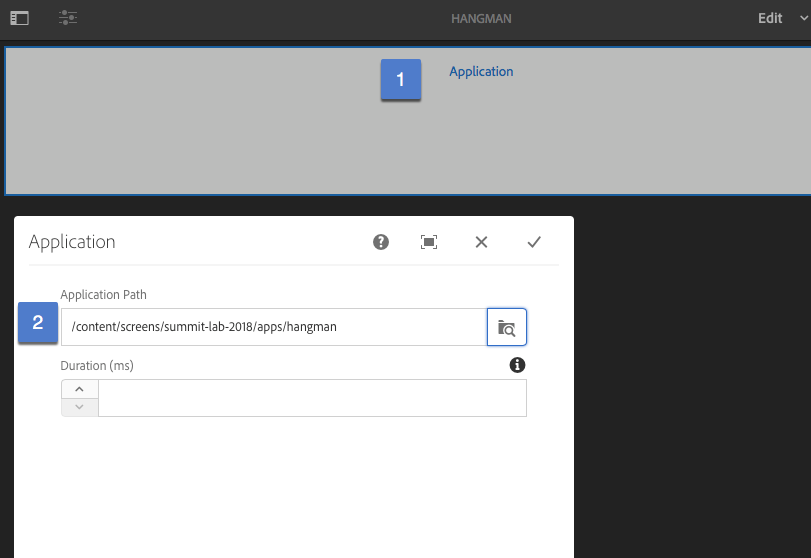

## Exercise 7 - Attaching an Application
===========

## Objective
In this lesson, we will learn how to leverage applications within a player by creating the application, applying the application within an Application Channel & finally scheduling your application channel within your Location.

## Tasks

1. Install the package [L727-Screen-Apps.zip](../../Packages/L727-Screen-Apps.zip)

1.1 download the package

1.2 Install via Package Manager  http://localhost:4502/crx/packmgr/index.jsp

2. Click on Applications, select any of the applications & click Preview

3. Go to your Channels folder, Select new Entity

4. Select Channels Folders & create a folder calls apps

5. Open CRX DE Lite --> http://localhost:4502/crx/de/index.jsp#/apps/summit

5.1 Within /apps/summit, create a folder called templates.

5.2 Overlay (copy the appChannel node from /libs/screens/core/templates/appchannel to /apps/summit/templates/

5.3 Copy the offline-config node from the sequencechannel located /libs/screens/core/templates/sequencechannel/jcr:content/offline-config to /apps/summit/templates/appchannel/jcr:content/offline-config

5.4 keep the pages node, but remove the rest.

5.5 create a new node (nt:unstructured) called etc.clientlibs.summit

5.6. Add a property called path (type String) with a value  /etc/clientlibs/summit/

5.7  Add a property called targetRootDirectory (type String) with a value www

5.8  Add a property called type (type String) with a value copy

5.9  Change the property title in the location /apps/summit/templates/appchannel from Application Channel to Application Channel w/ Offline

6. From the apps folder, create a new entity & then select the Applications Channel w/ Offline Tile

7. Create an Application called Hangman

8. Click on the Hangman Application Channel & Select Edit.   Double click the Application component & select the path for the Hangman app

9. Create application channels for Hangman.

- Use Priority Level 3
- Use Supported Events:  Initial Load

From your location dashboard, click on preview to load the experience

10. Create application channels for Demo App & Explosion.  To view Demo App, use a higher priority of (4) & supported events Initial Load to view the other applications.  To view Explosian, again use a higher priority & the Initial View event.

