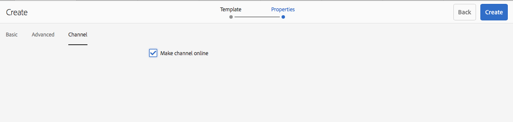

## Exercise 7 - Attaching an Application
===========

## Objective
In this lesson, we will learn how to attach a phsyical screen player to a location.

## Tasks

1. Install the package [L727-Screen-Apps.zip](../../Packages/L727-Screen-Apps.zip)

1.1 download the package

1.2 Install via Package Manager  http://localhost:4502/crx/packmgr/index.jsp

2. Click on Applications, select any of the applications & click Preview

3. Go to your Channels folder, Select new Entity

4. Select the Applications Channel Tile

5. Create an Application called Hangman

6. Go into the Channel Property & Select "Make channel online"

7. Re-order the priorities of your primary display
 
 - Marketing Campaign role should be priority 3 with after 9:00AM and before 10:00AM
 - default role should be priority 2
 - Add a new channel called hangman.  The supported events should be User Interative only
 

 8. From the Locations Dashboard, click on preview to view your content.  While it is playing, click on the screen to trigger the interactive trigger

 **Note**
 the idle channel should play by default
 when a user clicks on the screen, the User Interaction trigger fires & switches channel to the hangman application.
 You can interact with the screen to play hangman

