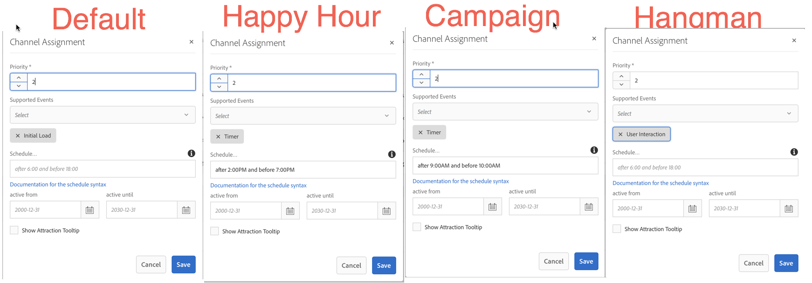

## Exercise 9 - Using Supported Events
===========

## Objective
In this lesson, we will learn how to leverage supported events to alter the channel within the player

## Tasks

## NOTE
Please make sure that content is updated for all your channels

Scenario 1:  Matching Events, higher Priorities

- Modify all Channels to have the same priority level 2
- Default Channel should have event "Initial Load"
- Happy hour Channel should have event "Timer" +  a schedule "after 5:00PM and before 7:00PM"
- Campaign Channel should have an event "Timer" + a schedule "after 9:00AM and before 10:00AM"

Results:
- The initial load event fires when the player loads -->   Default Channel loads
- The initial load event is not present in any other channel assignment --> no matter what other channels have higher priorities, only Default will load
- The Timer event is present & the Marketing Campaign schedule matches --> The Campaign channel **should** load (but it doesnt) 
 
Scenario 2: Modify all channels except for default to have a priority level 3

- Modify Campaign, Hangman, Happy hour channels to Priority level 3

Results:  
- Default Channel loads, within a minute or so the Campaign channel loads

Sceneario 2.1:  Add initial load to the Marketing Campaign Channel
- Campaign channel loads immediately

Result:
- Default channel still loads when the player starts
- Clicking on the screen causes the hangman application to fire

Scenario 3:  Update the Marketing Campaign Channel to run every weekday between 10:00AM and 11:30AM

Scenario 4:  Update your Happy hour channel to run only in the Bar location after 7PM to 2AM

## Hint:  https://bunkat.github.io/later/parsers.html#cron

