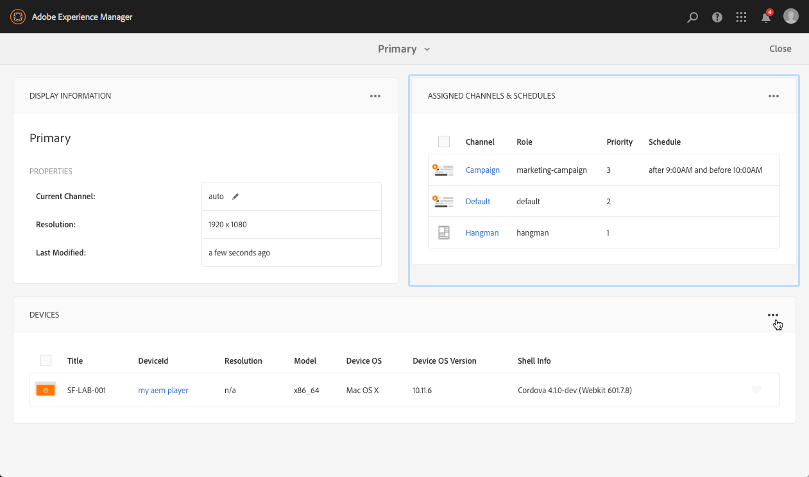
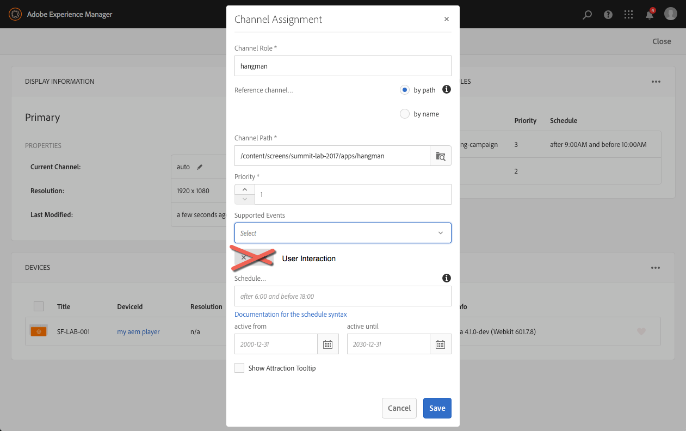

## Exercise 9 - Using Supported Events
===========

## Objective
In this lesson, we will learn how to leverage supported events to alter the channel within the player

## Tasks

Scenario 1:  Matching Events, higher Priorities

- Modify all Channels to have the same priority level 2
- Default Channel should have event "Initial Load"
- Happy hour Channel should have event "Timer" + 

1. Re-order the priorities of your primary display
 
 - Marketing Campaign role should be priority 3 with after 9:00AM and before 10:00AM
 - default role should be priority 2
 - Add a new channel called hangman.  The supported events should be User Interative only
 

12. From the Locations Dashboard, click on preview to view your content.  While it is playing, click on the screen to trigger the interactive trigger

 **Note**
 the idle channel should play by default
 when a user clicks on the screen, the User Interaction trigger fires & switches channel to the hangman application.
 You can interact with the screen to play hangman
