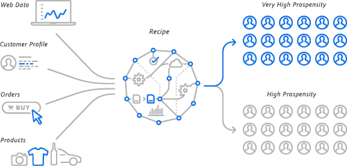

# L775 - Powering Digital Experiences with AI & ML on Adobe Cloud Platform

Lab Abstract

The core of the next generation of digital experiences is a consolidated view of your customer and experience data combined with intelligent services to power rich experiences at scale. Get an early preview and learn how the Adobe Cloud Platform (scheduled for general availability in 2018) will take your data, standardize it using Adobe Experience Data Model (XDM), and apply Artificial Intelligence and Machine Learning to automate your brand's digital experience.

Instructors
- Pari Sawant (Dir, Product Management, Digital Marketing)
- Seth Reilly (Sr Mgr, Engineering, Digital Marketing)

Adobe Solutions Used in This Lab
- Adobe Cloud Platform
- Adobe Audience Manager

Required Resources
- Google Chrome Browser (for best experience)
- Adobe Cloud Platform: https://ui-prod1-va7.cloud.adobe.io/
- Audience Manager: https://bank-beta.demdex.com/
- Credentials: *Provided by Lab Instructor*

## [Exercise 1 - Data Exploration](exercise1)
- Data Exploration
- Understanding the Schemas
- Previewing Sample Data
- Data Governance

## [Exercise 2 - Instance Creation and Training](exercise2)

- Creating an Instance of a Machine Learning Recipe
- Running Training Experiments
- Evaluating the Performance of Your Experiments
- Identifying an Experiment to Publish

## [Exercise 3 - Publishing an Intelligent Service and Making Predictions](exercise3)
- Publishing an Experiment as an Intelligent Service
- Making Predictions Using Batch Scoring

## [Exercise 4 - Audience Manager Integration](exercise4)
- Preview Adobe Cloud Platform > Audience Manager Integration
- Explore Audience Manager Datasources and Traits
- Explore Audience Manager Segments powered by Adobe Data Science Workspace

Let's go! ➡[Exercise 1](exercise1/README.md)
