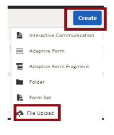

# L723 - [Forms] Authoring Adaptive Forms

## Prerequisites

1. AEM 6.4 author instance
2. Forms add-on installed

## Setup

1. Point your browser to [http://localhost:4502/crx/packmgr/index.jsp](http://localhost:4502/crx/packmgr/index.jsp)
2. Login in using your AEM credentials. The default credentials are admin/admin
3. Click on upload package. Browse and select **Summitfragments.zip** from the [packages folder](./packages). Click on Install package to install the package contents.
4. Repeat the above step and install:
	* **SummitLabTheme.zip**
	* **SummitPostDorToDam.zip** 
	* **WebChannelDelivery.zip**
5. Follow the instructions mentioned in [L723Handbook.pdf](L723Handbook.pdf) to complete the tutorial

## Testing

The completed form is available as **723CompletedForm.zip** in the assets folder. To import the completed form please follow the following steps:

1. Point your browser to [http://localhost:4502/aem/forms.html/content/dam/formsanddocuments](http://localhost:4502/aem/forms.html/content/dam/formsanddocuments)
2. Click Create | File Upload as shown. Select **723CompletedForm.zip**.

3. Test the form by pointing your browser to [http://localhost:4502/content/dam/formsanddocuments/summit/peak-application-form/jcr:content?wcmmode=disabled](http://localhost:4502/content/dam/formsanddocuments/summit/peak-application-form/jcr:content?wcmmode=disabled)