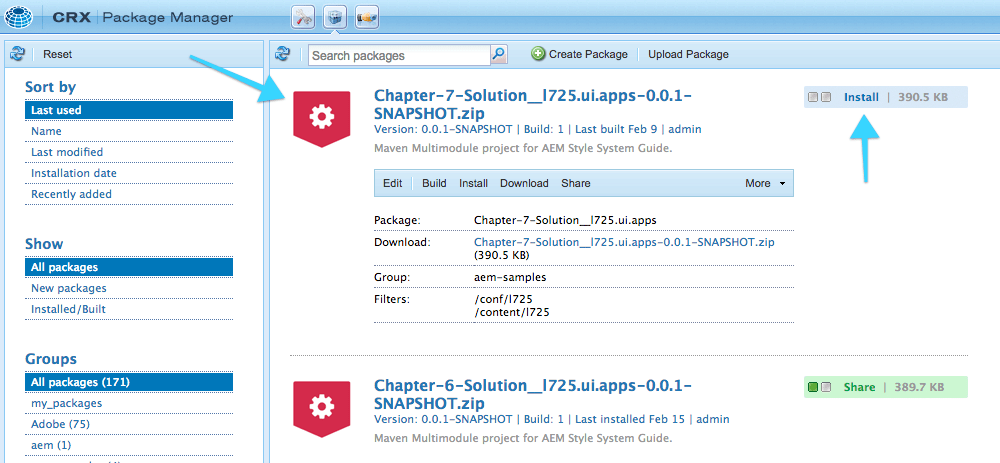

## Chapter 0: The Set Up

### Log In to AEM

1. Open the Chrome web browser
2. Navigate to **http://localhost:4502** and log in using:
	* Username `admin`
	* Password `admin`

### Install Starter Package

1. Download the following packages:
	1. [core.wcm.components.sandbox.all-0.0.1-SNAPSHOT.zip](../../packages/starter-packages/core.wcm.components.sandbox.all-0.0.1-SNAPSHOT.zip)
	2. [l725.ui.apps-0.0.1-SNAPSHOT.zip](../../packages/starter-packages/l725.ui.apps-0.0.1-SNAPSHOT.zip)
2. Navigate to  **CRX Package Manager** ([http://localhost:4502/crx/packmgr](http://localhost:4502/crx/packmgr))
3. Upload and install the above packages.

### Helpful Links

* **AEM Start**: [http://localhost:4502/aem/start.html](http://localhost:4502/aem/start.html)
* **Home Page Template**: [http://localhost:4502/editor.html/conf/l725/settings/wcm/templates/home-page-template/structure.html](http://localhost:4502/editor.html/conf/l725/settings/wcm/templates/home-page-template/structure.html)
* **Home Page**: [http://localhost:4502/editor.html/content/l725/dopetrope.html](http://localhost:4502/editor.html/content/l725/dopetrope.html)
* **CRX Package Manager**: [http://localhost:4502/crx/packmgr/index.jsp](http://localhost:4502/crx/packmgr/index.jsp)
* **CRXDE Lite**: [http://localhost:4502/crx/de/index.jsp](http://localhost:4502/crx/de/index.jsp)

### Chapter Solution Packages

Solution packages for each chapter can be found [here](../../solution-packages).

Note that this lab's solution packages all have the "red shield" icon.

To install a solution package:

1. [Locate the Chapter solution package to install](../../solution-packages), the naming is in the format:
	* `Chapter-#-Solution_l725.ui.apps-0.0.1-SNAPSHOT.zip` where `#` is the chapter to provide the solution for.
2. Download the package
3. Navigate to  **CRX Package Manager** ([http://localhost:4502/crx/packmgr](http://localhost:4502/crx/packmgr))
4. Upload and install the package

## Next - Chapter 1

[Chapter 1](../chapter-1)
