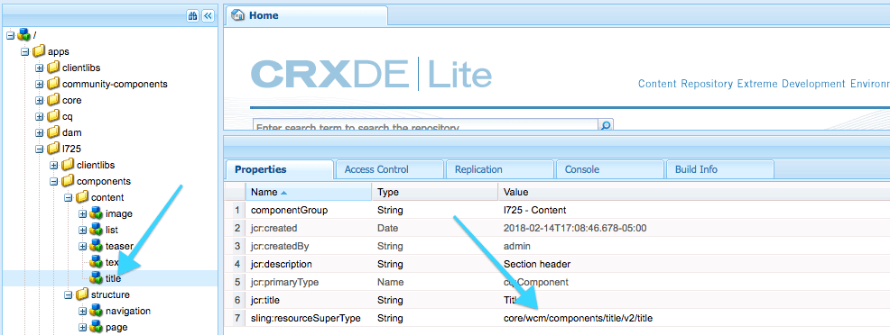

## Chapter 1: AEM Core Components

### Review & Learn

<dl class="tags">
<dt>Participating Personas</dt>
<dd>AEM Developer</dd>
</dl>

[Adobe Experience Manager Core Components](https://github.com/Adobe-Marketing-Cloud/aem-core-wcm-components) are a set of standardized components that can be used to speed up development of websites. 

Core Components are versioned and installed separately from AEM. Core Components have an independent release cycle with more frequent updates throughout the year.

### Including Core Components in your AEM project

Core Components should never be used directly, but rather proxied in by the custom application. The proxy components are simply `cq:Component` resource definitions with a `sling:resourceSuperType` that points to appropriate version of the corresponding Core Component components.

 
#### Proxy of the Title Core Component

```
/apps/l725/components/content/title
   @jcr:primaryType = cq:Component
   @sling:resourceSuperType = core/wcm/components/title/v2/title
```

### HTML as a Public API

Core Components are standardized on [BEM](http://getbem.com/) (Block Element Modifier) naming methodology, and use this to define Core Components' stable, public HTML APIs.

> When writing CSS and JavaScript for Core Components, only target the BEM CSS classes, and avoid selecting bare elements.

Below is the BEM notation for the Title component

```
BLOCK cmp-title
    ELEMENT cmp-title__text
```

### Step by Step

<dl class="tags">
<dt>Participating Personas</dt>
<dd>AEM Developer</dd>
</dl>

Review the L725 project proxied AEM Core Components.

1. Navigate to CRXDE Lite ([http://localhost:4502/crx/de/index.jsp](http://localhost:4502/crx/de/index.jsp)) via the Bookmarks.
2. Expanding `/apps/l725/components/content`.
3. Tap the **title** node.
4. See in the properties the `sling:resourceSuperType`.
5. Repeat for **image**, **list** components.



## Next - Chapter 2

[Chapter 2](../chapter-2)