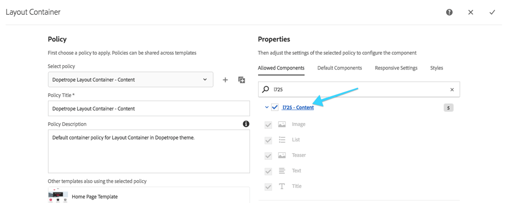

## Chapter 2: Preparing the Page Template

Editable Templates gives the Web Producer significant control over the page layout, without any coding. Templates are also where various policies are configured to provide granular control over the content that can be created on pages.

In this chapter the Home Page Template is updated with a Title and Navigation structural components. The allowed components of the Layout Container are updated.

### Step by step

<dl class="tags">
<dt>Participating Personas</dt>
<dd>Web Producer</dd>
</dl>

1. From the AEM Start Menu Navigate to **Tools (Hammer icon) > General > Templates**.
2. Tap into the **L725 Folder**.
3. Hover over **Home Page Template** and tap the **Pencil** icon to open.

4. Ensure **Structure** mode is enabled in the **top right**.
5. Open the left **Sidebar** and tap the **Components** icon.

6. Drag a **Title** component to the very top of the page.
7. Edit the **Title** component by tapping the **Wrench** icon.

	* In the dialog for the **Title** input the text `Summit 2018`.
8. Drag a **Navigation** component from the side panel onto the page **beneath the Title** component and **above the first Layout Container**.
9. Tap the **Policy** icon to open the Navigation component's Policy.
	
	* Verify **Navigation Root** is set to `/content/l725/dopetrope`.
10. Select the **1st Layout Container** and tap the **Policy** icon.
	1. In the Allowed Components Tab search for **l725**.
	2. Check the box for **l725 - Content**.

	3. **Save** the changes by taping the **Check** icon in the top right.

### Final

After completing the above steps, the Home Page Template should look like:

## Next - Chapter 3

[Chapter 3](../chapter-3)