## Chapter 3: Content-first Authoring

Embracing Core Components and the Style System empowers content-first authoring. 

*Content-first authoring is the idea that content authoring can begin in parallel, and sometimes before, the Sites' branding rules are defined and implemented.*

Using content wire framing techniques that include:

* A basic wireframe style
* AEM's responsive Layout Container

A fully authored page that conceptually, though not visually, represents the page and its content, can be created before the visual styling is applied.

While style is of utmost important in creating an engaging experience, the content is the foundation of the website.

### Step by step

<dl class="tags">
<dt>Participating Personas</dt>
<dd>Experience Author</dd>
</dl>

*The page is pre-populated with several authored components to expedite the authoring.*

1. From the AEM Start Menu Navigate to **Sites > L725**, select the **Dopetrope** page and tap **Edit** in the top action bar, or tap the **Home Page** from the Bookmarks.
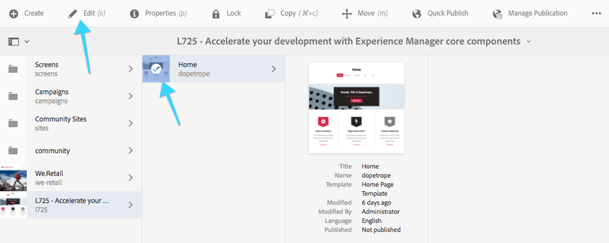
2. Ensure **Edit** mode is enabled in the **top right**.
3. Open the left Sidebar and tap the **Components** icon.
4. Drag a **Teaser** component onto the page.
5. Select the newly added **Teaser** component, and tap the **edit** (wrench) icon.
	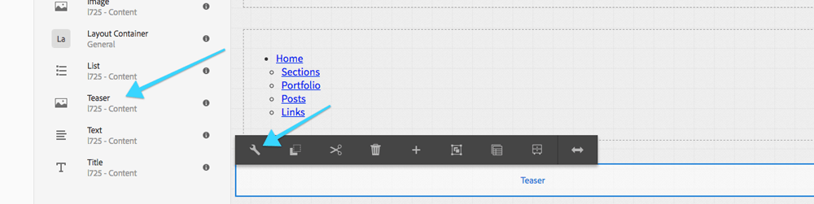 
	1. In the side panel **switch to the Assets panel**.
	2. Search for `gear-icon` it should be a **red shield with a gear**.
	3. Drag and drop the **gear-icon** image into Teaser's dialog drop-zone.
	4. Fill out the Teaser's fields
		* **Link**: `/content/l725/dopetrope`
		* **Link Text**: `Get Started`
		* **Title**: `Any title text you want!`
		* **Description**: `Any description text you want!`
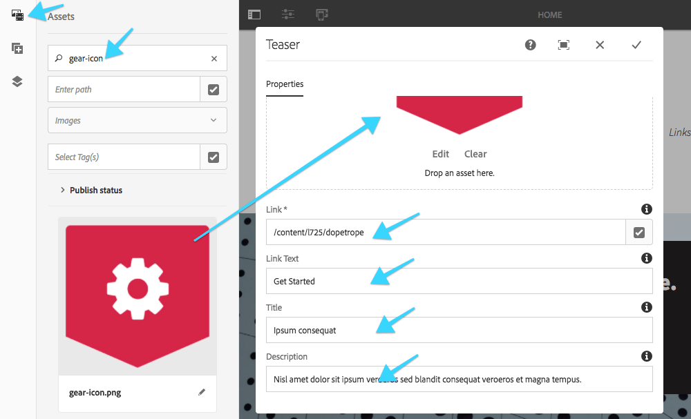
6. Switch to **Layout** mode by tapping the **Edit** dropdown in the right corner of the top action bar.
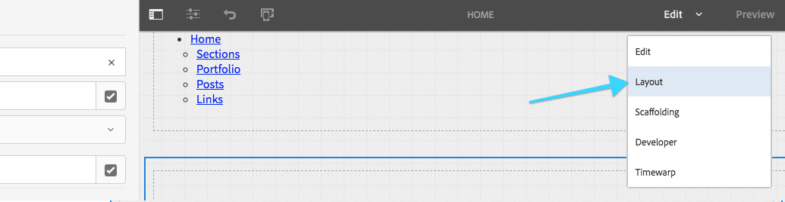
7. Select the **Teaser** Component **layout handle** (blue circle) on the **right** side. *You may need to scroll the page*
	1. Resize the component by dragging the **layout handle** from **right** to **left**.
	2. Resize the component until it spans **4** columns. *There should only be 2 light blue columns inside the handle.*
	3. This makes this teaser component 1/3 of the page width.
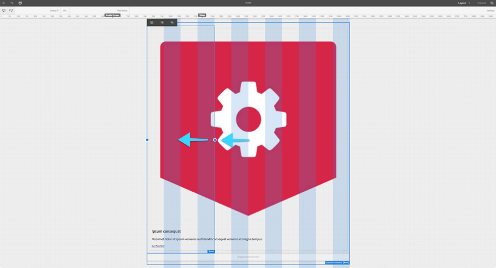
8. While in Layout mode the mobile emulator toolbar appears beneath the top menu representing various device widths.
	1. **Tap** the device width labeled **iPh..** to switch to mobile device width.
	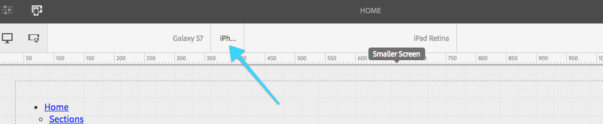
	2. **Resize** the Teaser component by dragging the **Layout Handle** full width from **left** to **right**. 
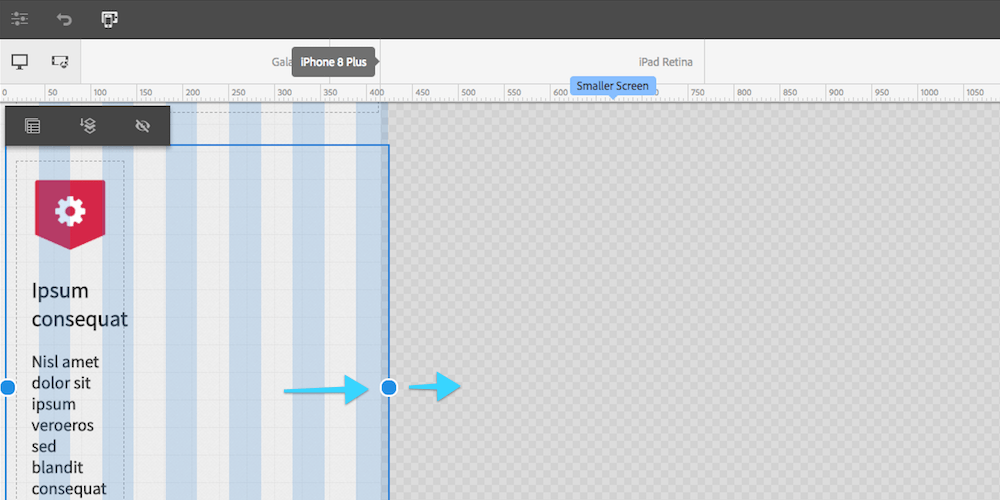
9. Return to **Edit** mode by tapping the **Layout** mode dropdown in the upper-right corner.
10. Select the **Teaser Component** and tap the **Copy** icon.
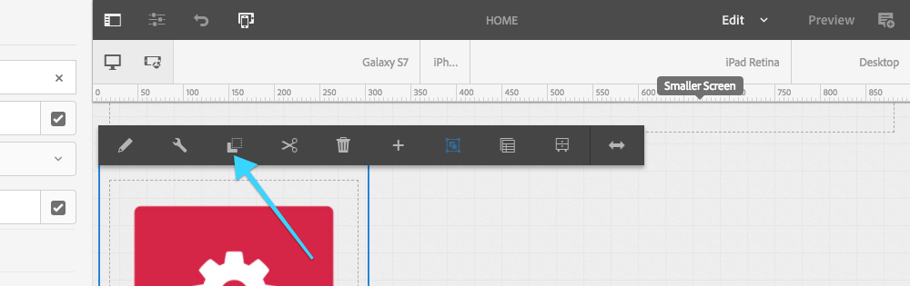
11. Select the drop zone beneath the teaser component and tap the **Paste** icon to paste the teaser component.
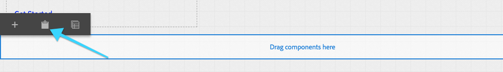
12. Repeat the above step to paste the teaser icon a second time. **There should now be three teasers across in Desktop width**.
13. **Edit** the middle teaser component by tapping the **wrench** icon.
	1. In the side panel switch to the Assets panel
	2. Search for `bolt-icon` to find the **black shield with a lightning bolt** image.
	3. Drag and drop the **bolt-icon.png** image into Teaser dialog drop zone
	4. **Link**:`/content/l725/dopetrope`
	5. **Link Text**: `Get Started`
	6. **Title**: `Any title text you want!`
	7. **Description**: `Any description text you want!`
14. **Edit** the 3rd teaser component by tapping the **wrench** icon.
	1. In the side panel switch to the Assets panel
	2. Search for `star-icon` to find the **grey shield with a star** image.
	3. Drag and drop the **star-icon.png** image into Teaser dialog drop zone
	4. **Link**: `/content/l725/dopetrope`
	5. **Link Text**: `Get Started`
	6. **Title**: `Any title text you want!`
	7. **Description**: `Any description text you want!`
15. There should now be 3 teasers, equally spaced across the desktop view.
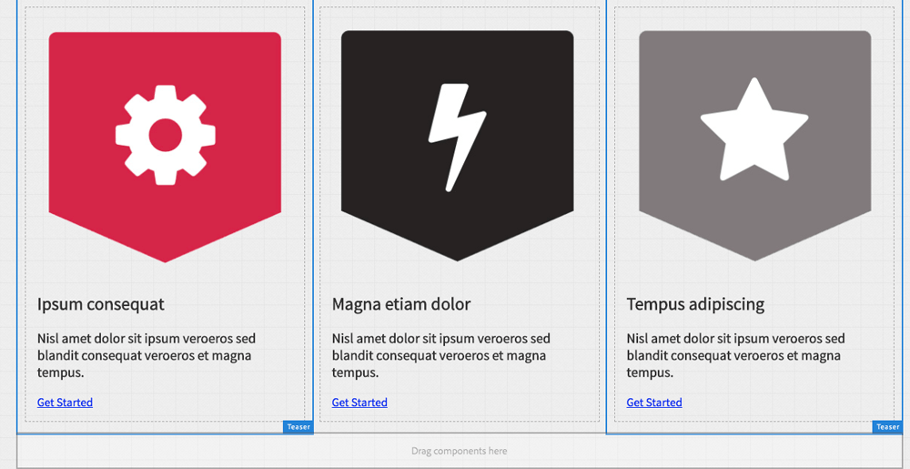
16. Now that we have had a taste of Authoring we will **install the Chapter 3 Solution Package**, to get a fully authored page.
	1. Download [Chapter-3-Solution__l725.ui.apps-0.0.1-SNAPSHOT.zip](../../packages/solution-packages/Chapter-3-Solution__l725.ui.apps-0.0.1-SNAPSHOT.zip)
	2. Navigate to **CRX Package Manager** ([http://localhost:4502/crx/packmgr/index.jsp](http://localhost:4502/crx/packmgr/index.jsp))
	3. Upload **Chapter-3-Solution__l725.ui.apps-0.0.1-SNAPSHOT.zip** package
	4. Tap the **Install** button to install the **Chapter-3-Solution__l725.ui.apps-0.0.1-SNAPSHOT.zip** package.
	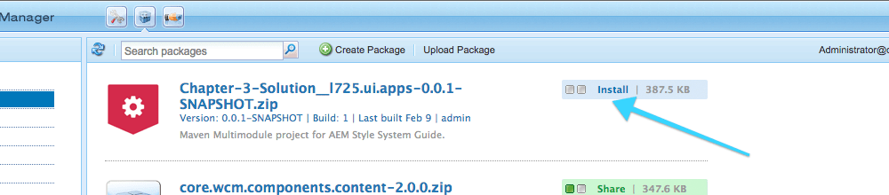
	*This will replace your authored content, so don't be alarmed!*
	5. Switch back to the **Home Page**.

## Next - Chapter 4

[Chapter 4](../chapter-4)

### Final

You can now see the **Home Page** populated with multiple components.
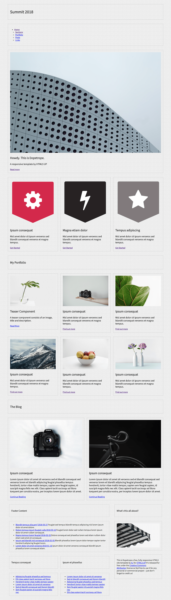

