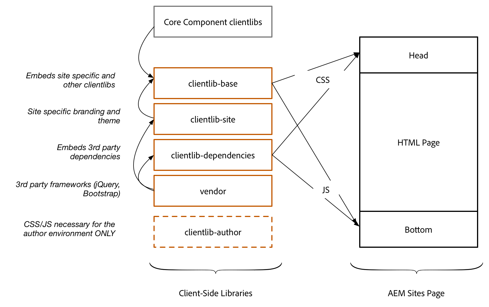

## Chapter 4: Organizing Client Libraries, CSS & JavaScript

#### Review & Learn

<dl class="tags">
<dt>Participating Personas</dt>
<dd>Front-end Developer</dd>
</dl>

AEM's Client Libraries provides a mechanism to organize and manage CSS and JavaScript files necessary for an AEM Sites implementation. The basic goals for client libraries or clientlibs are:

* Store CSS/JS in small discrete files for easier development and maintenance.
* Manage 3rd party dependencies in an organized fashion.
* Minimize the number of client-side requests by concatenating CSS/JS into a minimal number of HTTP requests.
* Minify CSS/JS that is delivered to optimize speed/performance of a site.

### Organizing Client Libraries

Below is an example way to organize the top-level client library folders.



### Step by Step

<dl class="tags">
<dt>Participating Personas</dt>
<dd>Front-end Developer</dd>
</dl>

We are going to be inspecting the **L725** project client libraries.

1. In a new tab navigate to CRXDE Lite ([http://localhost:4502/crx/de/index.jsp](http://localhost:4502/crx/de/index.jsp)) or navigated via Bookmarks.
2. Expand the **/apps/l725/clientlibs** node.

```
/apps
	/l725
 		/clientlibs
			/clientlib-author
			/clientlib-base
			/clientlib-dependencies
			/clientlib-dopetrope
			/clientlib-wireframes
```

#### Dopetrope Client Library

LESS (which stands for Leaner Style Sheets) is a backwards-compatible language extension for CSS. It allows front-end developers to use variables, mixins, and nesting to ease the creation and maintenance of CSS. 

Let's inspect the Dopetrope Client Library to see how LESS is used.

1. Expand **clientlib-dopetrope**. In order to make the maintenance of client libraries easier CSS and JS is broken out into multiple files.
2. Double tap **main.less** to open. **main.less** imports all of the different LESS files that makes up the Dopetrope styles.
3. Expand the **clientlib-dopetrope/css** folder and open the **variables.less** file. One of the advantages of using LESS (instead of straight CSS) is that you can create variables and mixins to make it easier to maintain consistent brand styles.
4. Open **grid.less**. This file includes the AEM Responsive Grid as part of the Dopetrope CSS Client Library. Note that we are able to define the Phone and Tablet breakpoints here, as well as the number of columns available. The inclusion of AEM's **grid.less** is required to allows us to resize the components in **Layout mode** in the Sites editor.

#### Component Styles

Each component has a dedicated folder to include any LESS to style the component. JavaScript that adds additional functionality/behavior to a component is also included in this folder. 

*When implementing the Style System, it is critical to have a standard pattern and organization for component front-end code.*

The following is the pattern we have used in implementing the Dopetrope design:

```
/component-x					<-- All front-end code related to the component
	component-x.js (optional)	<-- Any JavaScript related to the component
	component-x.less			<-- Organized component style imports
	/styles							<-- Folder to contain different styles
		default.less				<-- Default style 
		style-1.less					<-- Style 1 variation
		style-2.less					<-- Style 2 variation
```

1. Expand **/apps/l725/clientlibs/clientlib-dopetrope/components/title**. 
Notice how the pattern has been applied to the Title component. Besides the default style for the Title component there are be 2 additional styles for the **Site Title** and **Section Title**. 
2. Expand **title/styles** folder and open **site.less**. Note that the styles are scoped by the `.cmp-title--site` class at the start of the file.
3. Open **section.less**. Note that the styles are scoped by the `.cmp-title--section` class at the start of the file.

In the next chapter we will configure the Title Component to use these styles.

## Next - Chapter 5

[Chapter 5](../chapter-5)