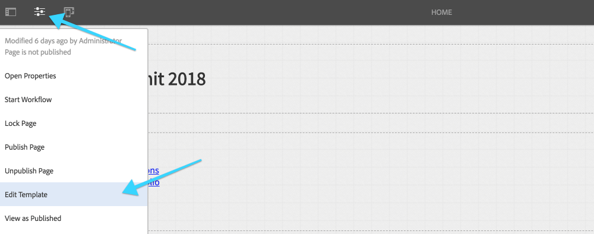
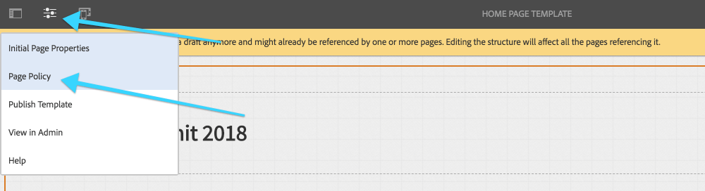
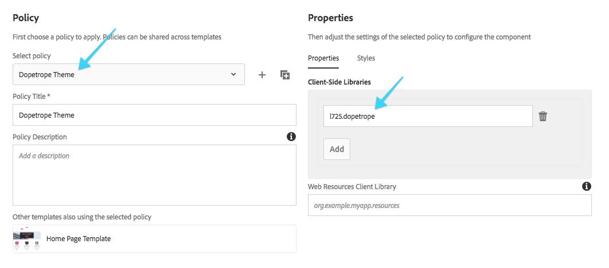
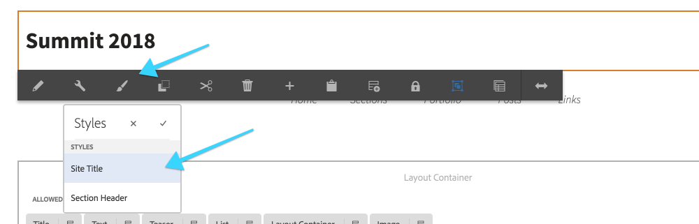
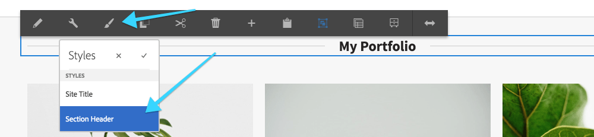
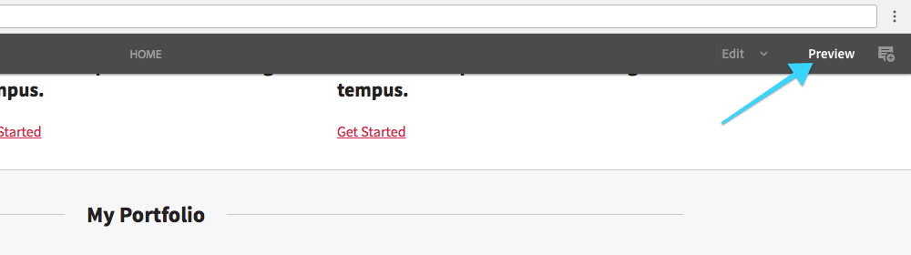
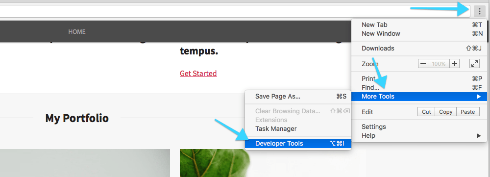
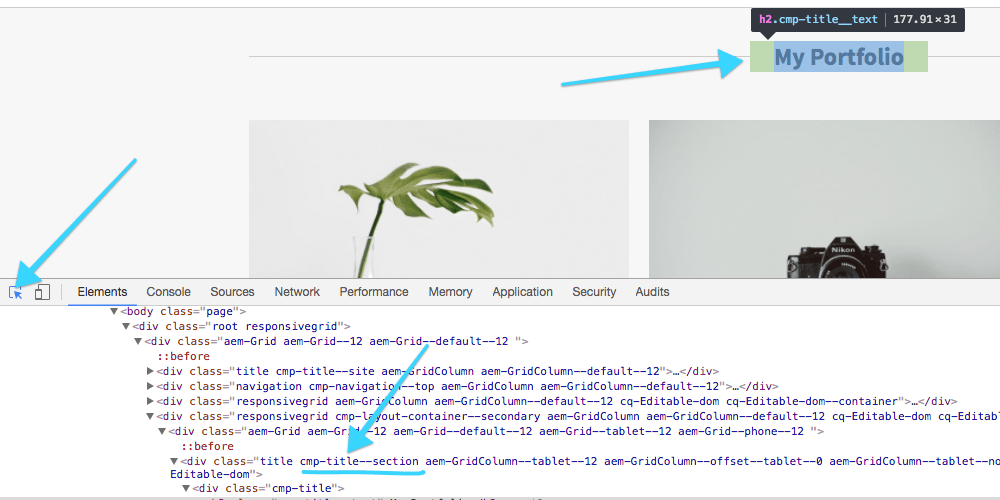
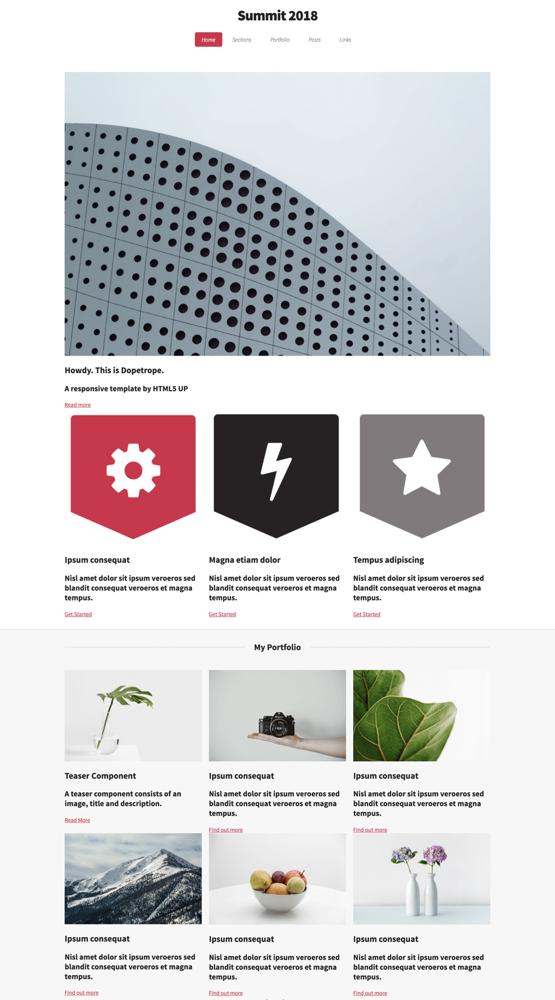

## Chapter 5: Applying the Basic Dopetrope Style

We will now apply the Dopetrope Client Library to the page template. We will also use the Style System to change the style of the Title Component.

### Step by step

<dl class="tags">
<dt>Participating Personas</dt>
<dd>Web Producer</dd>
</dl>

1. Navigate to the **Home Page Template**, then tap the **Page Properties** icon in the top left, and select **Edit Template**. *http://localhost:4502/editor.html/conf/l725/settings/wcm/templates/home-page-template/structure.html*

2. In the **Home Page Template Editor**, tap the **Template Properties** icon in the **top left**, and select **Page Policy**.

3. In the **Select Policy** drop down, choose the **Dopetrope Theme**.
	* Notice that the included **Client-Side Library** has switched to `l725.dopetrope` which loads the Dopetrope CSS and JavaScript.

4. **Save** the Page Policy changes by tapping the **Check** icon in the upper right-hand corner.
	* Notice that the look and feel of the page as completely changed. 
5. Select the **Title** component at the top of the Template, tap the **Styles** icon (paint brush) open the Styles dropdown for the **Title** component.
6. Select the **Site Title** style from the dropdown

7. **Tap** the **small check mark** to close the Styles dropdown.
8. Switch tabs and open the **Home Page** ([http://localhost:4502/editor.html/content/l725/dopetrope.html](http://localhost:4502/editor.html/content/l725/dopetrope.html)) or use the Bookmarks.
9. **Refresh** the **Home page**. The wireframe aesthetic will be replaced with a basic Dopetrope brand style.

10. Scroll midway down the page and location the **My Portfolio**'s **Title** component.
	* Tap **Styles** icon, and select **Section Header** style.

11. Scroll down and select the **The Blog** section's **Title** component, tap the **Styles** icon, and select **Section Header**.
 
### Bonus

1. With the **Home Page** open, tap the **Preview** button in the top right.

2. In the upper-right corner of the Chrome browser select the **three vertical dots** to expose the Chrome menu.
	1. Tap **More Tool > Developer Tools**. This will open the Chrome Developer tools at the bottom of the page.

3. In the upper-left corner of the Chrome Developer tools tap the **Inspect** icon (blue mouse cursor icon).
4. Hover over the **My Portfolio** component and view the HTML source. Notice that the `.cmp-title--section` class is added to the `div` surrounding the **Title Component**. This is the same class that saw in **Chapter 4**.

5. Switch back to **Edit Mode** and toggle off the **Section Header** style. Repeat the above steps and to see the `.cmp-title--section` class is removed from the DOM.
6. Re-apply the **Section Header** style if you had toggled it off.

### Final
After completing the above steps, your screen should look like:

## Next - Chapter 6

[Chapter 6](../chapter-6)