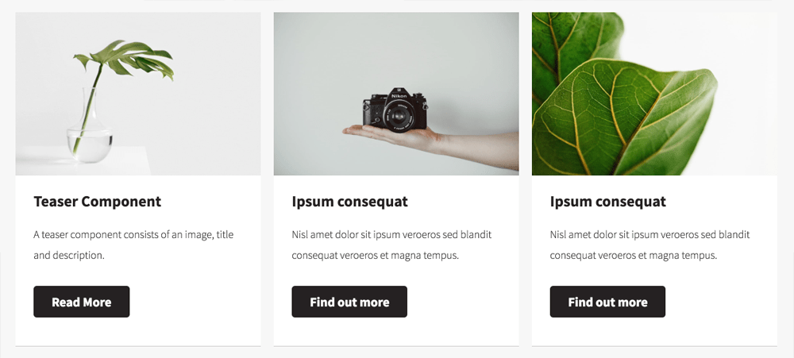
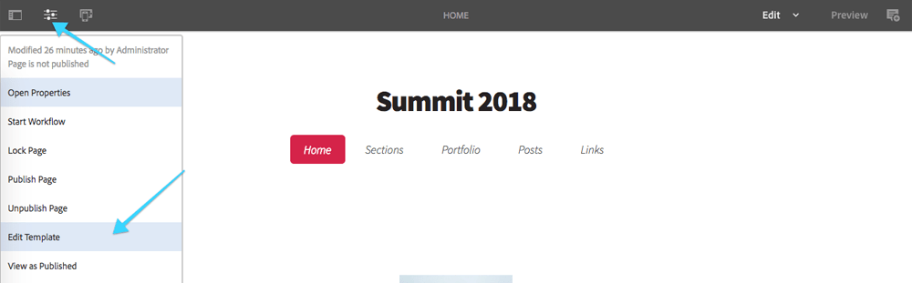
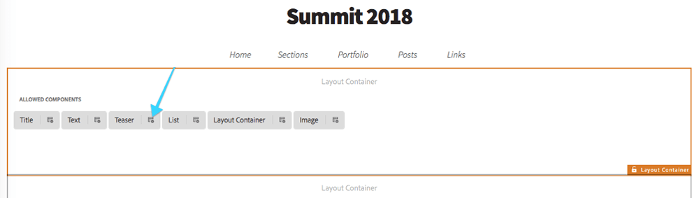
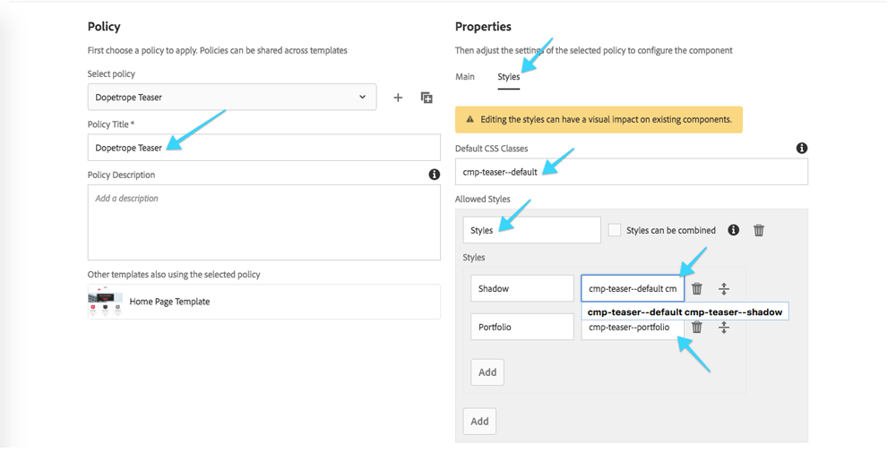
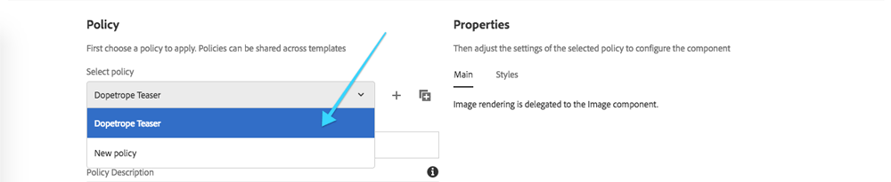
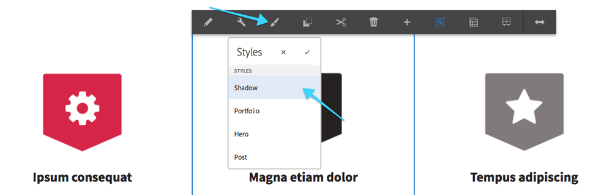
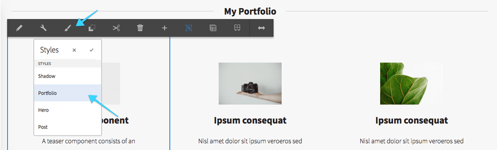
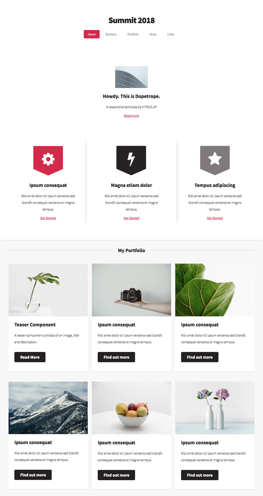

## Chapter 6: Applying the Teaser Component CSS-based Styles

In this chapter the well see how the Web Producer configures Teaser Component to allow the Shadow and Portfolio styles, which are implemented using **only CSS** (or in our case LESS), and how an Experience Author applies these styles to different teasers on the page.

### Review and Learn

<dl class="tags">
<dt>Participating Personas</dt>
<dd>Front-end Developer</dd>
</dl>

Remember, all styling is possible w raw CSS, however we use LESS as it results in cleaner code and AEM natively compiles LESS to CSS.

A few LESS idiosyncrasies used in this file:

* Rules that start with an `@` are LESS **variables**!
* Rules that start with `.` end with `()` for example, `.border-color()`, are LESS **mixins**, and are used to defined re-usable sets of CSS rules in `variables.less`.
* LESS supports **nesting of CSS selectors**. This is handy for ensuring proper namespacing. For example, the following **LESS**...

```
/* LESS */
.foo {
	color: red;
	.bar {
		color: blue;
	}
}
```

..compiles to the following **CSS**...

```
/* CSS */
.foo { color: red; }
.foo .bar { color: blue; }
```

### The Teaser's Portfolio Styles LESS (or CSS)

Each Component Style LESS file is responsible for that style's visual representation. AEM's Core Components and AEM Component development best practices outline that CSS rules should target **BEM (Block Element Modifier)** CSS class names, and these BEM CSS classes are considered the stable HTML API of the component.

* **BLOCK** represents the Component.
* **BLOCK__ELEMENT** represents some logical "part" of the component (hyperlink, text, image, etc.)
*  **BLOCK--MODIFIER** represents a Component Style.

#### Teaser Component's HTML

The Core Component's Teaser component generates the following HTML. The BEM CSS classes define the stable, style-able API that can be safely targeted by our styles.

```
<div class="teaser cmp-teaser--portfolio ... aem-GridColumn--default--4">
	<div class="cmp-teaser">
	    <div class="cmp-teaser__image">
			<div class="cmp-image">
				
		</div>
	</div>

    <h2 class="cmp-teaser__title">Teaser Component</h2>
    <h3 class="cmp-teaser__description">A teaser component consists of an image, title and description.</h3>
    <a class="cmp-teaser__link" href="#">Read More</a>
</div>

```

> The Teaser component is an interesting case as it includes the Core Image Component, and thus has a BLOCK (`.cmp-image`) within a BLOCK (`.cmp-teaser`). 

Pulling the BEM CSS classes from the above HTML, the following API is exposed and safe to target for styling.

```
cmp-teaser--portfolio
cmp-teaser
	cmp-teaser__image
	cmp-image
		cmp-image__image
	cmp-teaser__title
	cmp-teaser__description
	cmp-teaser__link
```

#### Teaser Component's "Portfolio Style" LESS (or CSS)


* **BLOCK** represents the Component.
	* Structural styles (padding, min-height, background, etc.) are applied here, as this wraps the component and has little or no direct content of its own.
* **BLOCK__ELEMENT** represents some logical "part" of the component (hyperlink, text, image, etc.).
	* The bulk of the styles are applied at this level as this directly target the specific parts of the component. 
* **BLOCK--MODIFIER** represents a Component Style.
	* Typically, no styles are applied directly to this class, as this class is attached to responsive grid elements, thus styles applied here may conflict with AEM's Grid styles.
	* The exception is when adjusting the AEM Grid styles is explicitly desired for this style, for example, collapsing the margin between AEM Grid cells. 

> Avoid styling bare elements (p, li, a, span), and prefer the BEM Classes, no matter how tempting.

We can review the CSS (or LESS) for the Teaser's Portfolio style by navigating the **CRXDE Lite** (http://localhost:4502/crx/de) in a new tab, and opening 
`/apps/l725/clientlibs/clientlib-dopetrope/components/teaser/styles/portfolio.less`.

```
.cmp-teaser--portfolio {				<-- BLOCK--MODIFIER (Component Style)
  
  .cmp-teaser {							<-- BLOCK (Component)
    border-style: solid;
    ...

    .cmp-teaser__image {				<-- BLOCK__ELEMENT (Component's Image)
      position: relative;
      ...
    }

	...

    .cmp-teaser__link {					<-- BLOCK__ELEMENT (Component's Link)
      display: block;
      ...
    }	

    /* Responsive style adjustments */

    @media @tablet, @desktop {			<-- CSS MEDIA QUERIES
      .cmp-teaser__link {				<-- BLOCK__ELEMENT (Component's Link)
        display: inline-block;
        ...
      }
    }
  }
}
```

The resulting CSS will be consistently name spaced, and always scoped by the `.cmp-teaser--portfolio` selector, ensuring these rules do not leak and accidently effect other Teaser styles.

```
.cmp-teaser--portfolio .cmp-teaser { ... } 						<-- Selector weight of 2
.cmp-teaser--portfolio .cmp-teaser .cmp-teaser__image { ... } 	<-- Selector weight of 3
.cmp-teaser--portfolio .cmp-teaser .cmp-teaser__link { ... }	<-- Selector weight of 3

```
This allows the application of the Component Style by simply set any parent DOM element of the Component has the Component Style CSS Class (`.cmp-teaser--portfolio`) applied. This means Component styles can be applied specifically for each component, or even in more advanced use cases, at the Layout Container or Page level!

> Always try to keep consistent selector weight, via consistent nesting depth as described a above as it helps avoid CSS rule collisions in more advanced use cases.

### Step by Step

<dl class="tags">
<dt>Participating Personas</dt>
<dd>Web Producer</dd>
<dd>Experience Author</dd>
</dl>

1. From the **Dopetrope** page tap the **Page Properties** icon in the top left, and select **Edit Template**.

2. In the **Template Editor**, locate the **1st Layout Container** and tap its **Teaser's Policy** icon.

3. Create a new Policy by entering `Dopetrope Teaser` into the **Policy Title** text field.
	1. Tap the **Styles** tab on the right.
	2. Add the **Default CSS Classes**: `cmp-teaser--default`
	3. Tap **Add** under **Allowed Styles**.
	4. Enter the **Group Name** `Styles`.
	5. For each new style, tap **Add** under the **Style** sub-heading, and enter the following **Style Name** and **CSS Classes** pairs:
		* `Shadow` &rarr; `cmp-teaser--default cmp-teaser--shadow`
		* `Portfolio` &rarr; `cmp-teaser--portfolio` 
	6. Tap the **Check** icon in the top right **save** the Teaser Component Policy changes.

4. Back in the **Template Editor**, locate the **2nd Layout Container** and tap its **Teaser's Policy** icon.
	1. Select **Dopetrope Teaser** from the **Select policy** drop down.
	2. 	Tap the **Check** icon in the top right **save** the Teaser Component Policy changes.
	
5. **Close** the **Template Editor** browser tab to return to the **Dopetrope** page.
6. **Refresh** the Dopetrope page.
7. Select the middle **Teaser** with the **lightning bolt** icon, tap the **Styles** icon, and select **Shadow**.

8. Select each of the **Teasers** in the **My Portfolio** section, tap the **Styles** icon, and select **Portfolio**.


### Final

After completing the above steps, the Teaser with the lightning bolt should have a shadow effect on the left and right side of it, and the 6 Teasers under My Portfolio should have the portfolio card style applied, and your page should look like:



## Next - Chapter 7

[Chapter 7](../chapter-7)