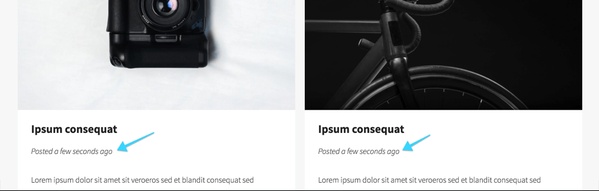
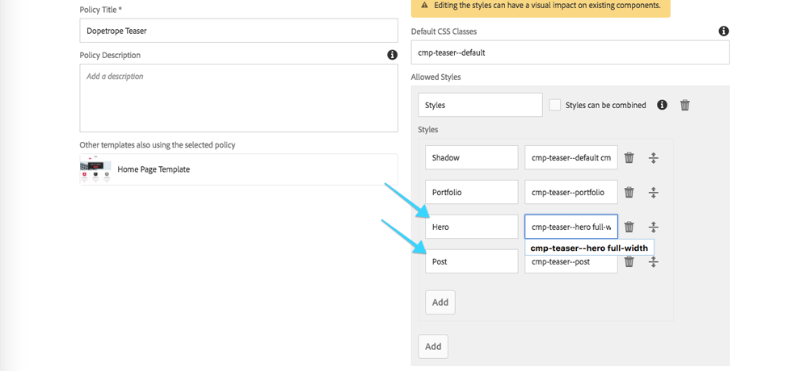
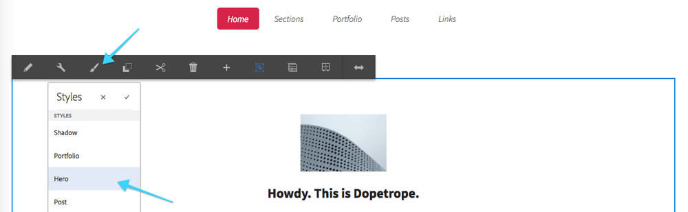
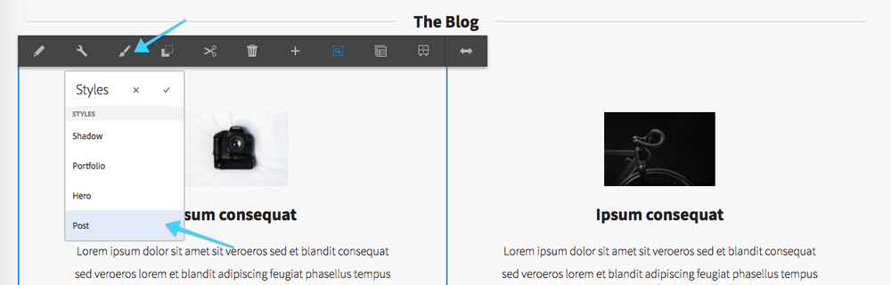
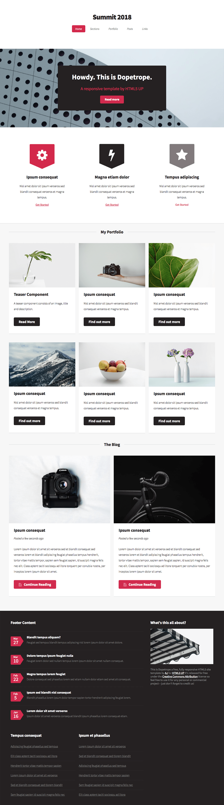

## Chapter 7: Applying the Teaser Component JavaScript-based Styles

In this chapter the we'll see how the Web Producer configures Teaser Component to allow the **Hero** and **Post** styles, which are implemented using both CSS and JavaScript, and how an Experience Author applies these styles to different teasers on the page. 

### Review and Learn

<dl class="tags">
<dt>Participating Personas</dt>
<dd>Front-end Developer</dd>
</dl>

Before defining and applying these styles, let's look at how, why and when to use JavaScript to augment component styles. Component JavaScript can be broken into two categories:

* JavaScript that provides functional behavior for the component. For example, opening a modal, or swapping out images.
	* This variety is **NOT** the focus of this lab.
* JavaScript that modifies the component's DOM sub-tree either to facilitate CSS styling, or to inject content into the DOM that is not naturally exposed by the component.
 	* This variety **IS** the focus of this lab.


Style JavaScript follows similar guidelines as the CSS application.

* Use the **BLOCK--MODIFIER** CSS class to identify component DOM sub-trees to process.
* **Target** component HTML elements via their **BEM CSS classes**.
* When inserting new DOM elements, provide corresponding BEM CSS classes to they can be clearly styled via CSS.


#### Overview of AEM Component Style JavaScript

The below pseudocode (optionally using jQuery) to illustrates the general approach for applying JavaScript-based to support Component styles.

The general JavaScript execution outline is:

* Invoke the following logic when:
	* The page is loaded.
	* An authoring event occurs that requires a re-application of the style.
* All components that match the style are located in the DOM.
* For each of these components, check if the component has already been processed.
* If the component has not yet been processed:
	* Mark the component as processed.
	* Derive any new data that might be required, often via AJAX calls to AEM Content Services end points.
	* Modify the DOM as the styles needs.

```
jQuery(function($) { 
	// This code will execute when the DOM is ready
	
	function applyComponentStyles() { 
		
		$(BLOCK--MODIFIER BLOCK).not("[data-<style-id>-processed]").each(function() { 
			// Mark the component as processed for this style
			var component = $(this).attre("data-<style-id>-processed", true);
			
			// Perform any work including modifying the DOM sub-tree of `var component`
			// or making AJAX calls to collect and inject new data in the component.
		});
		
	}
	
	/** The 2 hooks for invoking applyComponentStyles() **/ 

	// Immediately apply styles when the DOM is ready.
	applyComponentStyles();
	
	// Whenever a component is inserted into AEM's responsive grid, apply styles if needed.
	// This helps support the application of styles during authoring.
	$(".responsivegrid").on("DOMNodeInserted", applyComponentStyles);
	
}(jQuery))

```

#### Overview of AEM Component "Post Style" JavaScript

The Teaser's Post style involves deriving the last modified data from the linked AEM Page, and injecting this new content into the Teaser below the Teaser's title.


We can review the JavaScript for the Teaser's Post style by navigating the **CRXDE Lite** (http://localhost:4502/crx/de) in a new tab, and opening 
`/apps/l725/clientlibs/clientlib-dopetrope/components/teaser/styles/teaser.js`.


```
jQuery(function ($) {

    function applyComponentStyles() {
		 ...

        // Teaser - Post style
        $(".cmp-teaser--post .cmp-teaser").not("[data-cmp-teaser-posted-at-processed='true']").each(function () {
            var teaser = $(this).attr("data-cmp-teaser-posted-at-processed", true),
                // Get the teaser's Link element
                link = teaser.find(".cmp-teaser__link"),
                // Determine get the teaser's link if it exists
                linkHref = link ? link.attr('href') : null,
                dateUrl;

            if (linkHref) {
                // Get the linked page's path and append Content Services model.json
                dateUrl = Granite.HTTP.getPath(linkHref) + ".model.json";

                // Make an AJAX call to the page's AEM Content Services end-point to retrieve the data.
                $.getJSON(dateUrl, function (jsonData) {
                    var dateObject, title, postedAtElement;

                    // Create a date object using the open source MomentJS library
                    dateObject = moment(jsonData['lastModifiedDate']);

                    // Find the component's Title element
                    title = teaser.find('.cmp-teaser__title');

                    // Create a new Paragraph <p> element to display the formatted date.
                    postedAtElement = $("<p>")
                    	 // Assign a BEM CSS Class name so it can be styled via CSS
                        .addClass("cmp-teaser__posted-at")
                        // Add the formatted date text to the Paragraph
                        .text("Posted " + dateObject.fromNow());

                    // Inject the new paragraph tag into the DOM after the title element.
                    title.after(postedAtElement);
                });
            }
        });
    }

    applyComponentStyles();

    $(".responsivegrid").bind("DOMNodeInserted", applyComponentStyles);
});
```

### Step by Step

<dl class="tags">
<dt>Participating Personas</dt>
<dd>Web Producer</dd>
<dd>Experience Author</dd>
</dl>

1. From the **Dopetrope** page tap the **Page Properties** icon in the top left, and select **Edit Template**.
2. In the **Template Editor**, tap the **Teaser's Policy** icon from either Layout Container.
	1. Tap the **Styles** tab on the right.
	2. For each new style, tap **Add** under the previously configured styles, and enter the following **Style Name** and **CSS Classes** pairs:
		* `Hero` &rarr; `cmp-teaser--hero full-width` 
		* `Post` &rarr; `cmp-teaser--post`
	3. Tap the **Check** icon in the top right **save** the Teaser Component Policy changes.

3. **Close** the **Template Editor** browser tab to return to the **Dopetrope** page.
4. **Refresh** the Dopetrope page.
5. Select the top-most **Teaser**  on the page, tap the **Styles** icon, and select **Hero**.

6. Scrolling down past My Portfolio, select the **2 Teasers** in the **Blog** section, tap the **Styles** icon, and select **Post**.



### Final

After completing the above steps, the Teaser with the lightning bolt should have a shadow effect on the left and right side of it, and the 6 Teasers under My Portfolio should have the portfolio card style applied, and your page should look like:



## Next - Chapter 8

[Chapter 8](../chapter-8)