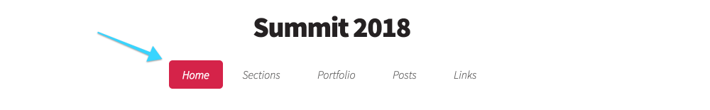
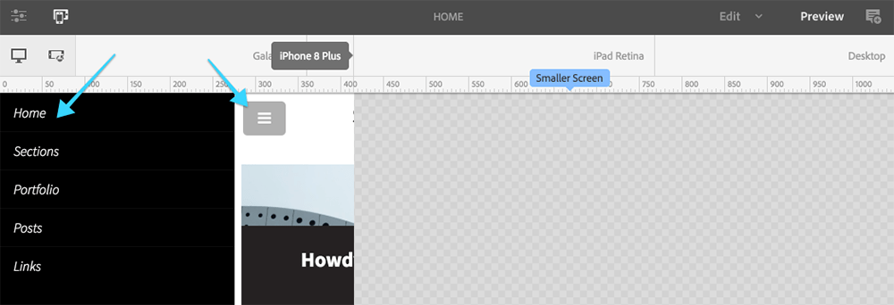
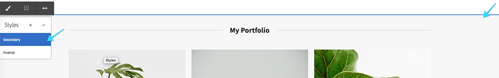
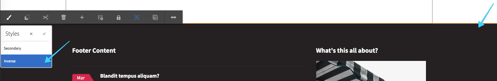
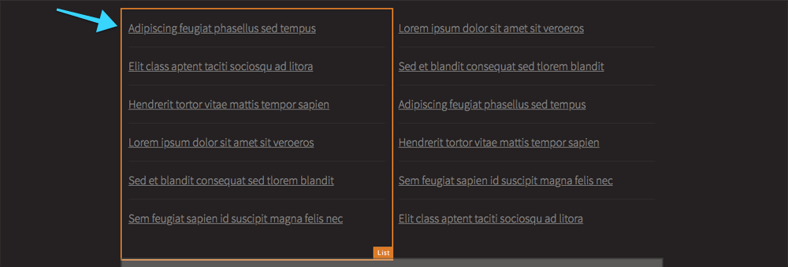
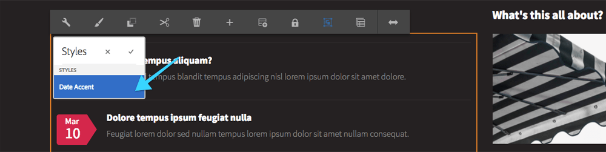

## Chapter 8: The Bonus

Chapter 8 is an exploration of how various other AEM Core Components have been styled and configured to support the Dopetrope theme.

### The Navigation Component

The Core Navigation Component is used for the top navigation and uses the Core Navigation Component. Navigation is configured via the Template Editor and uses the Dopetrope-provided `.cmp-navigation--top` style.

The Navigation is a more advanced component has it drastically changes visuals and behavior for mobile devices. Using a combination of CSS media queries and JavaScript, the menu turns into a mobile menu when the viewport is shrunk.

### The Layout Container

The Dopetrope theme styles AEM's Layout Container component in two different ways. 

#### Layout Container Secondary Style

The Secondary style is applied to the Layout Container containing **My Portfolio** and **The Blog** at the Page level. The Secondary style colors the background **grey**, adds a **border across the top,** and expands to the **full width of the Web browser**, while keeping the content centered.

#### Layout Container Footer Style

The Footer style is applied to the Layout Container containing the footer content at the Page Template level.  The Secondary style colors the background **black**, and expands to the **full width of the Web browser**, while keeping the content centered.

And interesting facet of this Layout Container style, is it inverts the background color, requiring an inversion of the text (from the normal black, to a light grey) to maintain legibility.

Dig into how this is done by reviewing these LESS and JavaScript files:

* `/apps/l725/clientlibs/clientlib-dopetrope/components/layout-container/styles/inverse.less`
* `/apps/l725/clientlibs/clientlib-dopetrope/components/list/styles/date-accent.less`, lines 88 - 104
* `/apps/l725/clientlibs/clientlib-dopetrope/components/list/styles/default.less`, lines 44 - 59
* `/apps/l725/clientlibs/clientlib-dopetrope/components/title/styles/section.less`, lines 49 - 57

## The List Component

The Dopetrope theme allows the Core Components List component to be styled in two different ways. 

### List Default Style

The **Default style** is a simple text list and is the default list style, and requires no selection via the Styles dropdown.

Dig into how this is done by reviewing these LESS and JavaScript files:

* `/apps/l725/clientlibs/clientlib-dopetrope/components/list/styles/default.less`, lines 1 - 43

### List Date Accent Style

The **Date Accent style** which injects the Last Modified date from the list item's linked page. The style uses JavaScript to retrieve the date in a similar manner as the Teaser Post.

Dig into how this is done by reviewing these LESS and JavaScript files:

* `/apps/l725/clientlibs/clientlib-dopetrope/components/list/styles/date-accent.less`, lines 1 - 87
* `/apps/l725/clientlibs/clientlib-dopetrope/components/list/list.js`

## Appendix

The appendix contains links to a various resource leveraged by this lab.

* [Adobe Experience Manager Core Components](https://github.com/Adobe-Marketing-Cloud/aem-core-wcm-components)
	* github.com/Adobe-Marketing-Cloud/aem-core-wcm-components
* [BEM - Block Element Modifier](http://getbem.com/)
	* getbem.com
* [AEM Client Libraries](https://helpx.adobe.com/experience-manager/6-3/sites/developing/using/clientlibs.html)
	* helpx.adobe.com/experience-manager/6-3/sites/developing/using/clientlibs.html
* [LESS](http://lesscss.org/)
 	* lesscss.org
* [jQuery](https://jquery.com/)
	* jquery.com 	
* [HTML5up.net - Dopetrope Template](https://html5up.net/dopetrope)
	* 	html5up.net/dopetrope