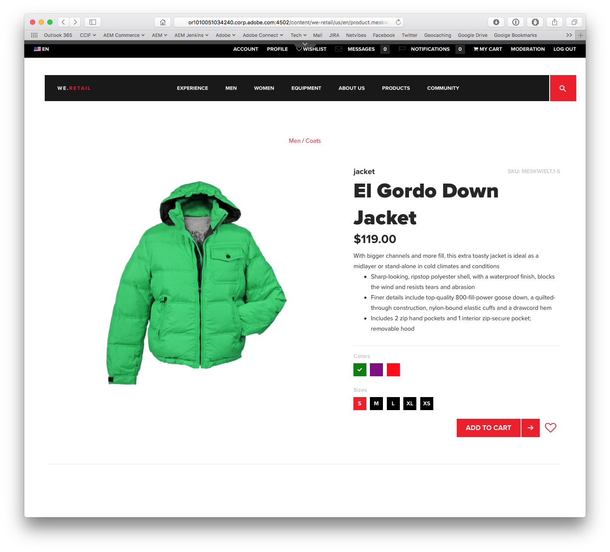
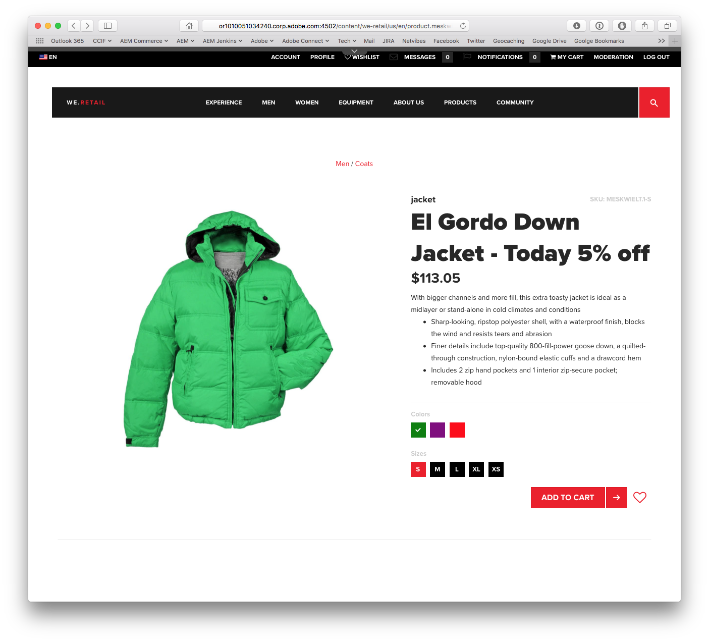

Exercise 4 - Integrate CIF Services with AEM
============================================

## Objective


## Tasks

```diff
- **WARNING: PLEASE REPLACE seat-{YOUR_FIRSTNAME}-{YOUR_LASTNAME} with your firstname and lastname: seat-john-doe**
```

1. Goto to We.Retail Page

    ```ruby
    http://localhost:4502/content/we-retail/us/en.html 
    ```


2. Navigate to product page **El Gordo Down Jacket** (red t-shirt)

    Click on products
    Click on **Men's** category

    Sample URL:
    ```ruby
    http://localhost:4502/content/we-retail/us/en/category.693b0fc5-7283-4673-a362-589d37fb7b73.html
    ```

    Click on **El Gordo Down Jacket**
        
    ```ruby
    http://localhost:4502/content/we-retail/us/en/product.meskwielt.1-s.html
    ```

    see **El Gordo Down Jacket** product page
    

4. Instructor will update the sequence

    ```ruby
    wsk action update commerce/searchProducts --sequence "commercetools-products-actions@latest/searchProductsService,seat-X-X/applyDiscount,commercetools-products-actions@latest/webActionTransformer" --web true
    ```
    
    updates the default **commerce/searchProduct** sequence to use our **applyDiscount** action from exercise 3.

5. Refresh the product page
    
    Reload:
    ```ruby
    http://localhost:4502/content/we-retail/us/en/product.meskwielt.1-s.html
    ```

    Sample Server URL:
    ```ruby
    http://localhost:4502/content/we-retail/us/en/product.meskwielt.1-s.html
    ```
    
    see **El Gordo Down Jacket** product page with new discounted price and updated title
     

6. Overall outcome

      
