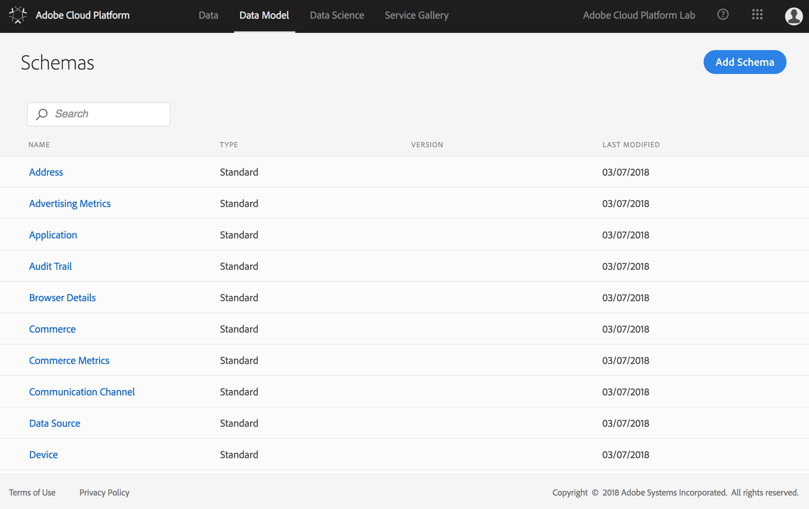
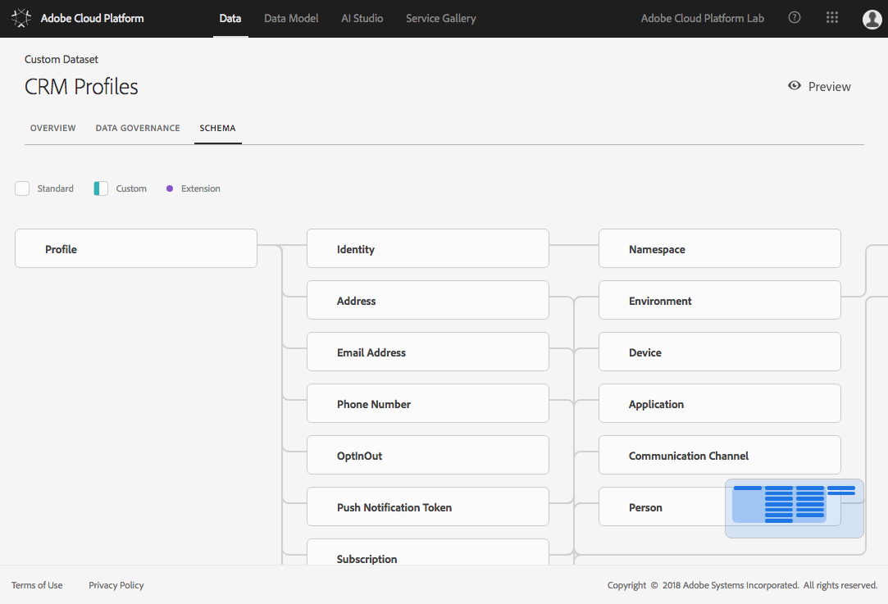
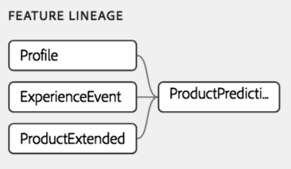

# Exercise 1 - Data Exploration

⏳Time Allocated: 20 minutes

Login URL:
- Adobe Cloud Platform: https://ui-prod1-va7.cloud.adobe.io/

Concepts:

  **Experience Data Model (XDM) Schema** - The Experience Data Model (XDM) is the language of digital experiences. XDM is a publicly documented specification, driven by Adobe to improve the interoperability, expressiveness, and power of digital experiences. More Information: https://www.adobe.io/open/standards/xdm.html

 **Data Governance: Data Usage Labeling and Enforcement (DULE) in the Adobe Cloud Platform** - The Adobe Cloud Platform provides a robust, powerful data governance framework that enables customers to manage their compliance with regulations, restrictions, and policies controlling the use of data. The core of ACP’s system for data governance is Data Usage Labeling & Enforcement (DULE). The DULE feature set includes predefined data usage labels that can be used to categorize data in four ways: Contractual, Identity, Sensitive and GDPR (General Data Protection Regulation). Once data has been labeled, the DULE Policy Service will use those labels and the associated policies to determine the use and/or permissibility of marketing actions.

Objectives:
- Log into the Adobe Cloud Platform
- Explore XDM
- Explore the Data
- Review Data Governance Labels
- Preview Sample Data

## Log into the Adobe Cloud Platform

1. Navigate to: https://ui-prod1-va7.cloud.adobe.io/
2. Authenticate using the provided credentials

## Explore the Schemas That Make up the Experience Data Model (XDM)

1. On the **DATA MODEL** tab explore the available schemas 
2. Click on the **NAME** of a schema and expand the various entities
3. Locate the Profile schema and explore (we will be using this schema in the lab)

## Explore the Datasets That Will be Used Throughout the Lab

For each of the following datasets, explore the **SCHEMA** tab, the **DATA GOVERNANCE** tab, and **Preview** sample records.

1. On the **DATA** tab select a dataset that you would like to explore e.g., **CRM Profiles**
2. Select the **DATA GOVERNANCE** tab and review any labels that have been applied. These labels are used to inform downstream users on what marketing activities this data can be used for from a compliance perspective.
3. Select the **SCHEMA** tab and explore the schema for the dataset
4. Select the **Preview** option and examine sample records
5. Explore each of the datasets listed below by repeating the above steps

### Source Datasets

| Dataset Name | Schema | Description |
|:------|:------|:------|
| CRM Profiles | Profile | Customer Profiles are used as input to the machine learning feature pipeline | 
| Products | ProductExtended | Product details are used as input to the machine learning feature pipeline | 
| Web Transactions | ExperienceEvent |  Web transactions are used as input to the machine learning feature pipeline. ⚠Please skip **Preview** option for this specific Dataset as there are known performance issues | 

The source datasets are processed by a feature pipeline to produce a single dataset that will be used to train the Machine Learning model instance.

### Training Datasets

| Dataset Name | Schema | Description |
|:------|:------|:------|
| ProductPurchaseTrainingData | ProductPrediction | The source data is converted into a feature/training dataset using a feature processing pipeline. This data is used to train the Product Purchase Prediction machine learning instance (the machine learning model). Notice that the **propensity** field has values. In Machine Learning this is referred to as the target field, or label.  | 

### Scoring Datasets

| Dataset Name | Schema | Description |
|:------|:------|:------|
| ProductPurchaseScoringData | ProductPrediction | This is the dataset that you will be scoring towards the end of the lab. You will be able to make predictions for each record in this dataset. Notice that the **propensity** field is empty. You will be able to predict this value. | 

## Explore the Available Methods for Adding Data to the Adobe Cloud Platform

In this lab we will not be adding additional data, but it is helpful to understand what the available options are. 

Data can be on-boarded to the Adobe Cloud Platform by uploading data files, through connectors such as Microsoft Dynamics and Salesforce, via the API and by using ETL tools such as Informatica.

1. On the Data tab select the option to **Create Dataset**
2. Explore the various options for adding data to the platform

## (Optional) Add or Edit Data Usage Labels
1. On the **DATA** tab select a dataset that you would like to edit
2. Select the **DATA GOVERNANCE** tab and review any labels that have been applied. Select a field and add or edit a label by selecting the **Edit Labels** pencil icon. 

## Frequently Asked Questions
- You may have noticed that some values in the training dataset are not integers as you may have expected e.g. a quantity1 of 1.15... These values are computed using **Mean Imputation**, which is a common method for estimating missing values. The imputed values are assumed to be the real values that would have been observed if the data was complete.
- In the **Data Governance** tab what are Inherited Labels? Governance labels can be applied at the Connection, Dataset, or Field level. Enabling the **Show Inherited Labels** option will display all labels applied. 

## Next Steps

In the next exercise you will leverage these datasets to begin making predictions. 

Let's go! ➡[Exercise 2](../exercise2/README.md)
