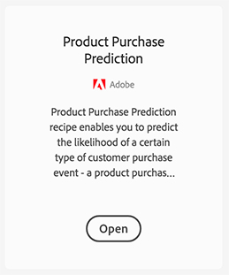
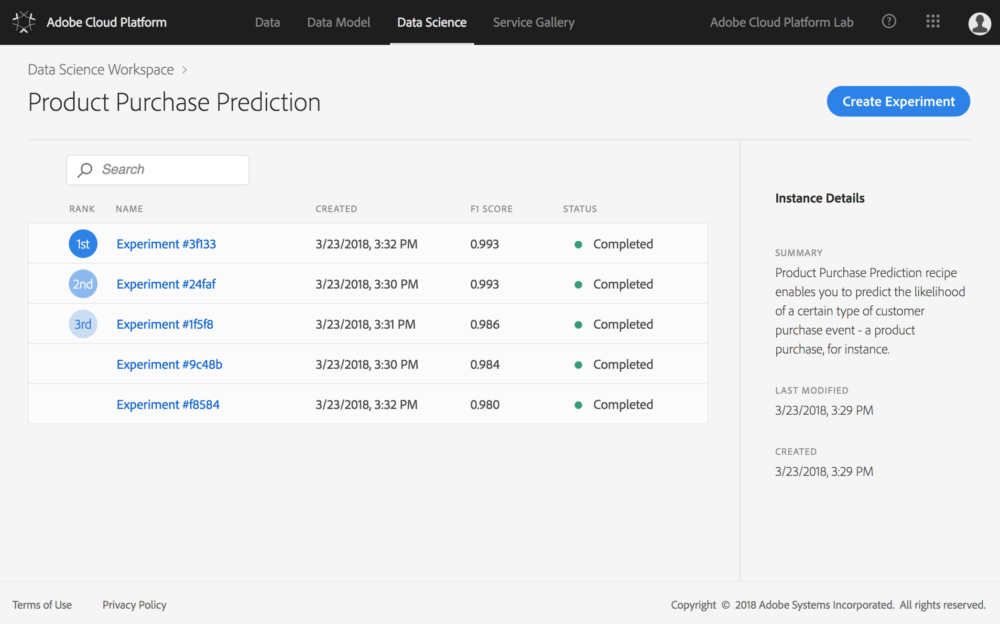
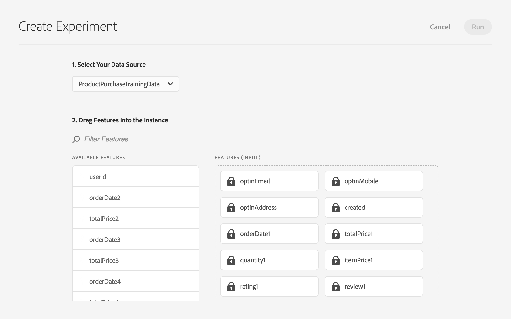
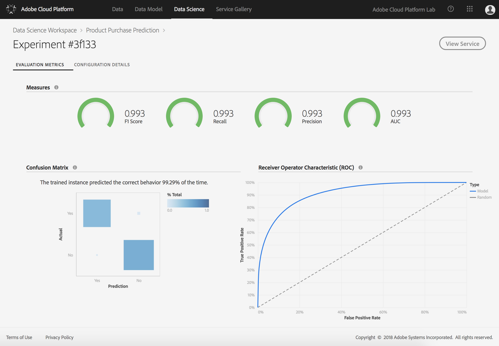

# Exercise 2 - Recipes and Training Experiments

⏳Time Allocated: 15 minutes

Login URL:
- Adobe Cloud Platform: https://ui-prod1-va7.cloud.adobe.io/

Concepts:

  **Recipe** - A recipe is a propriety machine learning or AI algorithm, or an ensemble of machine learning or AI algorithms, to help solve specific business problems.

 **Instance** - An instance is an occurrence of the recipe configured with the right data definition to help solve specific business problems.

 **Trained Model** - A trained model is an instance (of the recipe) that is trained using historical data to learn from. The historical data must contain the correct answer, also known as the target or target attribute. The trained model finds patterns in the training data to help predict the target and uses that knowledge to predict the target for new sets of data where the target is unknown.

 **Experiment** - An experiment is the process of creating a trained model by training the instance with a portion of the live production data.

Objectives:
- Explore Available Recipes
- Examine a Recipe Instance
- Training Experiment Configuration
- Evaluate the Accuracy of Experiments

## Log into the Adobe Cloud Platform

You may skip this step if you are already logged in.

1. Navigate to: https://ui-prod1-va7.cloud.adobe.io/
2. Authenticate using the provided credentials

## Explore Available Recipes

Explore the various Recipes. For this lab we will be using the **Product Purchase Prediction** Recipe. You may notice that the **Create Instance** option is disabled in your account. For this lab we will be exploring an existing instance. 

1. Navigate to **Data Science**
2. Explore the available Recipes
3. Where available, select **Open** and review the descriptions

## Examine a Recipe Instance

1. **Open** the existing **Product Purchase Prediction** Recipe Instance
2. Review the details

## Training Experiment Configuration

You may notice that the **Run** option is disabled in your account in the **Create Experiment** page. Due to time constraints, we will not be executing experiments in the lab. We have prepared a number of completed experiments that you can examine.

1. On the Instance details page select **Create Experiment**
2. Drag additional features into the Features Input area. Adding additional features may increase the accuracy of your Trained Instance
3. Adjust the Parameters. NumTrees and MaxDepth are hyper-parameters. Hyper-parameters cannot be learned, they must be assigned before training of the model. Adjusting the parameters may change the accuracy of the Trained Model.
4. Select **Cancel**

🔬 Configuring Features

Features that have a lock icon are required and cannot be removed. The additional Available Features are optional.

🔬 Configuring Parameters

| Parameter | Description | Recommended Range |
|:------|:------|:------|
| NumTrees |  The number of trees to create for the Random forest algorithm | 25 - 50 |
| MaxDepth | The maximum depth of each tree for mining rules for Random forest algorithm | 5 - 15 |

## Evaluate the Accuracy of Experiments

1. Review the **Evaluation Metrics** of Experiments by clicking on the Experiment name
2. Explore the information provided for each metric
3. You can see which features and hyper-parameters were used for each Experiment on the **CONFIGURATION DETAILS** tab
4. Identify the top performing Experiment

## Next Steps

In the next exercise we will be using a published Experiment to make predictions.

Let's go! ➡[Exercise 3](../exercise3/README.md)
