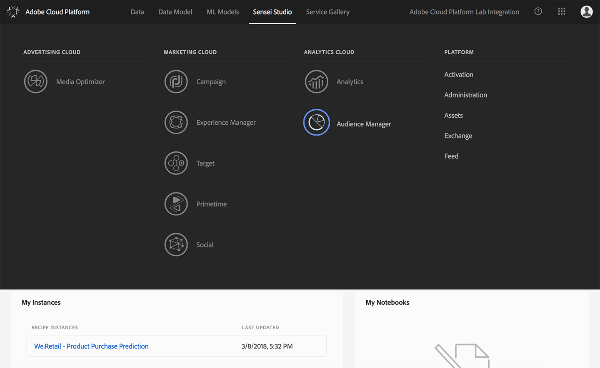
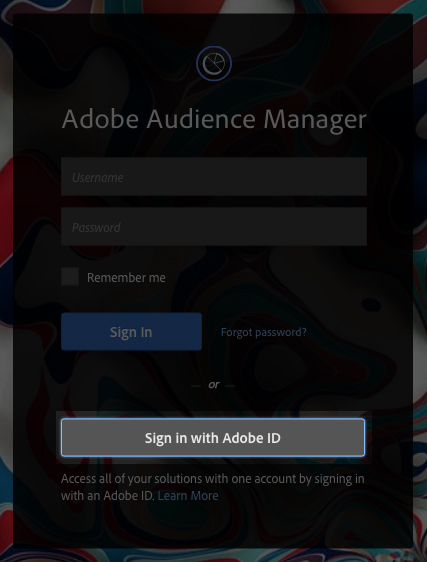
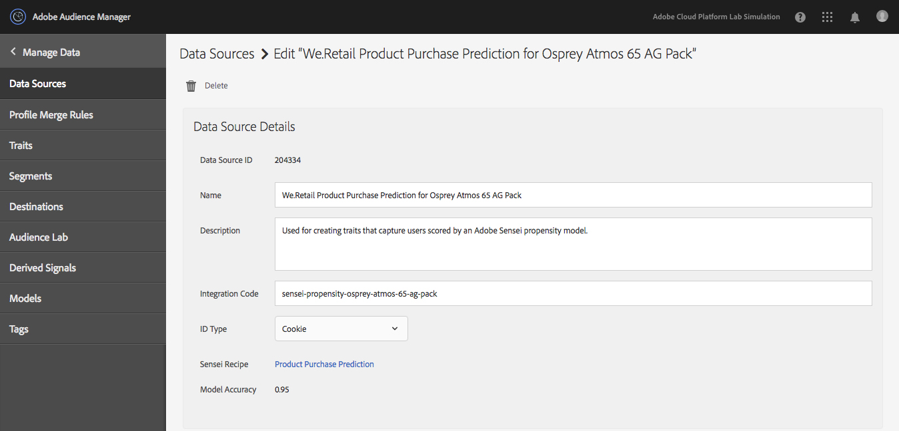
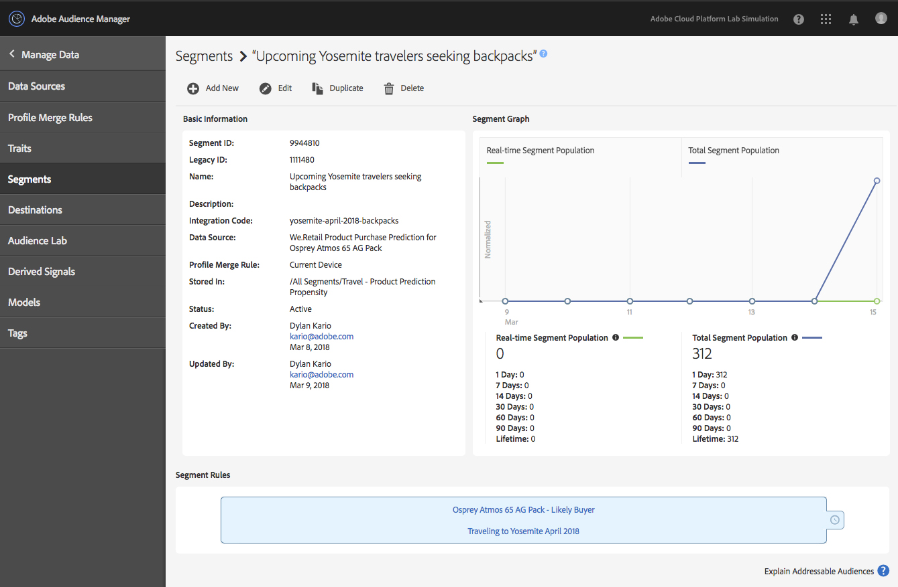

# Exercise 4 - Audience Manager Integration

⏳Time Allocated: 10 minutes

Login URL:
- Audience Manager Beta: https://bank-beta.demdex.com/

Concepts:

  **Audience Manager Data Sources** - In Audience Manager, a data source is a user-defined grouping for traits. It acts as a prerequisite ID for data onboarded from other sources, such as from AI Studio, Adobe Analytics, or customer CRM data. 

  **Audience Manager Traits** - In Audience Manager, a trait is a set of rules that captures user attributes. User data takes the form of key-value pairs, such as `age=30`. A trait with the rule `age > 25` would "qualify" a user with that data point.

  **Audience Manager Segments** - In Audience Manager, a segment is a combination of traits. It represents a collection of users who share a set of common attributes.

Objectives:
- Preview Adobe Cloud Platform > Audience Manager Integration
- Explore Audience Manager Datasources and Traits
- Explore Audience Manager Segments powered by Adobe AI Studio

 ## Navigate to Audience Manager

Navigate to Audience Manager using the Solution Picker.
1. Open the solution picker  at the top right of the screen
 
 
## Log into Audience Manager

1. Select the option to **Sign in with Adobe ID**
2. Authenticate using the provided credentials

## Explore Data Sources

Scoring data will not be available immediately. However, we have provided an existing data source that has been populated with prediction data for you to examine.

1. Navigate to **Manage Data** > **Data Sources**
2. Locate the preconfigured data source named **We.Retail Product Purchase Prediction for Osprey Atmos 65 AG Pack**
3. Open the Data Source Details view by clicking the Name
4. Locate the following fields, which are only shown for data sources generated by Adobe Cloud Platform Recipe Instances:
   - **Sensei Recipe:** The name of the Recipe used; links back to your Adobe Cloud Platform Recipes
   - **Model Accuracy:** The overall accuracy of the Recipe Instance
   

## Explore Traits

Similarly, we have provided a Trait that has been pre-populated with prediction data for you to examine. This trait captures users that have a high propensity to purchase a specific product.

1. Navigate to **Manage Data** > **Traits**
2. Select the folder: All Traits > Product Prediction Propensity
3. Locate and select the preconfigured trait named **Osprey Atmos 65 AG Pack - Likely Buyer**
4. Open the Trait Details view by clicking the Name
5. In the **Osprey Atmos 65 AG Pack - Likely Buyer** Trait locate the following fields, which are only shown for traits generated by Adobe Cloud Platform Recipe Instances:
   - **Sensei Recipe:** The name of the Recipe used; links back to your Adobe Cloud Platform Recipes
   - **Propensity:** Users with a propensity to purchase this product that fall within this range will be captured by this trait; specific to traits auto-generated by a Propensity Scoring Recipe Instance
   - **Model Accuracy:** The overall accuracy of the Recipe Instance
6. Locate the standard trait fields which are populated with custom data from a scored Recipe:
   - **Trait Expression:** The rules for capturing user attributes; automatically set up with a rule to capture users with high propensity to purchase this product
   - **Unique Trait Realizations and Total Trait Population:** Metrics that represent how many users qualify for this trait; initially populated with the number of users that the Recipe scored to have a high propensity, and will increase over time as more real users are qualified

## Explore Segments

The end goal of this integration is to create Segments in Audience Manager — this is the key to AI Studio-Powered user targeting. We have provided a segment that combines two traits: the trait you explored in the previous step, which targets users with a high propensity to buy a specific backpack, and a second preconfigured trait that targets users who are planning to travel to Yosemite in April 2018. This segment allows you to target a more specific set of users for a particular use case.

1. Navigate to **Manage Data** > **Segments**
2. Locate the segment **Upcoming Yosemite travelers seeking backpacks**
3. Select the Name to open the Segment details view
4. Under **Segment Rules**, locate the following two traits that this segment uses:
   1. **Osprey Atmos 65 AG Pack - Likely Buyer**: The preconfigured trait that qualifies high-propensity purchasers, which you explored in the previous step
   2. **Traveling to Yosemite April 2018**: A preconfigured trait that qualifies users who have booked travel for Yosemite in April 2018

## Completed

🏆Congratulations - You made it!

Thank you for participating.

Please take a moment to fill out the poll and provide feedback on this preview.
