# Activate Adobe Target via Adobe Launch

## About Adobe Launch
Launch is a platform to develop and deploy Dynamic Tag Management extensions.

Adobe Experience Cloud as well as other third party solutions, requires
code on the customer site in order to activate and integrate them. This may imply extra-knowledge from customer,
or a person from IT department involvement which most of the time doesn't have experience with Adobe products.
As many Solutions customer decides to integrate with as much time and investment it requires.

Here comes Adobe Launch, a project that will make Adobe more open and essential for customers.
Each Adobe Experience Cloud Solution has it's own Adobe Launch Extension.
Multiple Extensions can be combined together into a single bundle.
Once you deploy Launch tag to your site/web applications, you can manage everything via Adobe Launch UI.

## Deploy Adobe Launch

1. Go to https://launch-demo.adobe.com to access Adobe Launch

 Login details:
 * email:  nciocanu+testXX@adobetest.com
 * password:

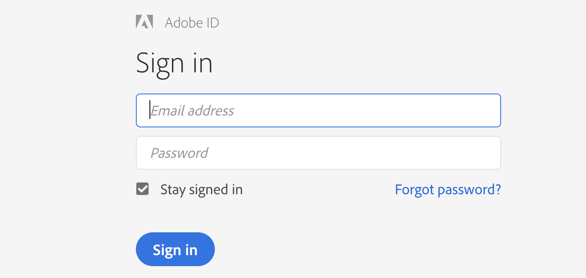

Once you have logged in successfully you should be able to see the Adobe Launch UI.
In the right upper corner you'll see the logged in user details, organization and Adobe Products associated to it.

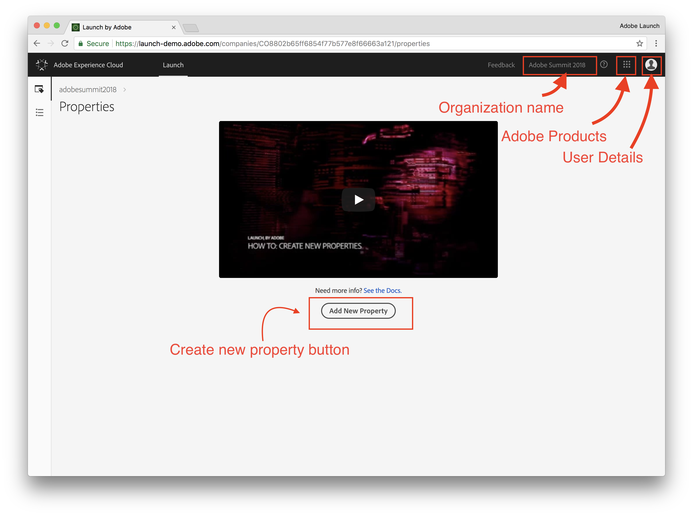

2. To create new property, click on the `Add new Property` button.
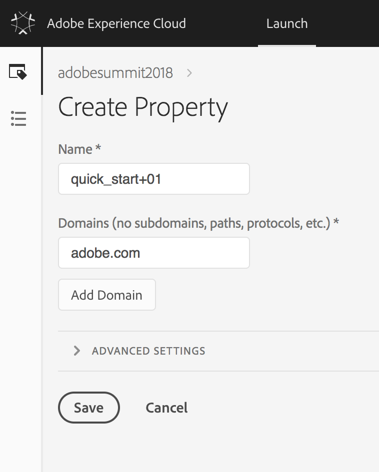

* Name your property —`quick_start+XX`
* Use `adobe.com` as the domain
* Click on `Save` button

 *Don’t change any of the Advanced Settings.

Your new property should display on the list of Properties:


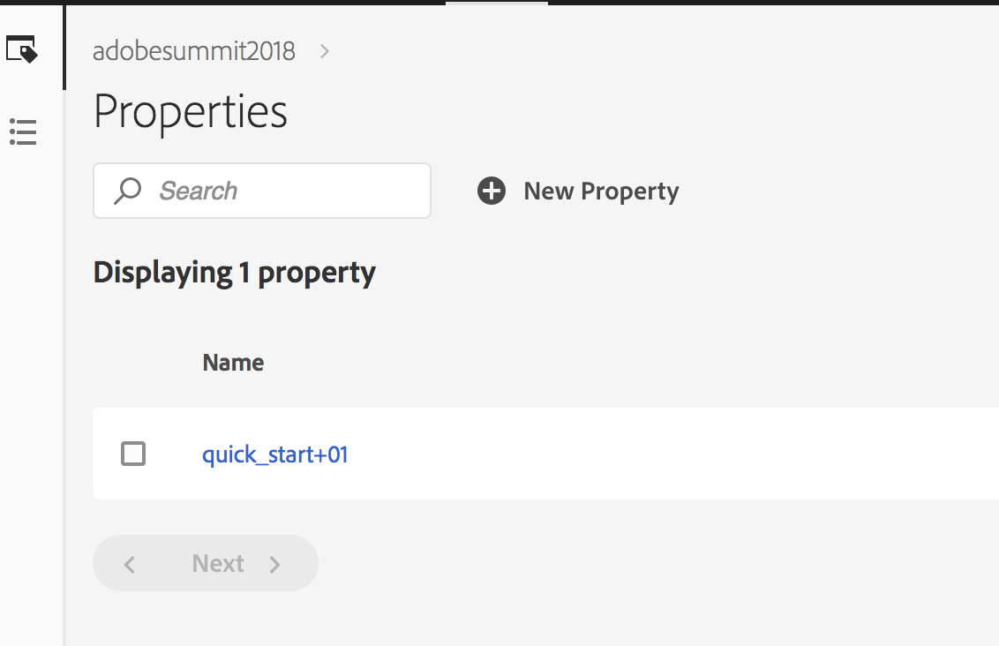

3. Now, go into your property by clicking on it.
You should see a panel like this:
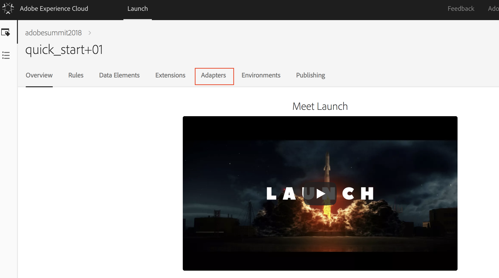

4. We'll have to create an Adapter for our property.
An “Adapter” refers to the destination(s) where you want to deploy your
 Launch libraries—on Adobe’s Akamai instance or on your own web servers.
For our Lab we'll use the Akamai Adapter.
1. Click on the `Adapter` tab.

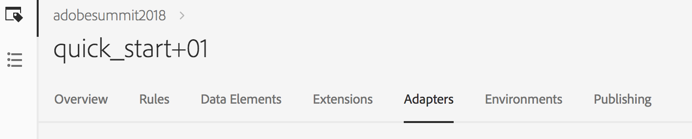

2. Click on `Create New Adapter` button.

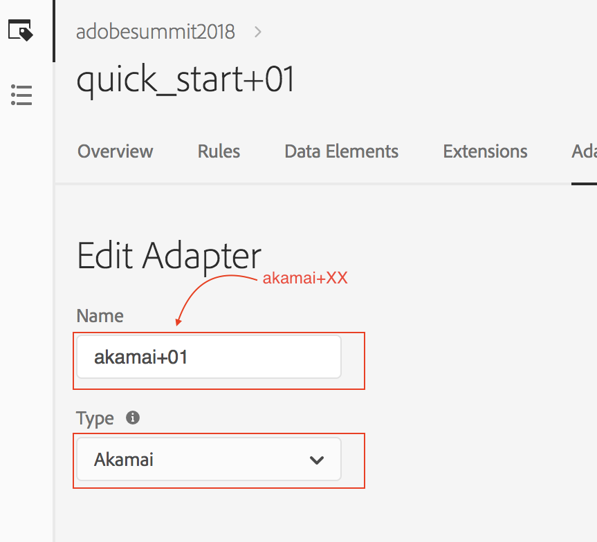

* Enter an adapter name: `akamai+XX`
* Choose an Akamai Adapter type
* Click on `Save` button

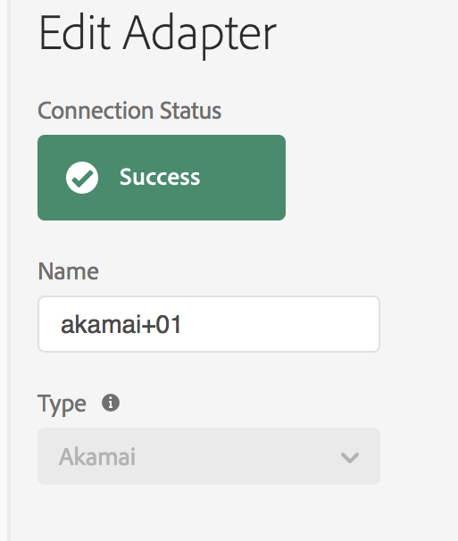

5. Create Environments

* Choose “Environments” from the top navigation tabs and then click “Create New Environment”

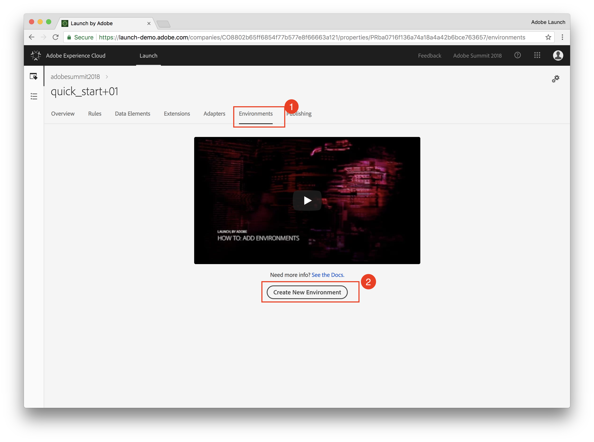

* Under “Development” click `Select` to choose a development environment.

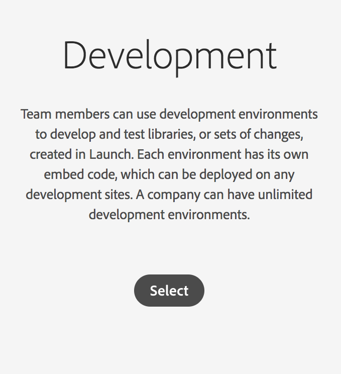

* Enter an environment name: `dev-env+XX` and choose from the adapters dropdown the adapter that we've created few min ago `akamai+XX` and click the create button.

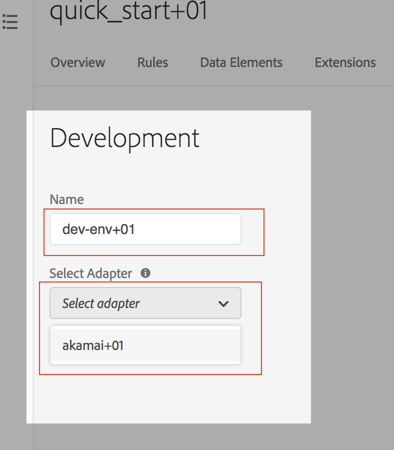

The Create archive option is a feature used for self-hosting, which we will not be using in this Lab.

Note that as soon as you select the Adapter and hit the create button, the embed code for that environment is created and displayed.
 Each environment will have its own unique embed code.

 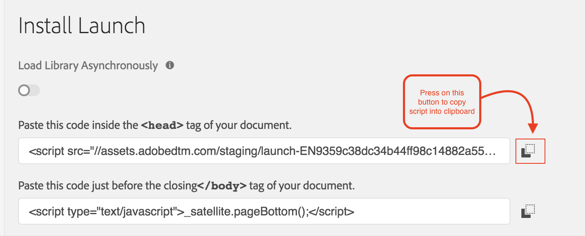

 6. Implement the Launch Embed Codes

