# Headless AEM - Beyond content repository

Experience Manager's Content and Experience Fragments are powerful tools allowing content authors to create, manage and expose AEM content across channels. In this lab we focus on the latest enhancements to Content Fragments, Content Fragment Models and Experience Fragments. You'll leave this lab with a working sample of best-practice code/content for Content and Experience Fragments.

In this lab:

* Learn use cases for Content Fragments vs Experience Fragments
* Create Content Fragments from the new Content Fragment Models
* Create custom page components to expose Content Fragments as JSON
* Explore how to update existing components to enable Content Service support

### Provided
* AEM 6.4 Beta
* We.Retail site

### Output of this lab:

* Experience Fragment & variations
* Simple Content Fragment & variations
* Content Fragment Model
* Content Fragments from model

## Lab Activities

### Chapter 1 - Experience Fragments

#### Definition

*Experience Fragment* - An Experience Fragment (XF) allows authors to manage a set of associated content that can be published/consumed via different channels. Variations of the content can be created for different devices (mobile, desktop), different contexts (Facebook, Pintrest, Target), or languages.

#### Scenario
We.Retail is unveiling a new Fleet running shoe. They want to create promotional teasers but they don't want to have to making authoring changes more than once for different devices, so they'll be using Experience Fragment & XF Building Blocks.

   
#### Activity 1 - Create XF
These steps create the base Experience Fragment, which will contain the Building Block defintions.

1. Open AEM (http://localhost:4502)

1. Navigate to Menu -> *Experience Fragments*

1. Create a new folder for **We.Retail** and subfolder **Summit Lab 724**.
	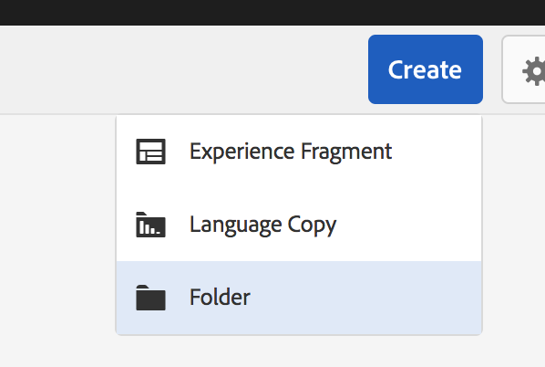
	
1. Select the **Summit Lab 724** folder and *Create*-> *Experience Fragment*.

1. Select the **We.Retail Experience Fragment Web Variant**, and click *Next*.

1. Enter `Fleet Shoe` for *Title* and optional *Description*, click *Create*, and open the XF.
	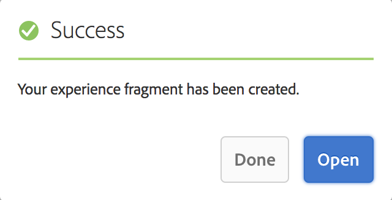

1. Open the sidebar (if not opened).
	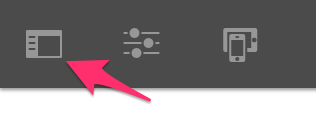

1. Select the *Assets* drawer.
	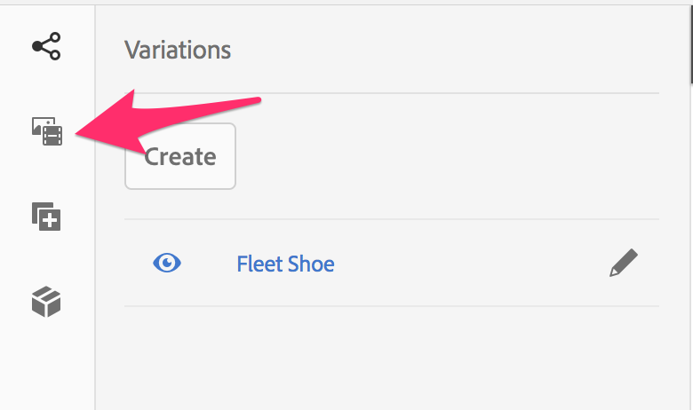

1. Filter the assets by name: `Fleet Shoe`.
	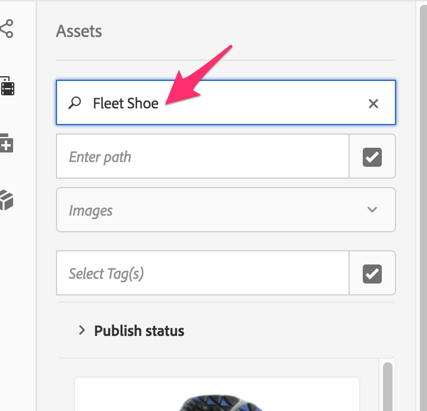

1. Drag the default view (named `Fleet Shoe.jpg`) onto the parsys.
	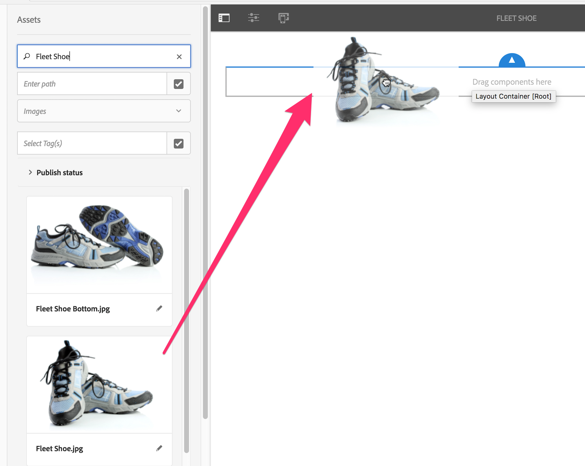

1. Select the *Components* drawer on the Sidebar. 
	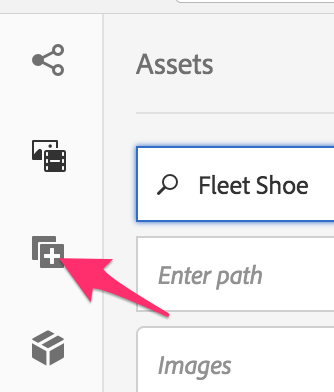

1. Filter the components by name: `Text`
	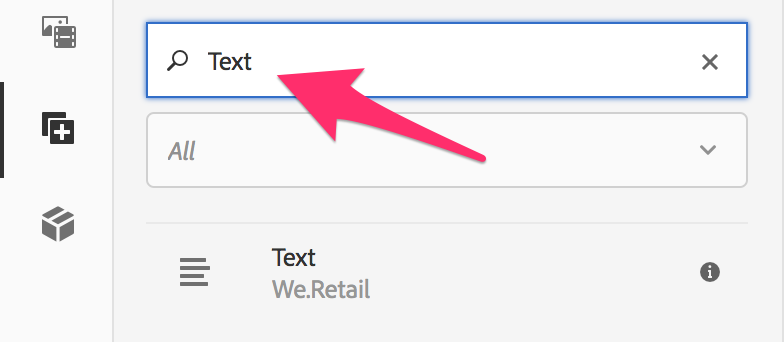

1. Drag and drop the *Text* component onto the parsys.
	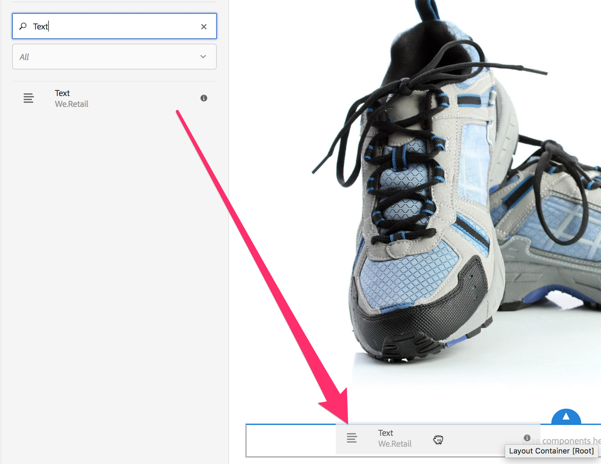

1. Edit the Text Component
	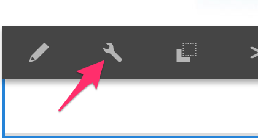

1. Add some content, here are two Lorem Ipsum Generators (they should also be bookmarked.)

	* <https://www.lipsum.com/>
	* <https://hipsum.co/>

	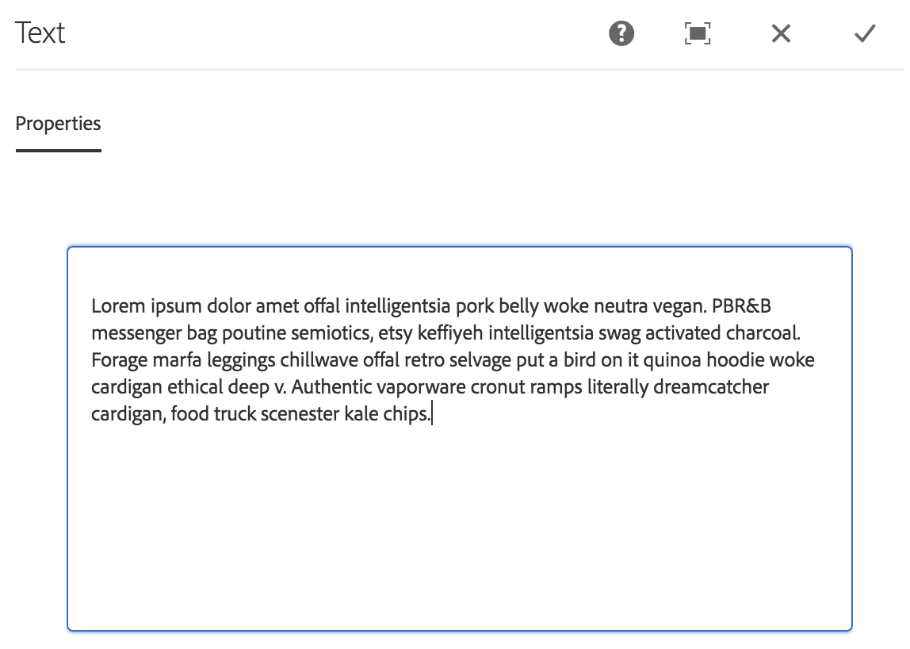

1. *Save* the content by clicking the **checkbox**.
	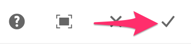

1. Filter for the **We.Retail** *Link Button* component onto the parsys and add some link text. 
	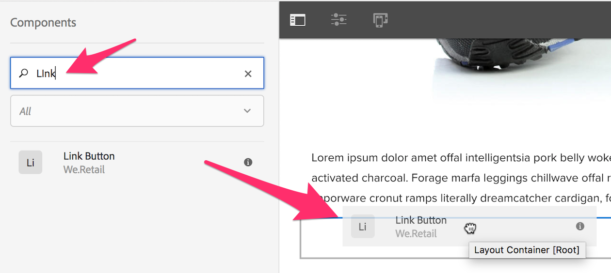

	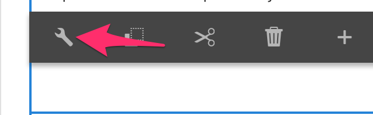

	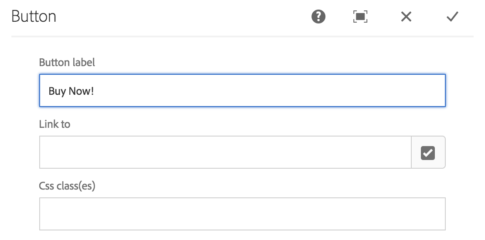

1. *Save* the Link edits.
	

#### Activity 2 - Create Building Block
A *Building Block* is essentially an Experience Fragment, that can only be used by other Experience Fragments. It creates a set of associated components, with the content, for reuse across XF Variations.

1. Select the *Variations* drawer on the Sidebar. Ensure that the primary variation is selected (Named *Fleet Shoe*).
	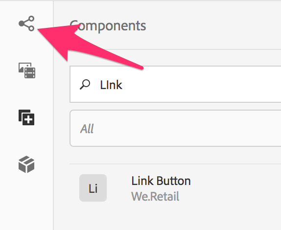

	This is the default (and currently, only) varaition.
	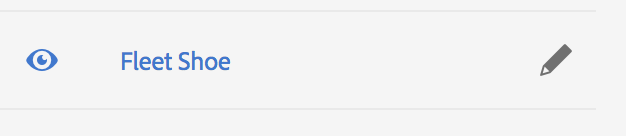

1. Select the **Image Component** on paragraph system.

1. Click the *Group* button on the edit bar.
	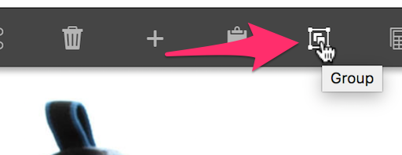

1. Select the **Text Component** on the paragraph system.

1. Select the **Link Component** on the paragraph system.
	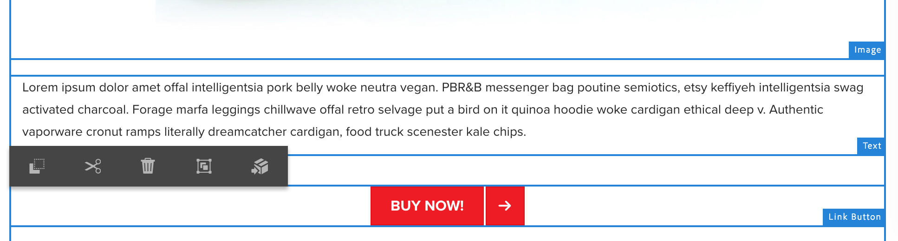

1. Click the *Convert to Building Block* button on the edit bar.
	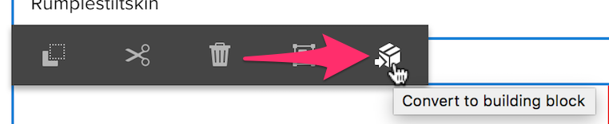

1. Give the block an appropriate name (e.g. `Fleet Shoe Promotion Content`) and *Convert*.
	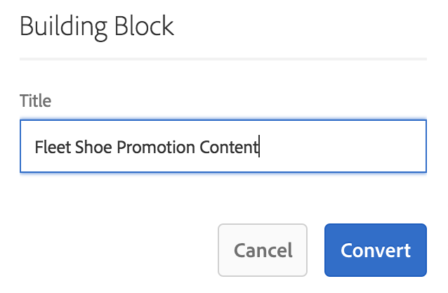

Building Blocks are meant to be reused across variations. This allows authors to maintain the content in one Experience Fragment variation, and have that content be updated/applied across other variations automatically. 

Building block best practices:

* Create a Content/Master variation that contains the components and defines the Building Block
* Consume the Building Block in other variations published to different channels/devices.

#### Activity 3 - Create XF Variations
We now want to create variations of the XF, one for each of the different devices: desktop & mobile. We'll be following the Building Block best practices and using the block defined in Activity 2.

##### Desktop Variation
1. Select the *Variations* drawer on the Sidebar. Ensure that the primary variation is selected (Named *Fleet Shoe*).

1. Click *Create* -> *Variation*. 
	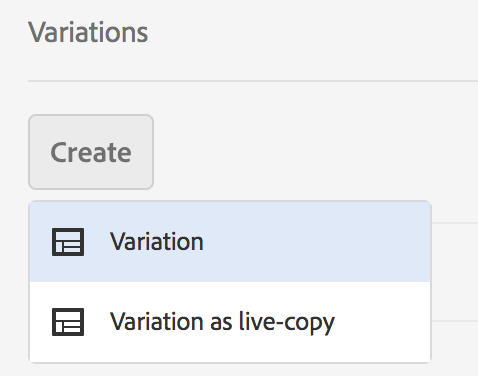

1. Fill out the dialog
	* **Template**: We.Retail Experience Fragment Web Variation
	* **Title**: Desktop
	

1. Select the *Building Blocks* drawer on the Sidebar. 
	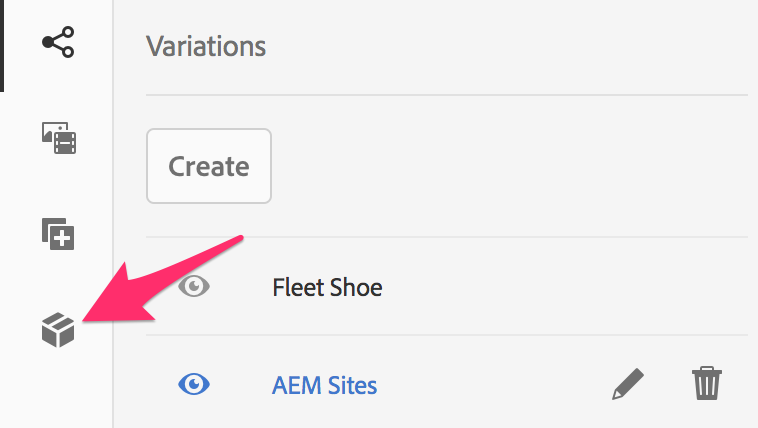

1. Drag and drop the **Fleet Shoe Promotion Content** block onto the parsys.
	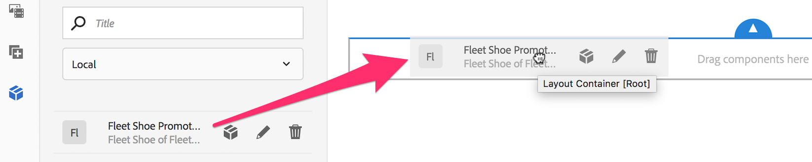

1. Enter *Layout* mode.
	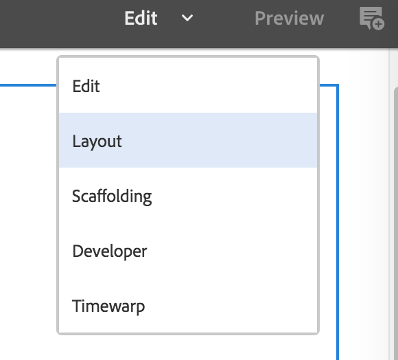

1. Adjust the view so that the Image uses the the left third of the container.
	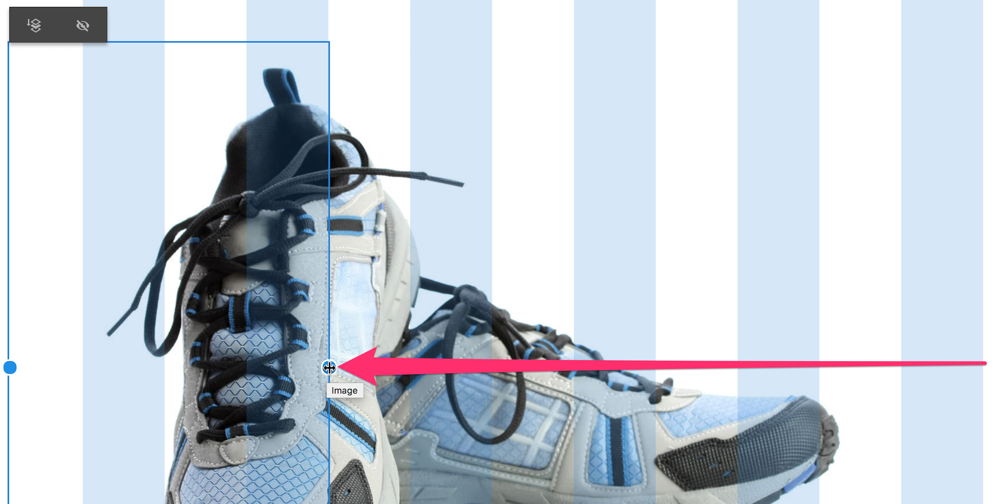

1. Adjust the view so that the text component uses the right two-thirds of the container. 
	

1. Adjust the view so that the link component uses the right two-thirds of the container. 
	

1. The final adjusted view should look like this:
	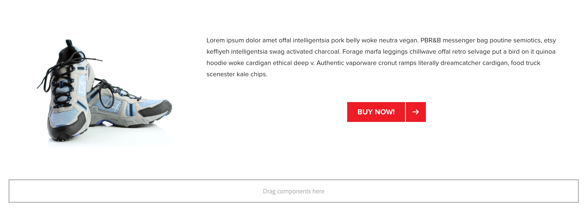

1. Return to *Edit* mode.
	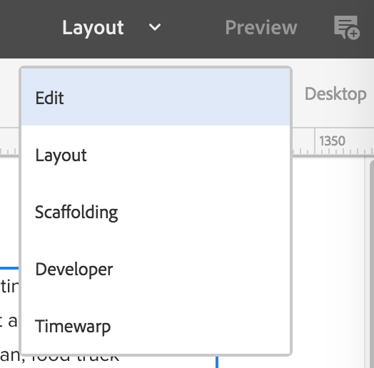

##### Mobile Variation

1. Select the *Variations* drawer on the Sidebar. Ensure that the primary variation is selected (Named *Fleet Shoe*).
	

1. Click *Create* -> *Variation*.

1. Fill out the dialog
	* **Template**: We.Retail Experience Fragment Web Variation
	* **Title**: Mobile

1. Select the *Building Blocks* drawer on the Sidebar. Drag and drop the Fleet Shoe Promotion block onto the parsys.

1. This version will use the view as-is.

#### Activity 4 - Consume XF

1. Switch back to AEM Navigation tab.
	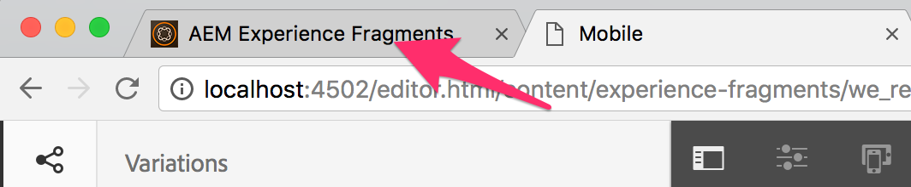

1. Navigate to Menu -> *Sites*.
	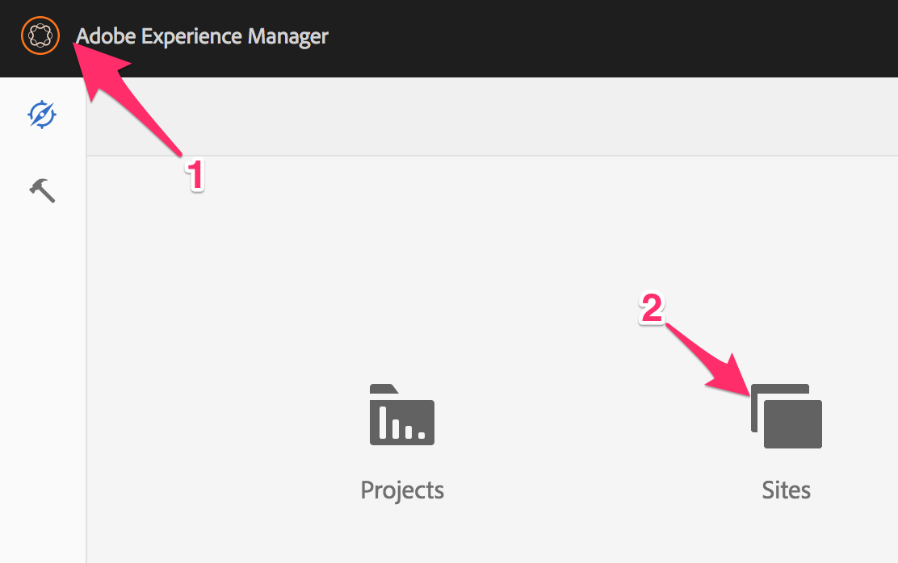

1. Navigate to *We.Retail* -> *Language Masters* -> *English*

1. Select the *English* Page (1), click on *Create (2)* -> *Page (3)*.
	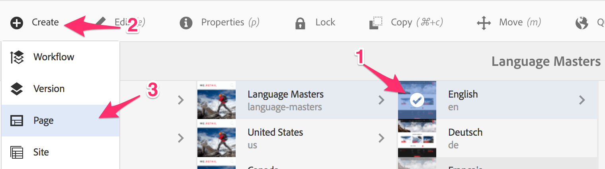

1. Fill out the dialog and *open* the page.

	* **Template**: Hero Page
	

	* **Title**: Summit Lab 724
	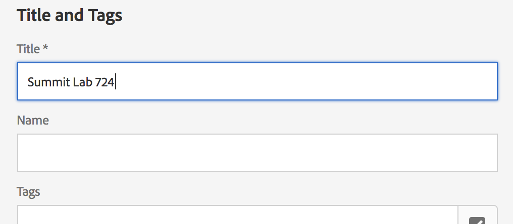
  
1. Select the *Assets* drawer on the Sidebar. Filter the type to *Experience Fragments*.
	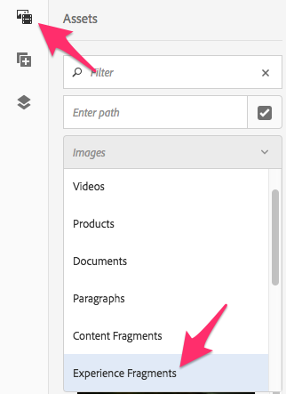

1. Drag and drop the Desktop XF previously created onto the page.
	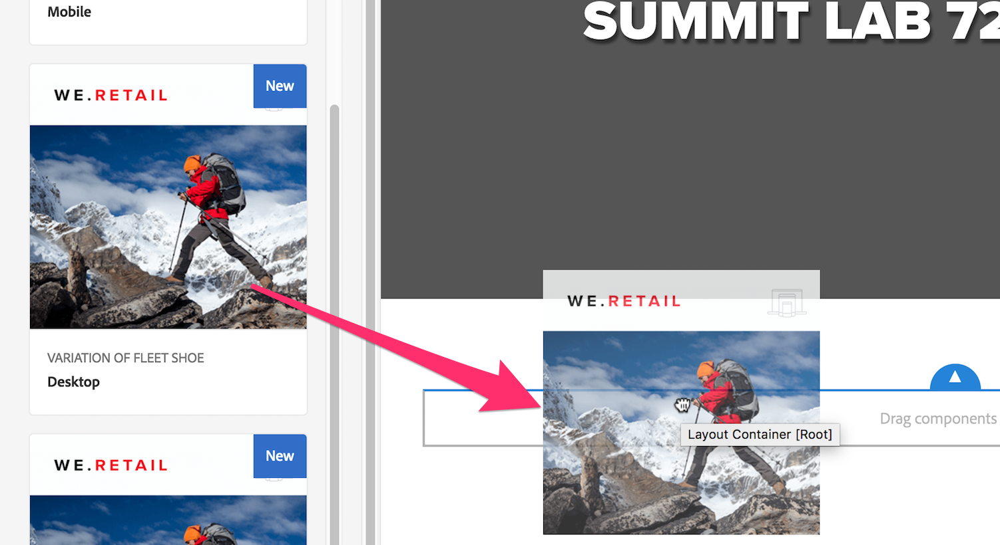

#### Activity 5 - Update XF 
An XF which contains building blocks is automatically updated when the original components are updated.

1. Return to the **Fleet Shoe** Experience Fragment editor (this tab should still be open).
	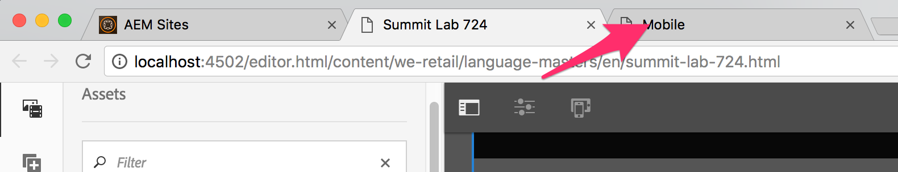

1. Select the *Variations* drawer on the Sidebar. Ensure that the primary variation is selected (Named *Fleet Shoe*).
	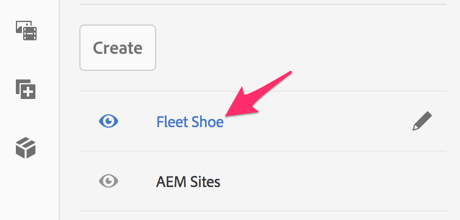

1. Change the image in the image component, and update the text (Add `Rumpelstiltskin`)

1. Select the **Desktop** or **Mobile** variation, the image and text will be updated.
	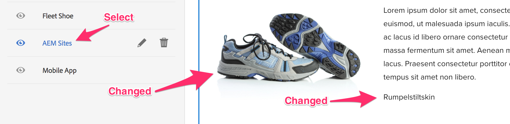

1. Switch to the Promotional Page tab (the one created in Activity 4, it should still be open).
	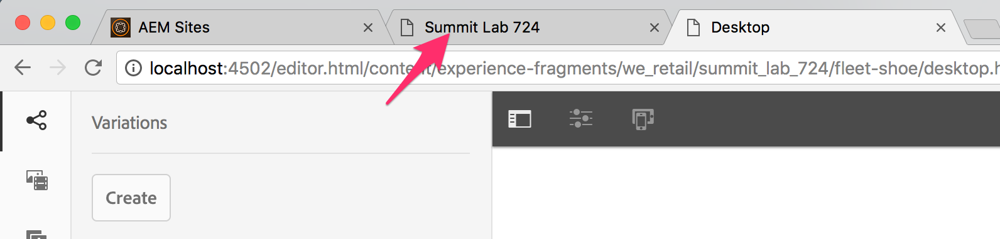

1. Refresh the page, its content will also be updated automatically.
	

### Extra Info
#### Publishing to Target

Currently in Beta, Experience Fragments can be published directly to Target for consumtion. See the *Export to Adobe Target* button on the Experience Fragment navigation/menu. 

#### Social Posting
Social Media XF instances can be published directly to the Social Platform, by selecting *Social Post* from the variation's Page Information menu. This requires the AEM instance has a valid Cloud Configuration for that Social platform.

#### Create Custom XF Template
You can add your own template to the Experince Fragment template list. This is done by configuring the template list. 
	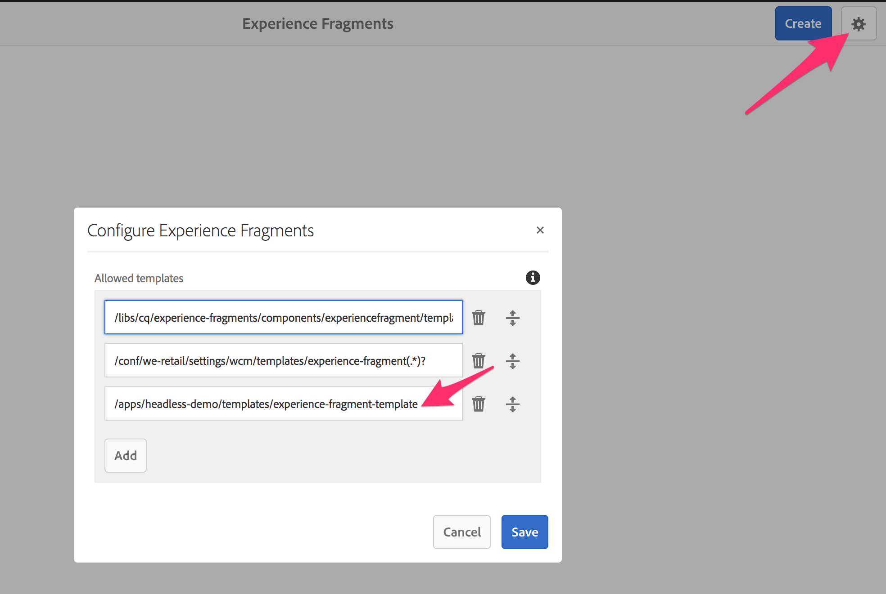
	
If you add the one shown in the screen, and the *Create* a new XF, you'll see the new example Experience Fragment Template
	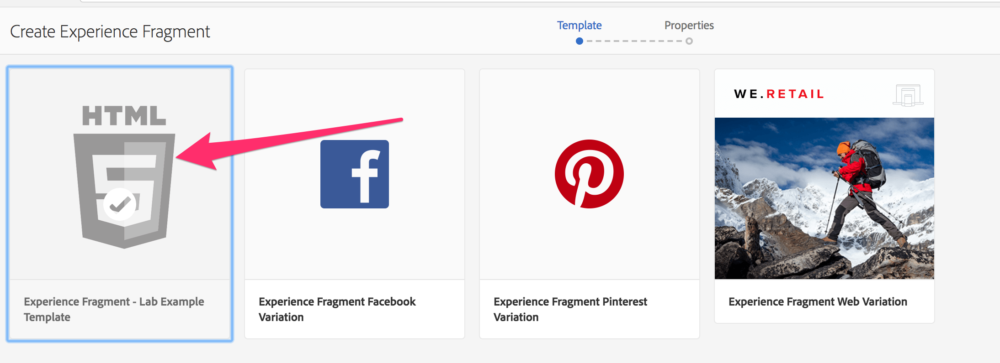
	
#### Limitations
Experience Fragments are powerful tools for managing reusable content. However there is one limitation with searching. Experience Fragments work similar to the Reference Component: they look up the content and render it upon request. 

Since the content does not exist on the page, searching for text known to be in an XF will not result in any pages which reference it. For this reason, you should not rely on an XF's content for populating internal AEM Page search. 

##### Proof.

1. Add some custom text to the XF previously created, content unique to that XF (e.g. Rumpelstiltskin).

1. Open the page to verify the content has been updated.

1. Use Omni Search to find pages that contain the unique content, you will see the fragment itself, but not the page which references it.

#### References
* <https://helpx.adobe.com/experience-manager/kt/sites/using/experience-fragments-feature-video-use.html>
* <https://helpx.adobe.com/experience-manager/kt/sites/using/experience-fragment-target-feature-video-use.html>

## Chapter 2 - Content Fragments
This chapter covers defining Content Fragment Models (CFM), creating Content Fragments instances from that Model, consuming the instance in a component, and finally exposing the instance as JSON. 

*Content Fragment Model (CFM)* - The ability to create and curate editorial content with structured relationships (elements, variations). Enhanced foundation for Content Fragments in in AEM 6.3+ to define structured beyond just text (elements based on various content types, initial content).

#### Scenario
We.Retail wants to start publishing articles written by their customers about experiences had while using We.Retail products. These articles will be accessed via a custom Single Page Application on the We.Retail site, as well as natively in their Mobile App(s).

To accomplish this goal, the We.Retail team will be using Content Fragment Models and Content Services to expose the articles as JSON.

### Activity 1 - Enable Content Fragment Models

These steps enable creating Content Fragments Models and storing it in the We.Retail configurations. Any Asset folders referencing this configuration will be able to create Content Fragment Model definitions.

1. Open AEM (http://localhost:4502)

1. Navigate (1) to *Tools (2)* > *General* > *Configuration Browser (3)*
	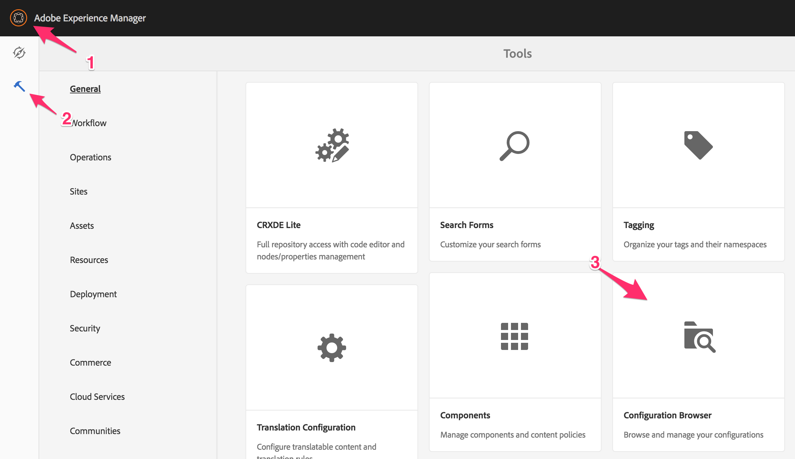

1. Select the **We.Retail** configuration, and edit its properties.
	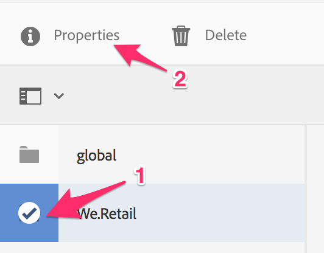

1. View that **Content Fragment Models** is enabled and *Save & Close* the configuration.
	
	The We.Retail project already has Content Fragment Models enabled on its configuration. These steps are provided as a reference for customer specific implementations.
	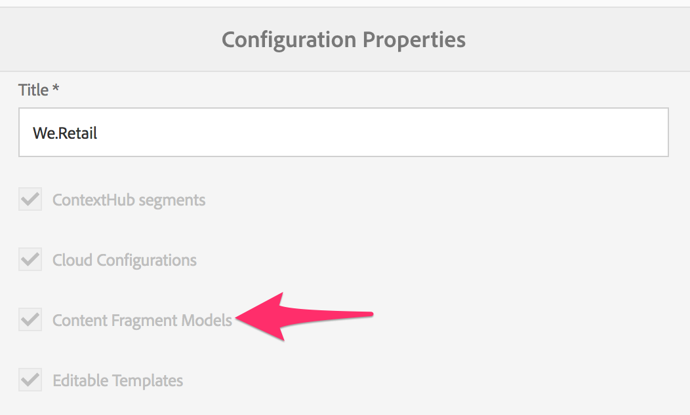

1. From the primary navigation, navigate to *Assets* > *Files*

1. Select the **We.Retail** folder and edit its properties.
	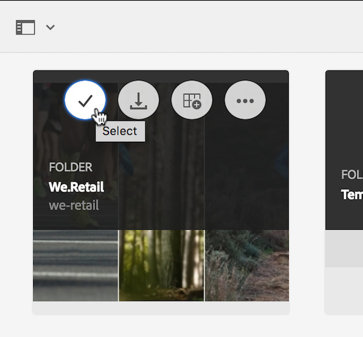
	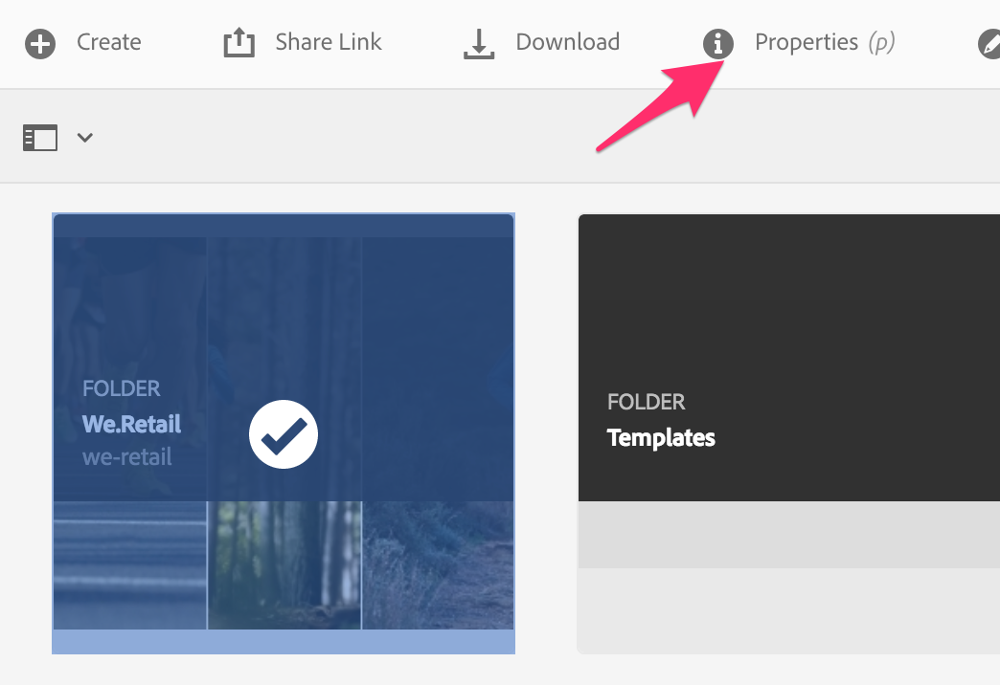

1. Select the *Cloud Services* services tab and edit the **Cloud Configuration** property.

1. Select the **We.Retail** configuration (or enter `/conf/we-retail` in the dialog).
	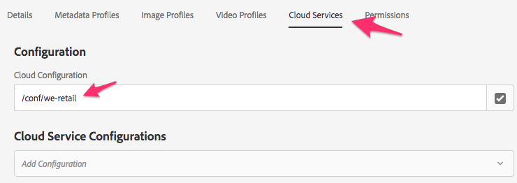

1. *Save & Close* the configuration.

### Activity 2 - Create Article Content Fragment Model

These steps create the Model, which will contain a structured form for creating new Content Fragments.

1. From the primary navigation (1), avigate to *Tools (2)* > *Assets (3)* > *Content Fragment Models (4)*.
	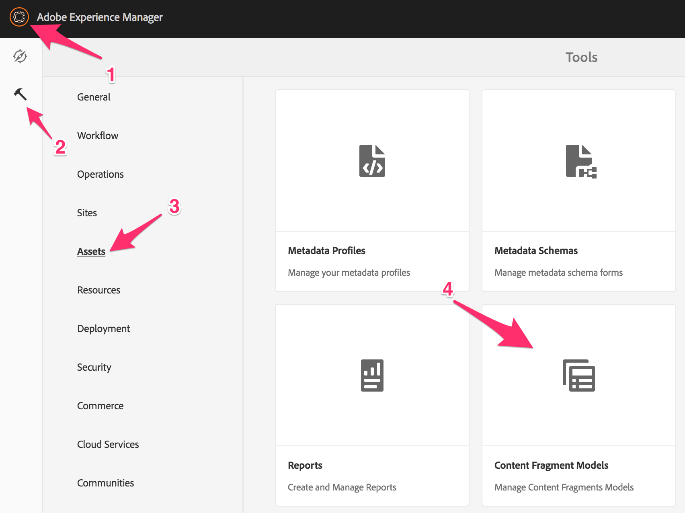

1. Click on the **We.Retail** Folder.

1. Click on the *Create* button.

1. Enter a name and optional description for the Content Fragment Model & click *Create*.
  	* **Name:** Article
	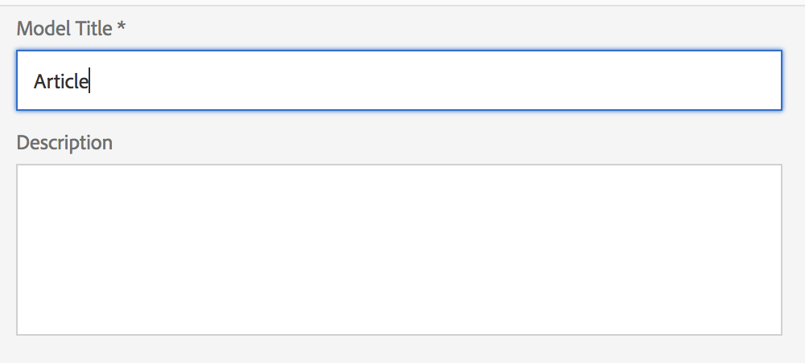

1. Open the Article Model.
	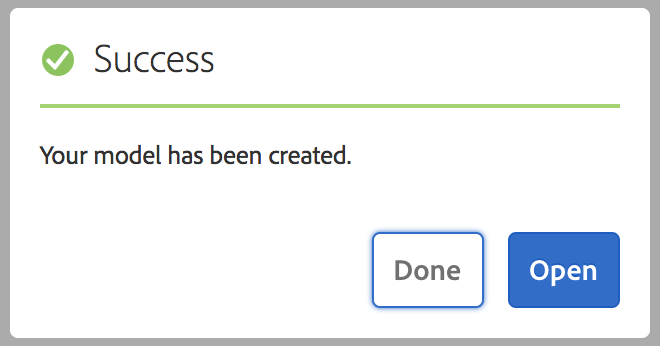

### Activity 3 - Define Article Content Fragment Model Structure
These steps create the structure which will be used as the *form* when creating Content Fragment Instances.

1. From the Article model edit page.
	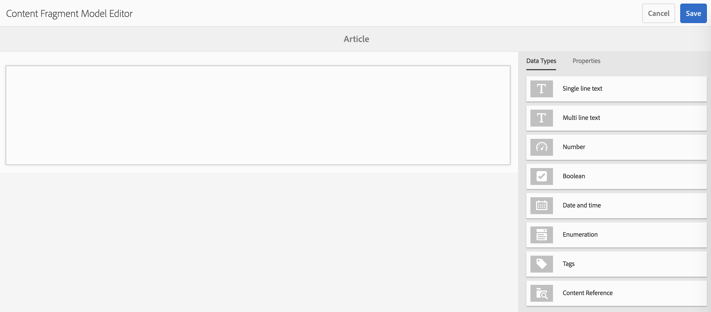

1. From the **Data Types** tab on the right (1), drag the *Single line text* input into the left drop-zone (2).
	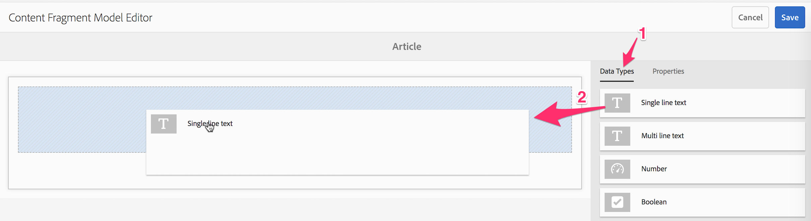

1. Once placed, the **Properties** tab will be highlighed to edit the field. Add properties to the field:

  	* **Field Label**: `Description`
		* This is the label displayed to the author when filling out the form.
	* **Property Name**: `description`
  		* This is the property name in the repository that will store the authored value.
  	* **Description**: `A short description of the article, typically for use on teasers.`
		* This is directions for the author when filling out the form.

	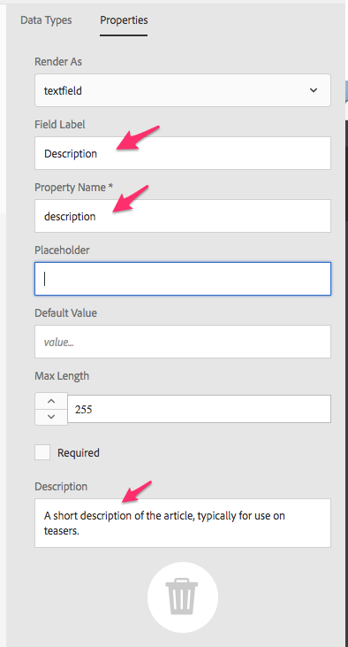

1. Click on the **Data Types** tab to add another field to the form.    
	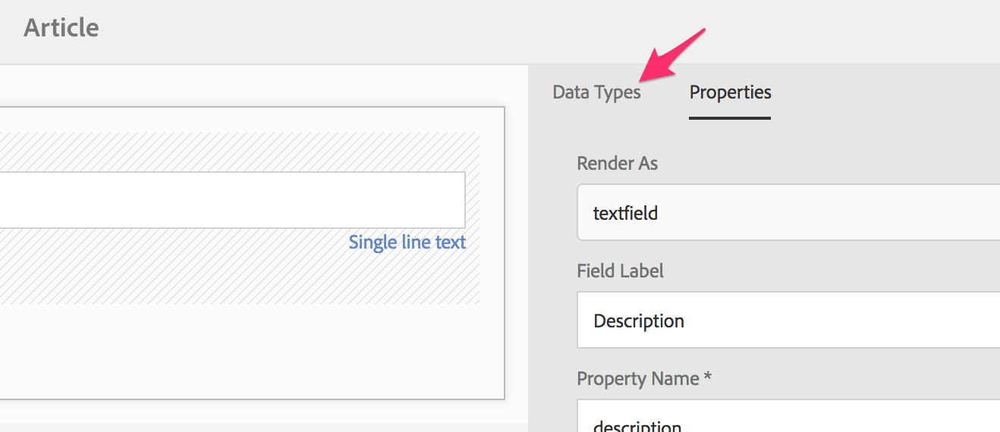

1. Repeat steps 1 through 3 above with the following fields, to complete the form. Drag each one to the bottom of the drop-area.
	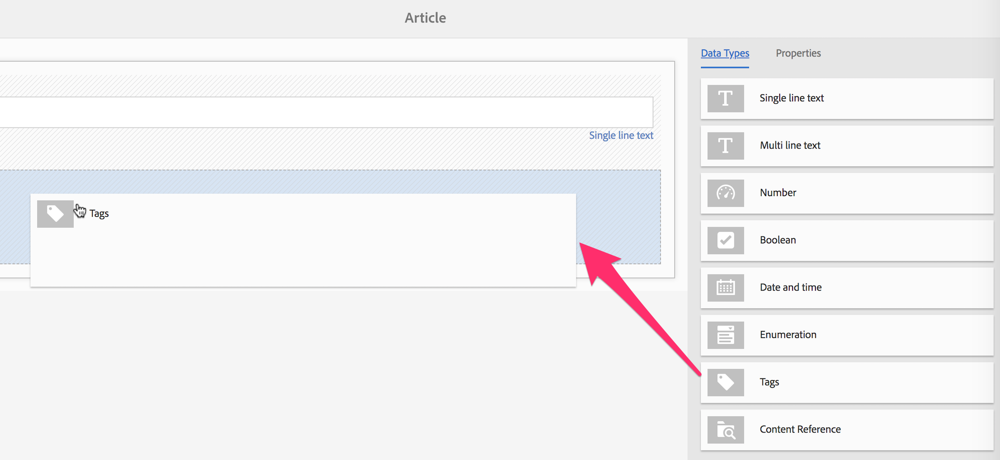

	* **Type**: *Tags*
  		* **Field Label**: `Subject/Keywords`
  		* **Property Name**: `keywords`

	* **Type**: *Single line text*
  		* **Field Label**: `Author`
  		* **Property Name**: `author`

	* **Type**: *Date and time*
  		* **Field Label**: `Published Date`
  		* **Property Name**: `published`
  	
	* **Type**: *Multi line text*	
  		* **Field Label**: `Body`
  		* **Property Name**: `body`
  		* **Description**: `The full content of the article.`

	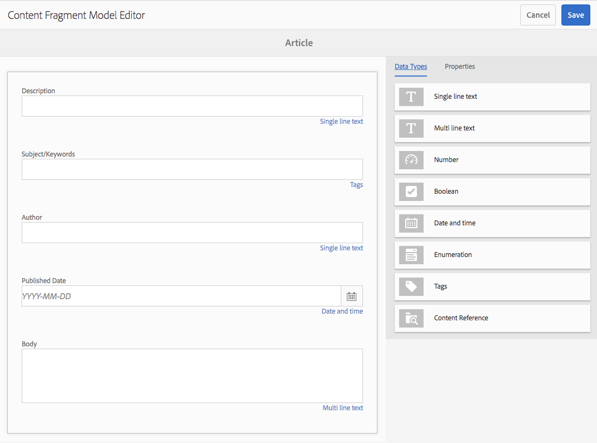

1. Click **Save** to save the model.

### Activity 4 - Create an Article Content Fragment
This is the process by which an Content Fragment instance is created. The model defines the structure that allow authors to quickly create new instances.

1. Switch to the AEM Navivation tab.

1. From the primary navigation, navigate to *Menu* -> *Assets* -> *Files*

1. Open the *We.Retail* -> *English* -> *Experiences* folder.

1. Create a new folder for **Summit Lab 724**, and open it.

1. Select *Create* -> *Content Fragment*.
	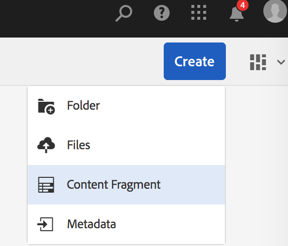

1. Select the new *Article* Model, and click *Next*.
	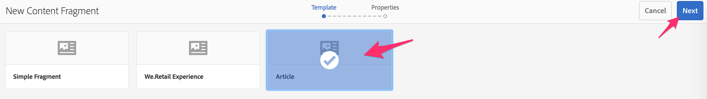

1. Enter a *Title* (`Example Article Entry`) and optional *Description*, click *Create*, and open the CF.
	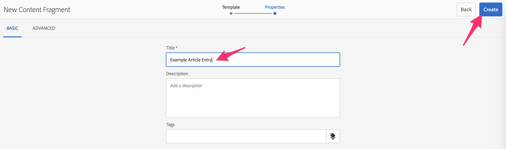

1. Fill out the form (Use a Lorem Ipsum Generator <https://hipsum.co/> for the **body** field).
	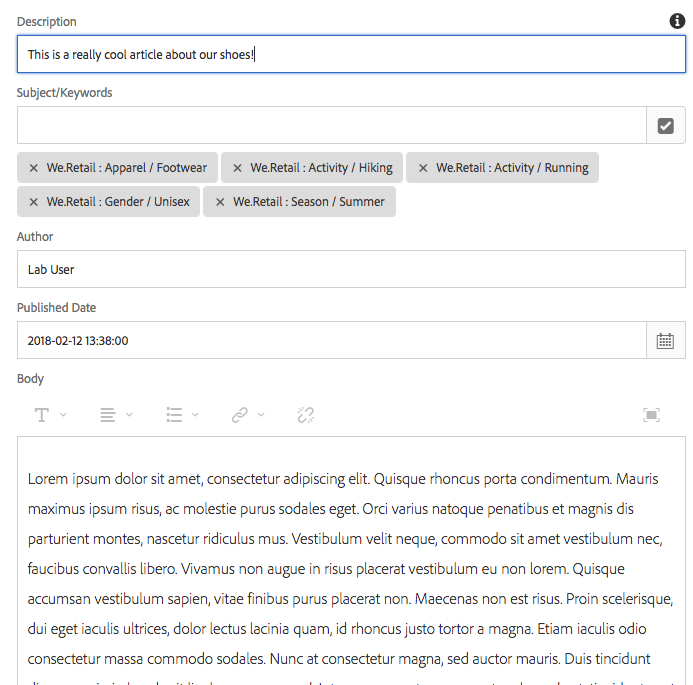

1. *Save* the Content Fragment
	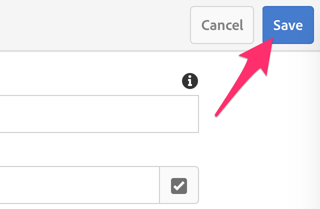

### Activity 5 - Summarize Fragment
Fragment summarization allows authors to quickly create a copy of a content fragment, with a subset of the content. This can be useful if the content fragment will be published to different channels.

1. Click on the Article Content Fragment to edit it.

1. Select the *Variations* drawer on the Sidebar. Ensure that the primary variation is selected (Named *Master*).

1. Create a new variation, named `Summary`.

1. Click on the **body** field to select it. Then and open it in Full Screen Mode.
	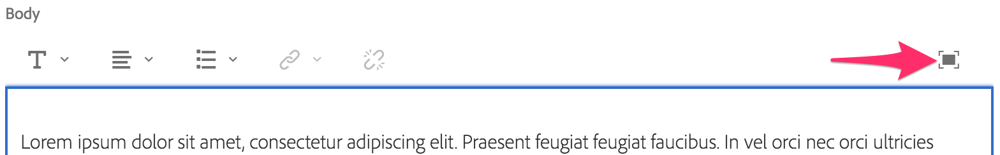

1. Click the *Summarize Text* button.
	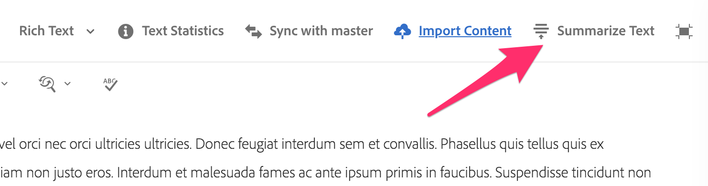

1. Enter a value for the number of words to target and click *Start*.

	The view will switch to a side-by-side comparison of the original and summarized text. 
	
	An author can change which sentences are kept and removed. The word count actuals and target are listed at the top. Additionally, a toggle for previewing the results of the summary is available.
	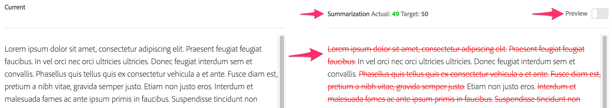
	
	How it works:
	>"On a more technical level the system keeps the sentences which it rates as providing the best ratio of information density and uniqueness according to specific algorithms."

1. Click *Summarize* to accept the updates.

1. Click on the *Full Screen Mode* button to toggle back to the Content Fragment View.

1. Click *Save* to save the variation. 

### Activity 6 - Add Associated Content
Associated Content allows a Content Fragment author to reference assets to a specific Content Fragment. This helps consuming authors identify which assets are intended to be used with the Content Fragment instance, but it does not force their use in specific places within the content fragment.

1. Click on the Article Content fragment to edit it.

1. Open the Sidebar an select the *Associated Content* icon.
	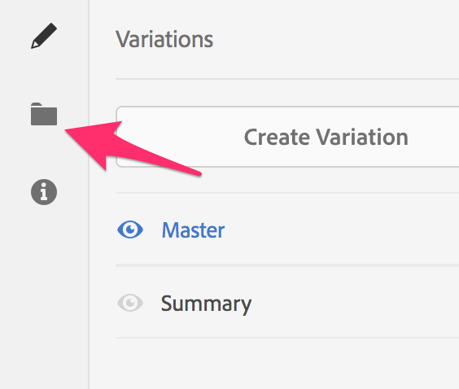

1. Click on *Associate Content*, and in the dialog, select the **Summit Lab 724** collection.
	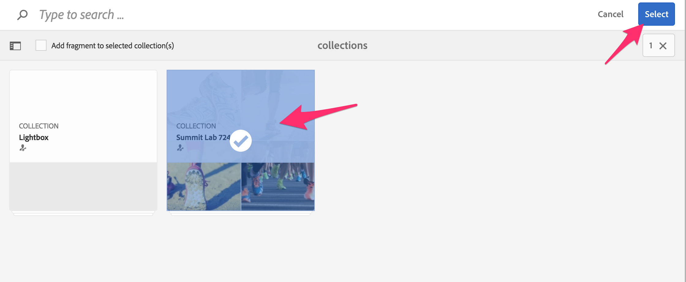

1. Click *Save*.

### Activity 7 - Consume Content Fragment - HTML Page
A Content Fragment can be used on any standard HTML page, through the Content Fragment Component. This

1. Switch to the AEM Navivation tab.

1. From the primary navigation, navigate to Menu -> *Sites*.

1. Select *We.Retail* -> *Langugage Masters* -> *English* -> *Experience*, in the column view.

1. Click on *Create* -> *Page*
	1. **Template**: *Experience Page*

1. Give the new page a title:
	2. **Title**: `Summit Lab 724`

1. Click *Create* and open the page.

1. This page already contains the **Content Fragment** component.

1. Select the *Assets* drawer on the Sidebar. Filter the type to *Content Fragments*.

1. Drag and drop the *Example Article Entry* CF created, to the Content Fragment component.
	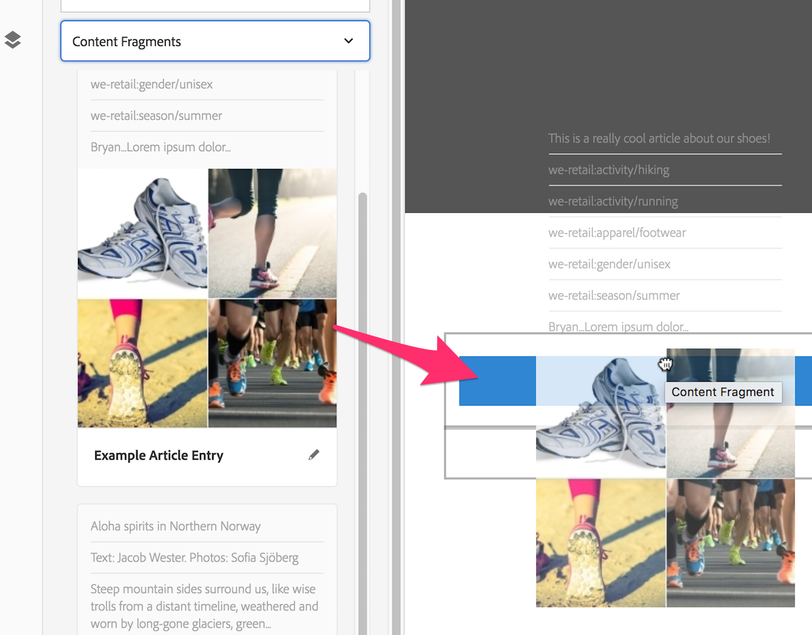

	By default, the Content Fragment component will display all fo the fields on the page; however for this context, we only want the Rich Text *body* element.

1. Click on the *Configure* button to open the on-page Content Fragment Component. **Note**: do not click on the *Edit* button, this will take you to the Content Fragment instance for editing.
	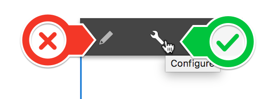

1. Change the **Display Mode** to use only a `Single Text Element`, then change the **Element** to reference the `Body` property. Finally save the changes.
	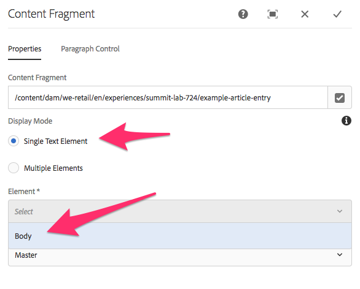

	Now the page will display each of the Rich Text paragraphs on the page, with an embedded *parsys* component between paragraphs.	

### Activity 8 - Use Associated Content
Associated content allows Authors to select curated assets to use in the Content Fragment. 

1. In the Sidebar select the *Associated Content* tab.
	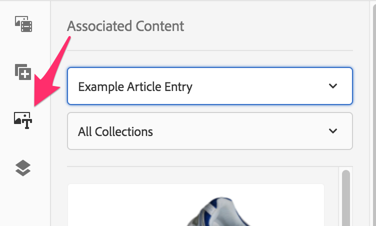

1. Drag and drop images to the Content Fragment parsys entries.

### Activty 9 - Create Article Content Service (API) Page
Acitvity 7 allowed the author to create the HTML Web representation of the article. The Authors also want to expose this article to a Single Page & Mobile app via JSON.

1. Switch to the AEM Navivation tab.

1. From the primary navigation, navigate to Menu -> *Sites*.

1. Select *We.Retail* -> *Langugage Masters* -> *English* -> *Experience* in the column view.

1. Click on *Create* -> *Page* (You do not need to open this page)
	* **Template**: *API Page*
	* **Title**: `API`
	
1. Create another new under the new API page.
	1. **Template**: *Experience Page*
	2. **Title**: `Summit Lab 724`

1. Drag and drop the *Example Article Entry*, to the Content Fragment component.

	The default view of the Content Fragment component is to display all of the attributes. This will support the authors needs to expose the Article via JSON.

	To view the page as JSON, convert the URL from `html` extension to `model.json`. For example if you followed the naming conventions used in this document open this URL, Bookmark `Article API JSON`

	<http://localhost:4502/content/we-retail/language-masters/en/experience/api/summit-lab-724.model.json>
	
	You can also view the HTML page created in Activity 7 as a JSON model as well. This is bookmarked as `Article HTML JSON`.
	
	<http://localhost:4502/content/we-retail/language-masters/en/experience/summit-lab-724.model.json>

	The API Page version outputs all of the properties of the Content Fragment in the JSON Model. However, the HTML page outputs only the Body content attribute. It _does_ however also output the images referenced by the sub paragraph systems, including their order.

### Optional Activity - Create Summary Experience Page 

For this activity, repeat activities 7 & 9, but on the Content Fragment's dialog, select the `Summary` value for the **Variation** property. See how that impacts the output of the content fragment displayed.

#### Extra Info

Content fragments do not suffer the same reference issue as Experience Fragments. As Content fragements are updated, the pages which reference them are updated as well. This allows full text search to function as expected.

It should be noted that Content Fragments use the Multi-Site Manager to manage the relationship between the original and referencing pages. Consideration should be taken on the number of pages referencing an individual fragment to prevent performance issues.

#### References
* <https://helpx.adobe.com/experience-manager/6-3/sites/authoring/using/content-fragments.html>
* <https://helpx.adobe.com/experience-manager/6-3/assets/using/content-fragments-variations.html>



## Chapter 3 - Advanced Topics - Component Exporter

The JSON Model output shown in the last chapter's activites is possible via an out-of-the-box exporter for each of the Core Components and We.Retail example components. 

For this chapter we're going to show how to modify an existing component to use the new APIs to export content as JSON.

#### Scenario
We.Retail has a custom List component which displays all children pages. They want to use this component on the API page to list all of the children experience pages as JSON.

### Activity 1 - Existing Functionality

For this activity we're just going to show what the existing capabilites are for components. In Chapter 2, activity 7 we created an page using a custom API Template. Let's look at this page.

1. Switch to the AEM Navivation tab.

1. From the primary navigation, navigate to Menu -> *Sites*.

1. Select *We.Retail* -> *Langugage Masters* -> *English* -> *Experience* in the column view.

1. Select the *API* Page, and *Edit* it.
	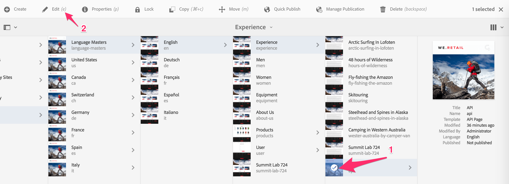

1. This page already lists all of the children on it.
	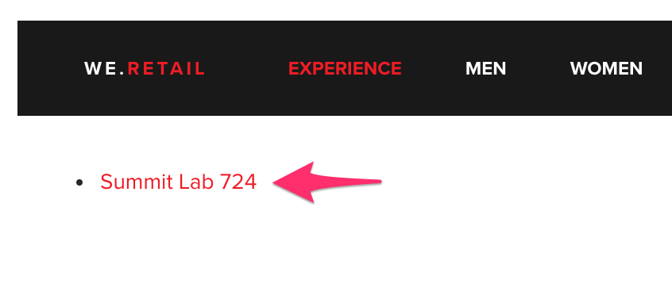

1. Opening the JSON model of this page (Bookmark `API Page JSON`) shows that the component does not output any information about the items in the list.

	* <http://localhost:4502/content/we-retail/language-masters/en/experience/api.model.json>

	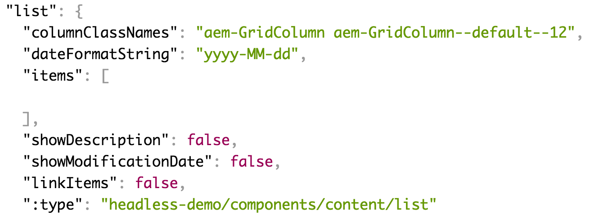

### Activity 2 - Updating Component Model

Now we'll update the Model which supports the **List Component** on the *API Page*. The updates to the code are to have the component's Sling Model implement the *ComponentExporter* interface.

1. Open IntelliJ IDE

1. The *List.java* class should already be open for editing.

1. Update the **Model** Annotation:
	1. Add `ComopnentExporter.class` to the list of *adapters*. 
	1. Add a *resourceType* attribute with a value of `headless-demo/components/content/list`.
	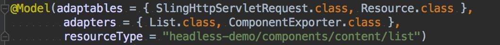

1. Update the `List` defintion to have it implement the `ComponentExporter` interface.
	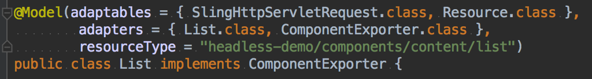

1. The `ComponentExporter` interface requires a single method to be implemented. Add this method to the `List` class.
	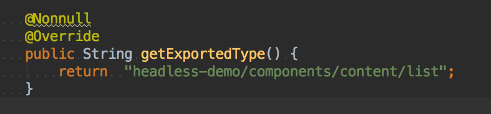

1. Now that the code is updated, all that's left is to push it to AEM. Execute a build from the IntelliJ run menu. This should already be configured here:
	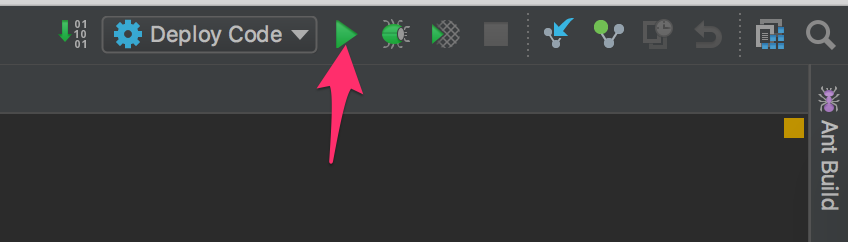

### Activity 3 - Updated JSON

1. In the browser, refresh the API page showing the JSON (Bookmark `API Page JSON`). It now lists the child page with some information.
	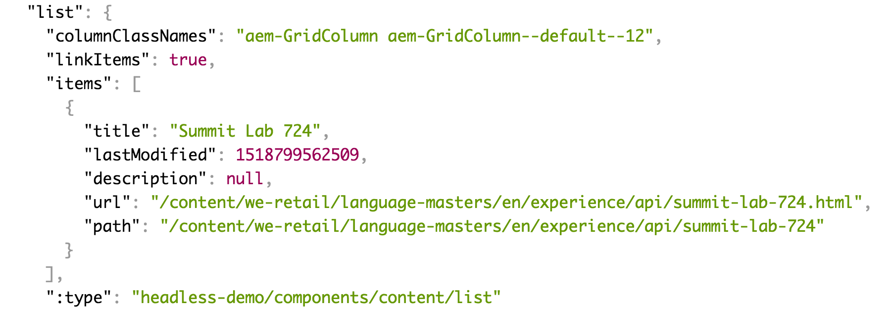

#### References
* <https://helpx.adobe.com/experience-manager/kt/platform-repository/using/sling-model-exporter-tutorial-understand.html>